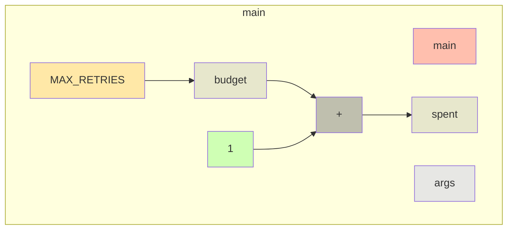

```mermaid
flowchart TD
  subgraph b0["main"]
    n1[main]:::RETURN
    n2[args]:::FUNC_PARAM
    n3[MAX_RETRIES]:::EXTERNAL
    n4[budget]:::VARIABLE
    n5[1]:::LITERAL
    n6[+]:::BIN_OP
    n7[spent]:::VARIABLE
    n3[MAX_RETRIES]:::EXTERNAL --> n4[budget]:::VARIABLE
    n4[budget]:::VARIABLE --> n6[+]:::BIN_OP
    n5[1]:::LITERAL --> n6[+]:::BIN_OP
    n6[+]:::BIN_OP --> n7[spent]:::VARIABLE
  end
  classDef LITERAL fill:#00FF0030
  classDef VARIABLE fill:#80808030
  classDef BIN_OP fill:#80808080
  classDef FUNC_PARAM fill:#8080FF30
  classDef RETURN fill:#FF808080
  classDef EXTERNAL fill:#FFA50040
  classDef UNMODELLED fill:#FF000030,stroke-dasharray: 4 2
```
