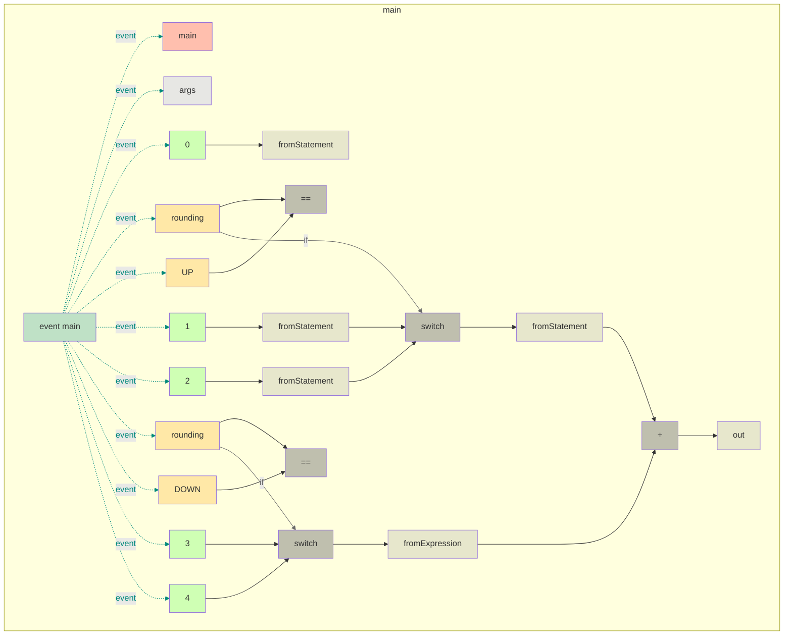

```mermaid
flowchart TD
  subgraph b0["main"]
    n1[event main]:::EVENT
    n2[main]:::RETURN
    n3[args]:::FUNC_PARAM
    n4[0]:::LITERAL
    n5[fromStatement]:::VARIABLE
    n6[rounding]:::EXTERNAL
    n7[UP]:::EXTERNAL
    n8[==]:::BIN_OP
    n9[1]:::LITERAL
    n10[fromStatement]:::VARIABLE
    n11[2]:::LITERAL
    n12[fromStatement]:::VARIABLE
    n13[switch]:::BIN_OP
    n14[fromStatement]:::VARIABLE
    n15[rounding]:::EXTERNAL
    n16[DOWN]:::EXTERNAL
    n17[==]:::BIN_OP
    n18[3]:::LITERAL
    n19[4]:::LITERAL
    n20[switch]:::BIN_OP
    n21[fromExpression]:::VARIABLE
    n22[+]:::BIN_OP
    n23[out]:::VARIABLE
    n1[event main]:::EVENT -. event .-> n2[main]:::RETURN
    n1[event main]:::EVENT -. event .-> n3[args]:::FUNC_PARAM
    n1[event main]:::EVENT -. event .-> n4[0]:::LITERAL
    n1[event main]:::EVENT -. event .-> n6[rounding]:::EXTERNAL
    n1[event main]:::EVENT -. event .-> n7[UP]:::EXTERNAL
    n1[event main]:::EVENT -. event .-> n9[1]:::LITERAL
    n1[event main]:::EVENT -. event .-> n11[2]:::LITERAL
    n1[event main]:::EVENT -. event .-> n15[rounding]:::EXTERNAL
    n1[event main]:::EVENT -. event .-> n16[DOWN]:::EXTERNAL
    n1[event main]:::EVENT -. event .-> n18[3]:::LITERAL
    n1[event main]:::EVENT -. event .-> n19[4]:::LITERAL
    n4[0]:::LITERAL --> n5[fromStatement]:::VARIABLE
    n6[rounding]:::EXTERNAL --> n8[==]:::BIN_OP
    n6[rounding]:::EXTERNAL -->|if| n13[switch]:::BIN_OP
    n7[UP]:::EXTERNAL --> n8[==]:::BIN_OP
    n9[1]:::LITERAL --> n10[fromStatement]:::VARIABLE
    n10[fromStatement]:::VARIABLE --> n13[switch]:::BIN_OP
    n11[2]:::LITERAL --> n12[fromStatement]:::VARIABLE
    n12[fromStatement]:::VARIABLE --> n13[switch]:::BIN_OP
    n13[switch]:::BIN_OP --> n14[fromStatement]:::VARIABLE
    n14[fromStatement]:::VARIABLE --> n22[+]:::BIN_OP
    n15[rounding]:::EXTERNAL --> n17[==]:::BIN_OP
    n15[rounding]:::EXTERNAL -->|if| n20[switch]:::BIN_OP
    n16[DOWN]:::EXTERNAL --> n17[==]:::BIN_OP
    n18[3]:::LITERAL --> n20[switch]:::BIN_OP
    n19[4]:::LITERAL --> n20[switch]:::BIN_OP
    n20[switch]:::BIN_OP --> n21[fromExpression]:::VARIABLE
    n21[fromExpression]:::VARIABLE --> n22[+]:::BIN_OP
    n22[+]:::BIN_OP --> n23[out]:::VARIABLE
  end
  linkStyle 0 stroke:#00897b,color:#00897b
  linkStyle 1 stroke:#00897b,color:#00897b
  linkStyle 2 stroke:#00897b,color:#00897b
  linkStyle 3 stroke:#00897b,color:#00897b
  linkStyle 4 stroke:#00897b,color:#00897b
  linkStyle 5 stroke:#00897b,color:#00897b
  linkStyle 6 stroke:#00897b,color:#00897b
  linkStyle 7 stroke:#00897b,color:#00897b
  linkStyle 8 stroke:#00897b,color:#00897b
  linkStyle 9 stroke:#00897b,color:#00897b
  linkStyle 10 stroke:#00897b,color:#00897b
  linkStyle 13 stroke:#6a6a6a,color:#6a6a6a
  linkStyle 22 stroke:#6a6a6a,color:#6a6a6a
  classDef LITERAL fill:#00FF0030
  classDef VARIABLE fill:#80808030
  classDef BIN_OP fill:#80808080
  classDef FUNC_PARAM fill:#8080FF30
  classDef RETURN fill:#FF808080
  classDef EXTERNAL fill:#FFA50040
  classDef UNMODELLED fill:#FF000030,stroke-dasharray: 4 2
  classDef EVENT fill:#00897B40
```
