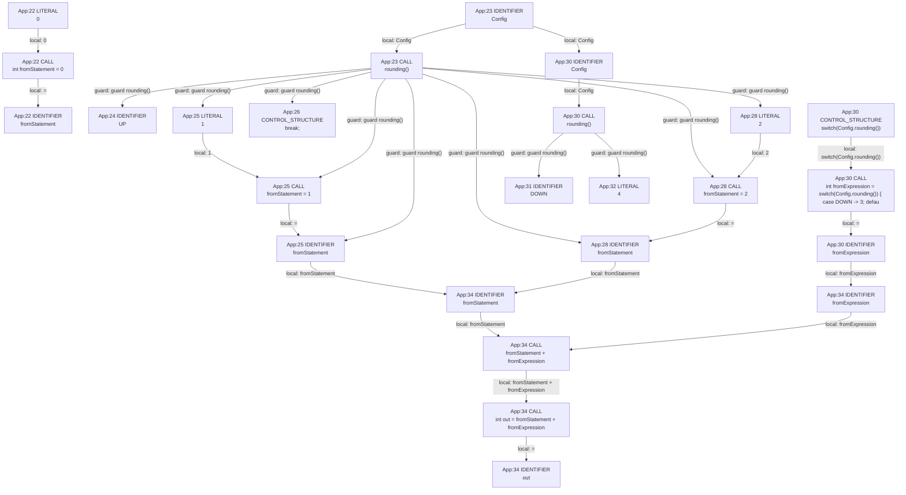

# externalEnumSwitch: spike value graph

```mermaid
flowchart TD
  n0["App:22 CALL<br/>int fromStatement = 0"]
  n1["App:22 IDENTIFIER<br/>fromStatement"]
  n2["App:22 LITERAL<br/>0"]
  n3["App:23 CALL<br/>rounding()"]
  n4["App:23 IDENTIFIER<br/>Config"]
  n5["App:24 IDENTIFIER<br/>UP"]
  n6["App:25 CALL<br/>fromStatement = 1"]
  n7["App:25 IDENTIFIER<br/>fromStatement"]
  n8["App:25 LITERAL<br/>1"]
  n9["App:26 CONTROL_STRUCTURE<br/>break;"]
  n10["App:28 CALL<br/>fromStatement = 2"]
  n11["App:28 IDENTIFIER<br/>fromStatement"]
  n12["App:28 LITERAL<br/>2"]
  n13["App:30 CALL<br/>int fromExpression = switch(Config.rounding()) { case DOWN -#gt; 3; defau"]
  n14["App:30 CALL<br/>rounding()"]
  n15["App:30 CONTROL_STRUCTURE<br/>switch(Config.rounding())"]
  n16["App:30 IDENTIFIER<br/>Config"]
  n17["App:30 IDENTIFIER<br/>fromExpression"]
  n18["App:31 IDENTIFIER<br/>DOWN"]
  n19["App:32 LITERAL<br/>4"]
  n20["App:34 CALL<br/>fromStatement + fromExpression"]
  n21["App:34 CALL<br/>int out = fromStatement + fromExpression"]
  n22["App:34 IDENTIFIER<br/>fromExpression"]
  n23["App:34 IDENTIFIER<br/>fromStatement"]
  n24["App:34 IDENTIFIER<br/>out"]
  n0 -->|"local: ="| n1
  n10 -->|"local: ="| n11
  n11 -->|"local: fromStatement"| n23
  n12 -->|"local: 2"| n10
  n13 -->|"local: ="| n17
  n14 -->|"guard: guard rounding()"| n18
  n14 -->|"guard: guard rounding()"| n19
  n15 -->|"local: switch(Config.rounding())"| n13
  n16 -->|"local: Config"| n14
  n17 -->|"local: fromExpression"| n22
  n2 -->|"local: 0"| n0
  n20 -->|"local: fromStatement + fromExpression"| n21
  n21 -->|"local: ="| n24
  n22 -->|"local: fromExpression"| n20
  n23 -->|"local: fromStatement"| n20
  n3 -->|"guard: guard rounding()"| n10
  n3 -->|"guard: guard rounding()"| n11
  n3 -->|"guard: guard rounding()"| n12
  n3 -->|"guard: guard rounding()"| n5
  n3 -->|"guard: guard rounding()"| n6
  n3 -->|"guard: guard rounding()"| n7
  n3 -->|"guard: guard rounding()"| n8
  n3 -->|"guard: guard rounding()"| n9
  n4 -->|"local: Config"| n16
  n4 -->|"local: Config"| n3
  n6 -->|"local: ="| n7
  n7 -->|"local: fromStatement"| n23
  n8 -->|"local: 1"| n6
```
