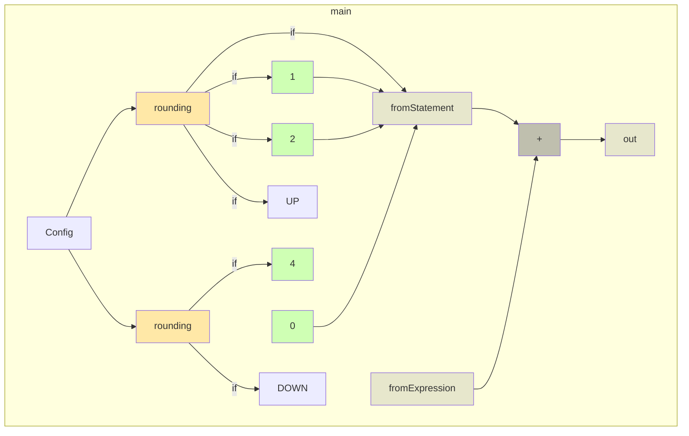

# externalEnumSwitch: spike value graph (condensed)

```mermaid
flowchart TD
  subgraph m0["main"]
    n0["+"]:::BIN_OP
    n1["rounding"]:::EXTERNAL
    n2["rounding"]:::EXTERNAL
    n3["0"]:::LITERAL
    n4["1"]:::LITERAL
    n5["2"]:::LITERAL
    n6["4"]:::LITERAL
    n7["Config"]:::OBJ_VARIABLE
    n8["DOWN"]:::OBJ_VARIABLE
    n9["UP"]:::OBJ_VARIABLE
    n10["fromExpression"]:::VARIABLE
    n11["fromStatement"]:::VARIABLE
    n12["out"]:::VARIABLE
  end
  n0 --> n12
  n1 -->|if| n11
  n1 -->|if| n4
  n1 -->|if| n5
  n1 -->|if| n9
  n10 --> n0
  n11 --> n0
  n2 -->|if| n6
  n2 -->|if| n8
  n3 --> n11
  n4 --> n11
  n5 --> n11
  n7 --> n1
  n7 --> n2
  classDef LITERAL fill:#00FF0030
  classDef VARIABLE fill:#80808030
  classDef BIN_OP fill:#80808080
  classDef FUNC_PARAM fill:#8080FF30
  classDef RETURN fill:#FF808080
  classDef EXTERNAL fill:#FFA50040
  classDef UNMODELLED fill:#FF000030,stroke-dasharray: 4 2
```
