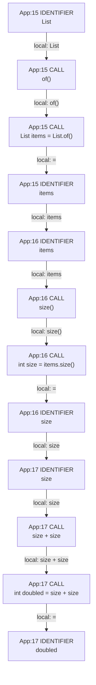

# externalObject: spike value graph

```mermaid
flowchart TD
  n0["App:15 CALL<br/>List items = List.of()"]
  n1["App:15 CALL<br/>of()"]
  n2["App:15 IDENTIFIER<br/>List"]
  n3["App:15 IDENTIFIER<br/>items"]
  n4["App:16 CALL<br/>int size = items.size()"]
  n5["App:16 CALL<br/>size()"]
  n6["App:16 IDENTIFIER<br/>items"]
  n7["App:16 IDENTIFIER<br/>size"]
  n8["App:17 CALL<br/>int doubled = size + size"]
  n9["App:17 CALL<br/>size + size"]
  n10["App:17 IDENTIFIER<br/>doubled"]
  n11["App:17 IDENTIFIER<br/>size"]
  n0 -->|"local: ="| n3
  n1 -->|"local: of()"| n0
  n11 -->|"local: size"| n9
  n2 -->|"local: List"| n1
  n3 -->|"local: items"| n6
  n4 -->|"local: ="| n7
  n5 -->|"local: size()"| n4
  n6 -->|"local: items"| n5
  n7 -->|"local: size"| n11
  n8 -->|"local: ="| n10
  n9 -->|"local: size + size"| n8
```
