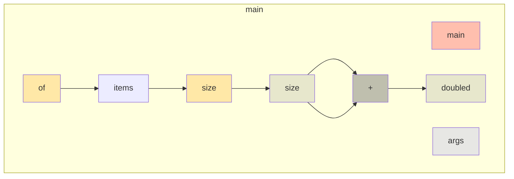

```mermaid
flowchart TD
  subgraph 4309014["main"]
    -1974841599[of]:::EXTERNAL
    -1974816533[+]:::BIN_OP
    -1923972548[args]:::FUNC_PARAM
    -1914852990[size]:::VARIABLE
    -1914847445[size]:::EXTERNAL
    -265987526[items]:::OBJ_VARIABLE
    56853577[main]:::RETURN
    29389632091[doubled]:::VARIABLE
    -1974841599[of]:::EXTERNAL --> -265987526[items]:::OBJ_VARIABLE
    -1974816533[+]:::BIN_OP --> 29389632091[doubled]:::VARIABLE
    -1914852990[size]:::VARIABLE --> -1974816533[+]:::BIN_OP
    -1914852990[size]:::VARIABLE --> -1974816533[+]:::BIN_OP
    -1914847445[size]:::EXTERNAL --> -1914852990[size]:::VARIABLE
    -265987526[items]:::OBJ_VARIABLE --> -1914847445[size]:::EXTERNAL
  end
  classDef LITERAL fill:#00FF0030
  classDef VARIABLE fill:#80808030
  classDef BIN_OP fill:#80808080
  classDef FUNC_PARAM fill:#8080FF30
  classDef RETURN fill:#FF808080
  classDef EXTERNAL fill:#FFA50040
```
