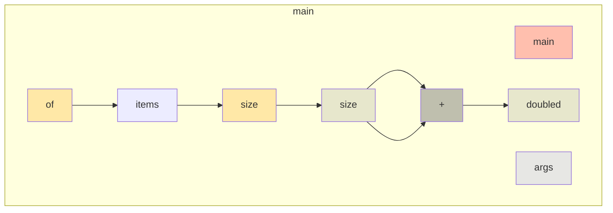

```mermaid
flowchart TD
  subgraph b0["main"]
    n1[main]:::RETURN
    n2[args]:::FUNC_PARAM
    n3[of]:::EXTERNAL
    n4[items]:::OBJ_VARIABLE
    n5[size]:::EXTERNAL
    n6[size]:::VARIABLE
    n7[+]:::BIN_OP
    n8[doubled]:::VARIABLE
    n3[of]:::EXTERNAL --> n4[items]:::OBJ_VARIABLE
    n4[items]:::OBJ_VARIABLE --> n5[size]:::EXTERNAL
    n5[size]:::EXTERNAL --> n6[size]:::VARIABLE
    n6[size]:::VARIABLE --> n7[+]:::BIN_OP
    n6[size]:::VARIABLE --> n7[+]:::BIN_OP
    n7[+]:::BIN_OP --> n8[doubled]:::VARIABLE
  end
  classDef LITERAL fill:#00FF0030
  classDef VARIABLE fill:#80808030
  classDef BIN_OP fill:#80808080
  classDef FUNC_PARAM fill:#8080FF30
  classDef RETURN fill:#FF808080
  classDef EXTERNAL fill:#FFA50040
  classDef UNMODELLED fill:#FF000030,stroke-dasharray: 4 2
```
