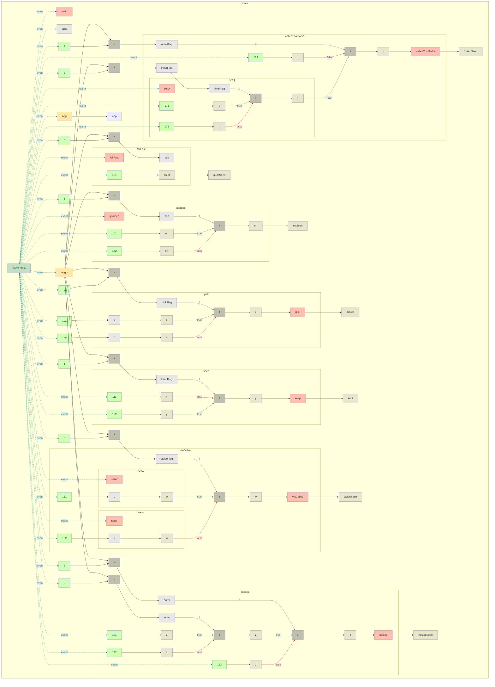

```mermaid
flowchart TD
  subgraph b0["main"]
    n1[event main]:::EVENT
    n2[main]:::RETURN
    n3[args]:::FUNC_PARAM
    n4[App]:::EXTERNAL
    n5[app]:::OBJ_VARIABLE
    n6[length]:::EXTERNAL
    n7[0]:::LITERAL
    n8[>]:::BIN_OP
    n9[101]:::LITERAL
    n10[102]:::LITERAL
    n20[picked]:::VARIABLE
    n21[1]:::LITERAL
    n22[>]:::BIN_OP
    n32[kept]:::VARIABLE
    n33[2]:::LITERAL
    n34[>]:::BIN_OP
    n35[3]:::LITERAL
    n36[>]:::BIN_OP
    n51[nestedSeen]:::VARIABLE
    n52[4]:::LITERAL
    n53[>]:::BIN_OP
    n63[errSeen]:::VARIABLE
    n64[5]:::LITERAL
    n65[>]:::BIN_OP
    n71[quietSeen]:::VARIABLE
    n72[6]:::LITERAL
    n73[>]:::BIN_OP
    n89[calleeSeen]:::VARIABLE
    n90[7]:::LITERAL
    n91[>]:::BIN_OP
    n92[8]:::LITERAL
    n93[>]:::BIN_OP
    n111[forkedSeen]:::VARIABLE
    n1[event main]:::EVENT -. event .-> n2[main]:::RETURN
    n1[event main]:::EVENT -. event .-> n3[args]:::FUNC_PARAM
    n1[event main]:::EVENT -. event .-> n4[App]:::EXTERNAL
    n1[event main]:::EVENT -. event .-> n6[length]:::EXTERNAL
    n1[event main]:::EVENT -. event .-> n7[0]:::LITERAL
    n1[event main]:::EVENT -. event .-> n9[101]:::LITERAL
    n1[event main]:::EVENT -. event .-> n10[102]:::LITERAL
    n1[event main]:::EVENT -. event .-> n21[1]:::LITERAL
    n1[event main]:::EVENT -. event .-> n33[2]:::LITERAL
    n1[event main]:::EVENT -. event .-> n35[3]:::LITERAL
    n1[event main]:::EVENT -. event .-> n52[4]:::LITERAL
    n1[event main]:::EVENT -. event .-> n64[5]:::LITERAL
    n1[event main]:::EVENT -. event .-> n72[6]:::LITERAL
    n1[event main]:::EVENT -. event .-> n90[7]:::LITERAL
    n1[event main]:::EVENT -. event .-> n92[8]:::LITERAL
    n1[event main]:::EVENT -. event .-> n26[111]:::LITERAL
    n1[event main]:::EVENT -. event .-> n28[122]:::LITERAL
    n1[event main]:::EVENT -. event .-> n41[131]:::LITERAL
    n1[event main]:::EVENT -. event .-> n43[132]:::LITERAL
    n1[event main]:::EVENT -. event .-> n47[133]:::LITERAL
    n1[event main]:::EVENT -. event .-> n55[guarded]:::RETURN
    n1[event main]:::EVENT -. event .-> n57[141]:::LITERAL
    n1[event main]:::EVENT -. event .-> n59[142]:::LITERAL
    n1[event main]:::EVENT -. event .-> n67[failFast]:::RETURN
    n1[event main]:::EVENT -. event .-> n69[151]:::LITERAL
    n1[event main]:::EVENT -. event .-> n77[161]:::LITERAL
    n1[event main]:::EVENT -. event .-> n82[162]:::LITERAL
    n1[event main]:::EVENT -. event .-> n79[setW]:::RETURN
    n1[event main]:::EVENT -. event .-> n84[setW]:::RETURN
    n1[event main]:::EVENT -. event .-> n107[173]:::LITERAL
    n1[event main]:::EVENT -. event .-> n99[setQ]:::RETURN
    n1[event main]:::EVENT -. event .-> n101[171]:::LITERAL
    n1[event main]:::EVENT -. event .-> n103[172]:::LITERAL
    n4[App]:::EXTERNAL --> n5[app]:::OBJ_VARIABLE
    n6[length]:::EXTERNAL --> n8[>]:::BIN_OP
    n6[length]:::EXTERNAL --> n22[>]:::BIN_OP
    n6[length]:::EXTERNAL --> n34[>]:::BIN_OP
    n6[length]:::EXTERNAL --> n36[>]:::BIN_OP
    n6[length]:::EXTERNAL --> n53[>]:::BIN_OP
    n6[length]:::EXTERNAL --> n65[>]:::BIN_OP
    n6[length]:::EXTERNAL --> n73[>]:::BIN_OP
    n6[length]:::EXTERNAL --> n91[>]:::BIN_OP
    n6[length]:::EXTERNAL --> n93[>]:::BIN_OP
    n7[0]:::LITERAL --> n8[>]:::BIN_OP
    n8[>]:::BIN_OP --> n13[pickFlag]:::FUNC_PARAM
    n9[101]:::LITERAL --> n14[a]:::FUNC_PARAM
    n10[102]:::LITERAL --> n15[b]:::FUNC_PARAM
    n21[1]:::LITERAL --> n22[>]:::BIN_OP
    n22[>]:::BIN_OP --> n25[keepFlag]:::FUNC_PARAM
    n33[2]:::LITERAL --> n34[>]:::BIN_OP
    n34[>]:::BIN_OP --> n39[outer]:::FUNC_PARAM
    n35[3]:::LITERAL --> n36[>]:::BIN_OP
    n36[>]:::BIN_OP --> n40[inner]:::FUNC_PARAM
    n52[4]:::LITERAL --> n53[>]:::BIN_OP
    n53[>]:::BIN_OP --> n56[bad]:::FUNC_PARAM
    n64[5]:::LITERAL --> n65[>]:::BIN_OP
    n65[>]:::BIN_OP --> n68[bad]:::FUNC_PARAM
    n72[6]:::LITERAL --> n73[>]:::BIN_OP
    n73[>]:::BIN_OP --> n76[calleeFlag]:::FUNC_PARAM
    n90[7]:::LITERAL --> n91[>]:::BIN_OP
    n91[>]:::BIN_OP --> n96[outerFlag]:::FUNC_PARAM
    n92[8]:::LITERAL --> n93[>]:::BIN_OP
    n93[>]:::BIN_OP --> n97[innerFlag]:::FUNC_PARAM
    n12[pick]:::RETURN --> n20[picked]:::VARIABLE
    n24[keep]:::RETURN --> n32[kept]:::VARIABLE
    n38[nested]:::RETURN --> n51[nestedSeen]:::VARIABLE
    n62[err]:::VARIABLE --> n63[errSeen]:::VARIABLE
    n70[quiet]:::VARIABLE --> n71[quietSeen]:::VARIABLE
    n75[viaCallee]:::RETURN --> n89[calleeSeen]:::VARIABLE
    n95[calleeThatForks]:::RETURN --> n111[forkedSeen]:::VARIABLE
    subgraph b11["pick"]
      n12[pick]:::RETURN
      n13[pickFlag]:::FUNC_PARAM
      n14[a]:::FUNC_PARAM
      n15[b]:::FUNC_PARAM
      n16[x]:::VARIABLE
      n17[x]:::VARIABLE
      n18[if]:::BIN_OP
      n19[x]:::VARIABLE
      n13[pickFlag]:::FUNC_PARAM -->|if| n18[if]:::BIN_OP
      n14[a]:::FUNC_PARAM --> n16[x]:::VARIABLE
      n15[b]:::FUNC_PARAM --> n17[x]:::VARIABLE
      n16[x]:::VARIABLE -->|true| n18[if]:::BIN_OP
      n17[x]:::VARIABLE -->|false| n18[if]:::BIN_OP
      n18[if]:::BIN_OP --> n19[x]:::VARIABLE
      n19[x]:::VARIABLE --> n12[pick]:::RETURN
    end
    subgraph b23["keep"]
      n24[keep]:::RETURN
      n25[keepFlag]:::FUNC_PARAM
      n26[111]:::LITERAL
      n27[y]:::VARIABLE
      n28[122]:::LITERAL
      n29[y]:::VARIABLE
      n30[if]:::BIN_OP
      n31[y]:::VARIABLE
      n25[keepFlag]:::FUNC_PARAM -->|if| n30[if]:::BIN_OP
      n26[111]:::LITERAL --> n27[y]:::VARIABLE
      n27[y]:::VARIABLE -->|false| n30[if]:::BIN_OP
      n28[122]:::LITERAL --> n29[y]:::VARIABLE
      n29[y]:::VARIABLE -->|true| n30[if]:::BIN_OP
      n30[if]:::BIN_OP --> n31[y]:::VARIABLE
      n31[y]:::VARIABLE --> n24[keep]:::RETURN
    end
    subgraph b37["nested"]
      n38[nested]:::RETURN
      n39[outer]:::FUNC_PARAM
      n40[inner]:::FUNC_PARAM
      n41[131]:::LITERAL
      n42[z]:::VARIABLE
      n43[132]:::LITERAL
      n44[z]:::VARIABLE
      n45[if]:::BIN_OP
      n46[z]:::VARIABLE
      n47[133]:::LITERAL
      n48[z]:::VARIABLE
      n49[if]:::BIN_OP
      n50[z]:::VARIABLE
      n39[outer]:::FUNC_PARAM -->|if| n49[if]:::BIN_OP
      n40[inner]:::FUNC_PARAM -->|if| n45[if]:::BIN_OP
      n41[131]:::LITERAL --> n42[z]:::VARIABLE
      n42[z]:::VARIABLE -->|true| n45[if]:::BIN_OP
      n43[132]:::LITERAL --> n44[z]:::VARIABLE
      n44[z]:::VARIABLE -->|false| n45[if]:::BIN_OP
      n45[if]:::BIN_OP --> n46[z]:::VARIABLE
      n46[z]:::VARIABLE -->|true| n49[if]:::BIN_OP
      n47[133]:::LITERAL --> n48[z]:::VARIABLE
      n48[z]:::VARIABLE -->|false| n49[if]:::BIN_OP
      n49[if]:::BIN_OP --> n50[z]:::VARIABLE
      n50[z]:::VARIABLE --> n38[nested]:::RETURN
    end
    subgraph b54["guarded"]
      n55[guarded]:::RETURN
      n56[bad]:::FUNC_PARAM
      n57[141]:::LITERAL
      n58[err]:::VARIABLE
      n59[142]:::LITERAL
      n60[err]:::VARIABLE
      n61[if]:::BIN_OP
      n62[err]:::VARIABLE
      n56[bad]:::FUNC_PARAM -->|if| n61[if]:::BIN_OP
      n57[141]:::LITERAL --> n58[err]:::VARIABLE
      n58[err]:::VARIABLE -->|true| n61[if]:::BIN_OP
      n59[142]:::LITERAL --> n60[err]:::VARIABLE
      n60[err]:::VARIABLE -->|false| n61[if]:::BIN_OP
      n61[if]:::BIN_OP --> n62[err]:::VARIABLE
    end
    subgraph b66["failFast"]
      n67[failFast]:::RETURN
      n68[bad]:::FUNC_PARAM
      n69[151]:::LITERAL
      n70[quiet]:::VARIABLE
      n69[151]:::LITERAL --> n70[quiet]:::VARIABLE
    end
    subgraph b74["viaCallee"]
      n75[viaCallee]:::RETURN
      n76[calleeFlag]:::FUNC_PARAM
      n77[161]:::LITERAL
      n82[162]:::LITERAL
      n87[if]:::BIN_OP
      n88[w]:::VARIABLE
      n76[calleeFlag]:::FUNC_PARAM -->|if| n87[if]:::BIN_OP
      n77[161]:::LITERAL --> n80[v]:::FUNC_PARAM
      n82[162]:::LITERAL --> n85[v]:::FUNC_PARAM
      n87[if]:::BIN_OP --> n88[w]:::VARIABLE
      n88[w]:::VARIABLE --> n75[viaCallee]:::RETURN
      n81[w]:::VARIABLE -->|true| n87[if]:::BIN_OP
      n86[w]:::VARIABLE -->|false| n87[if]:::BIN_OP
      subgraph b78["setW"]
        n79[setW]:::RETURN
        n80[v]:::FUNC_PARAM
        n81[w]:::VARIABLE
        n80[v]:::FUNC_PARAM --> n81[w]:::VARIABLE
      end
      subgraph b83["setW"]
        n84[setW]:::RETURN
        n85[v]:::FUNC_PARAM
        n86[w]:::VARIABLE
        n85[v]:::FUNC_PARAM --> n86[w]:::VARIABLE
      end
    end
    subgraph b94["calleeThatForks"]
      n95[calleeThatForks]:::RETURN
      n96[outerFlag]:::FUNC_PARAM
      n97[innerFlag]:::FUNC_PARAM
      n107[173]:::LITERAL
      n108[q]:::VARIABLE
      n109[if]:::BIN_OP
      n110[q]:::VARIABLE
      n96[outerFlag]:::FUNC_PARAM -->|if| n109[if]:::BIN_OP
      n97[innerFlag]:::FUNC_PARAM --> n100[innerFlag]:::FUNC_PARAM
      n107[173]:::LITERAL --> n108[q]:::VARIABLE
      n108[q]:::VARIABLE -->|false| n109[if]:::BIN_OP
      n109[if]:::BIN_OP --> n110[q]:::VARIABLE
      n110[q]:::VARIABLE --> n95[calleeThatForks]:::RETURN
      n106[q]:::VARIABLE -->|true| n109[if]:::BIN_OP
      subgraph b98["setQ"]
        n99[setQ]:::RETURN
        n100[innerFlag]:::FUNC_PARAM
        n101[171]:::LITERAL
        n102[q]:::VARIABLE
        n103[172]:::LITERAL
        n104[q]:::VARIABLE
        n105[if]:::BIN_OP
        n106[q]:::VARIABLE
        n100[innerFlag]:::FUNC_PARAM -->|if| n105[if]:::BIN_OP
        n101[171]:::LITERAL --> n102[q]:::VARIABLE
        n102[q]:::VARIABLE -->|true| n105[if]:::BIN_OP
        n103[172]:::LITERAL --> n104[q]:::VARIABLE
        n104[q]:::VARIABLE -->|false| n105[if]:::BIN_OP
        n105[if]:::BIN_OP --> n106[q]:::VARIABLE
      end
    end
  end
  linkStyle 0 stroke:#00897b,color:#00897b
  linkStyle 1 stroke:#00897b,color:#00897b
  linkStyle 2 stroke:#00897b,color:#00897b
  linkStyle 3 stroke:#00897b,color:#00897b
  linkStyle 4 stroke:#00897b,color:#00897b
  linkStyle 5 stroke:#00897b,color:#00897b
  linkStyle 6 stroke:#00897b,color:#00897b
  linkStyle 7 stroke:#00897b,color:#00897b
  linkStyle 8 stroke:#00897b,color:#00897b
  linkStyle 9 stroke:#00897b,color:#00897b
  linkStyle 10 stroke:#00897b,color:#00897b
  linkStyle 11 stroke:#00897b,color:#00897b
  linkStyle 12 stroke:#00897b,color:#00897b
  linkStyle 13 stroke:#00897b,color:#00897b
  linkStyle 14 stroke:#00897b,color:#00897b
  linkStyle 15 stroke:#00897b,color:#00897b
  linkStyle 16 stroke:#00897b,color:#00897b
  linkStyle 17 stroke:#00897b,color:#00897b
  linkStyle 18 stroke:#00897b,color:#00897b
  linkStyle 19 stroke:#00897b,color:#00897b
  linkStyle 20 stroke:#00897b,color:#00897b
  linkStyle 21 stroke:#00897b,color:#00897b
  linkStyle 22 stroke:#00897b,color:#00897b
  linkStyle 23 stroke:#00897b,color:#00897b
  linkStyle 24 stroke:#00897b,color:#00897b
  linkStyle 25 stroke:#00897b,color:#00897b
  linkStyle 26 stroke:#00897b,color:#00897b
  linkStyle 27 stroke:#00897b,color:#00897b
  linkStyle 28 stroke:#00897b,color:#00897b
  linkStyle 29 stroke:#00897b,color:#00897b
  linkStyle 30 stroke:#00897b,color:#00897b
  linkStyle 31 stroke:#00897b,color:#00897b
  linkStyle 32 stroke:#00897b,color:#00897b
  linkStyle 70 stroke:#6a6a6a,color:#6a6a6a
  linkStyle 73 stroke:#2e7d32,color:#2e7d32
  linkStyle 74 stroke:#c62828,color:#c62828
  linkStyle 77 stroke:#6a6a6a,color:#6a6a6a
  linkStyle 79 stroke:#c62828,color:#c62828
  linkStyle 81 stroke:#2e7d32,color:#2e7d32
  linkStyle 84 stroke:#6a6a6a,color:#6a6a6a
  linkStyle 85 stroke:#6a6a6a,color:#6a6a6a
  linkStyle 87 stroke:#2e7d32,color:#2e7d32
  linkStyle 89 stroke:#c62828,color:#c62828
  linkStyle 91 stroke:#2e7d32,color:#2e7d32
  linkStyle 93 stroke:#c62828,color:#c62828
  linkStyle 96 stroke:#6a6a6a,color:#6a6a6a
  linkStyle 98 stroke:#2e7d32,color:#2e7d32
  linkStyle 100 stroke:#c62828,color:#c62828
  linkStyle 103 stroke:#6a6a6a,color:#6a6a6a
  linkStyle 108 stroke:#2e7d32,color:#2e7d32
  linkStyle 109 stroke:#c62828,color:#c62828
  linkStyle 112 stroke:#6a6a6a,color:#6a6a6a
  linkStyle 115 stroke:#c62828,color:#c62828
  linkStyle 118 stroke:#2e7d32,color:#2e7d32
  linkStyle 119 stroke:#6a6a6a,color:#6a6a6a
  linkStyle 121 stroke:#2e7d32,color:#2e7d32
  linkStyle 123 stroke:#c62828,color:#c62828
  classDef LITERAL fill:#00FF0030
  classDef VARIABLE fill:#80808030
  classDef BIN_OP fill:#80808080
  classDef FUNC_PARAM fill:#8080FF30
  classDef RETURN fill:#FF808080
  classDef EXTERNAL fill:#FFA50040
  classDef UNMODELLED fill:#FF000030,stroke-dasharray: 4 2
  classDef EVENT fill:#00897B40
```
