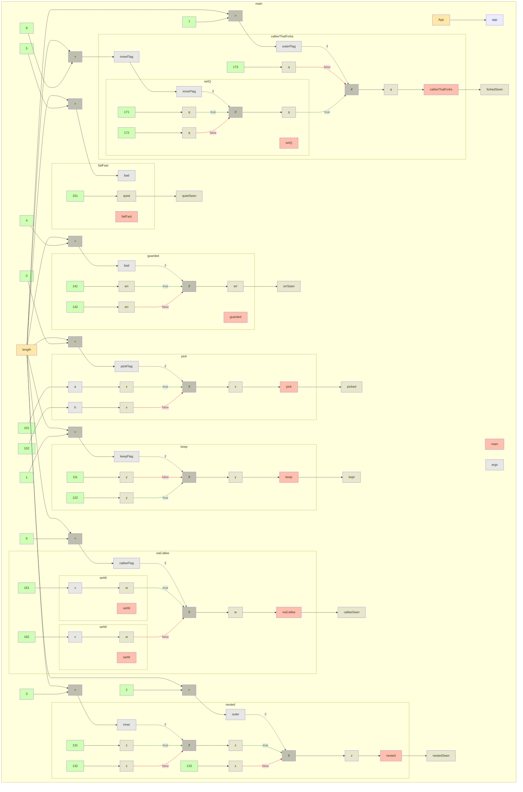

```mermaid
flowchart TD
  subgraph b0["main"]
    n1[main]:::RETURN
    n2[args]:::FUNC_PARAM
    n3[App]:::EXTERNAL
    n4[app]:::OBJ_VARIABLE
    n5[length]:::EXTERNAL
    n6[0]:::LITERAL
    n7[>]:::BIN_OP
    n8[101]:::LITERAL
    n9[102]:::LITERAL
    n19[picked]:::VARIABLE
    n20[1]:::LITERAL
    n21[>]:::BIN_OP
    n31[kept]:::VARIABLE
    n32[2]:::LITERAL
    n33[>]:::BIN_OP
    n34[3]:::LITERAL
    n35[>]:::BIN_OP
    n50[nestedSeen]:::VARIABLE
    n51[4]:::LITERAL
    n52[>]:::BIN_OP
    n62[errSeen]:::VARIABLE
    n63[5]:::LITERAL
    n64[>]:::BIN_OP
    n70[quietSeen]:::VARIABLE
    n71[6]:::LITERAL
    n72[>]:::BIN_OP
    n88[calleeSeen]:::VARIABLE
    n89[7]:::LITERAL
    n90[>]:::BIN_OP
    n91[8]:::LITERAL
    n92[>]:::BIN_OP
    n110[forkedSeen]:::VARIABLE
    n3[App]:::EXTERNAL --> n4[app]:::OBJ_VARIABLE
    n5[length]:::EXTERNAL --> n7[>]:::BIN_OP
    n5[length]:::EXTERNAL --> n21[>]:::BIN_OP
    n5[length]:::EXTERNAL --> n33[>]:::BIN_OP
    n5[length]:::EXTERNAL --> n35[>]:::BIN_OP
    n5[length]:::EXTERNAL --> n52[>]:::BIN_OP
    n5[length]:::EXTERNAL --> n64[>]:::BIN_OP
    n5[length]:::EXTERNAL --> n72[>]:::BIN_OP
    n5[length]:::EXTERNAL --> n90[>]:::BIN_OP
    n5[length]:::EXTERNAL --> n92[>]:::BIN_OP
    n6[0]:::LITERAL --> n7[>]:::BIN_OP
    n7[>]:::BIN_OP --> n12[pickFlag]:::FUNC_PARAM
    n8[101]:::LITERAL --> n13[a]:::FUNC_PARAM
    n9[102]:::LITERAL --> n14[b]:::FUNC_PARAM
    n20[1]:::LITERAL --> n21[>]:::BIN_OP
    n21[>]:::BIN_OP --> n24[keepFlag]:::FUNC_PARAM
    n32[2]:::LITERAL --> n33[>]:::BIN_OP
    n33[>]:::BIN_OP --> n38[outer]:::FUNC_PARAM
    n34[3]:::LITERAL --> n35[>]:::BIN_OP
    n35[>]:::BIN_OP --> n39[inner]:::FUNC_PARAM
    n51[4]:::LITERAL --> n52[>]:::BIN_OP
    n52[>]:::BIN_OP --> n55[bad]:::FUNC_PARAM
    n63[5]:::LITERAL --> n64[>]:::BIN_OP
    n64[>]:::BIN_OP --> n67[bad]:::FUNC_PARAM
    n71[6]:::LITERAL --> n72[>]:::BIN_OP
    n72[>]:::BIN_OP --> n75[calleeFlag]:::FUNC_PARAM
    n89[7]:::LITERAL --> n90[>]:::BIN_OP
    n90[>]:::BIN_OP --> n95[outerFlag]:::FUNC_PARAM
    n91[8]:::LITERAL --> n92[>]:::BIN_OP
    n92[>]:::BIN_OP --> n96[innerFlag]:::FUNC_PARAM
    n11[pick]:::RETURN --> n19[picked]:::VARIABLE
    n23[keep]:::RETURN --> n31[kept]:::VARIABLE
    n37[nested]:::RETURN --> n50[nestedSeen]:::VARIABLE
    n61[err]:::VARIABLE --> n62[errSeen]:::VARIABLE
    n69[quiet]:::VARIABLE --> n70[quietSeen]:::VARIABLE
    n74[viaCallee]:::RETURN --> n88[calleeSeen]:::VARIABLE
    n94[calleeThatForks]:::RETURN --> n110[forkedSeen]:::VARIABLE
    subgraph b10["pick"]
      n11[pick]:::RETURN
      n12[pickFlag]:::FUNC_PARAM
      n13[a]:::FUNC_PARAM
      n14[b]:::FUNC_PARAM
      n15[x]:::VARIABLE
      n16[x]:::VARIABLE
      n17[if]:::BIN_OP
      n18[x]:::VARIABLE
      n12[pickFlag]:::FUNC_PARAM -->|if| n17[if]:::BIN_OP
      n13[a]:::FUNC_PARAM --> n15[x]:::VARIABLE
      n14[b]:::FUNC_PARAM --> n16[x]:::VARIABLE
      n15[x]:::VARIABLE -->|true| n17[if]:::BIN_OP
      n16[x]:::VARIABLE -->|false| n17[if]:::BIN_OP
      n17[if]:::BIN_OP --> n18[x]:::VARIABLE
      n18[x]:::VARIABLE --> n11[pick]:::RETURN
    end
    subgraph b22["keep"]
      n23[keep]:::RETURN
      n24[keepFlag]:::FUNC_PARAM
      n25[111]:::LITERAL
      n26[y]:::VARIABLE
      n27[122]:::LITERAL
      n28[y]:::VARIABLE
      n29[if]:::BIN_OP
      n30[y]:::VARIABLE
      n24[keepFlag]:::FUNC_PARAM -->|if| n29[if]:::BIN_OP
      n25[111]:::LITERAL --> n26[y]:::VARIABLE
      n26[y]:::VARIABLE -->|false| n29[if]:::BIN_OP
      n27[122]:::LITERAL --> n28[y]:::VARIABLE
      n28[y]:::VARIABLE -->|true| n29[if]:::BIN_OP
      n29[if]:::BIN_OP --> n30[y]:::VARIABLE
      n30[y]:::VARIABLE --> n23[keep]:::RETURN
    end
    subgraph b36["nested"]
      n37[nested]:::RETURN
      n38[outer]:::FUNC_PARAM
      n39[inner]:::FUNC_PARAM
      n40[131]:::LITERAL
      n41[z]:::VARIABLE
      n42[132]:::LITERAL
      n43[z]:::VARIABLE
      n44[if]:::BIN_OP
      n45[z]:::VARIABLE
      n46[133]:::LITERAL
      n47[z]:::VARIABLE
      n48[if]:::BIN_OP
      n49[z]:::VARIABLE
      n38[outer]:::FUNC_PARAM -->|if| n48[if]:::BIN_OP
      n39[inner]:::FUNC_PARAM -->|if| n44[if]:::BIN_OP
      n40[131]:::LITERAL --> n41[z]:::VARIABLE
      n41[z]:::VARIABLE -->|true| n44[if]:::BIN_OP
      n42[132]:::LITERAL --> n43[z]:::VARIABLE
      n43[z]:::VARIABLE -->|false| n44[if]:::BIN_OP
      n44[if]:::BIN_OP --> n45[z]:::VARIABLE
      n45[z]:::VARIABLE -->|true| n48[if]:::BIN_OP
      n46[133]:::LITERAL --> n47[z]:::VARIABLE
      n47[z]:::VARIABLE -->|false| n48[if]:::BIN_OP
      n48[if]:::BIN_OP --> n49[z]:::VARIABLE
      n49[z]:::VARIABLE --> n37[nested]:::RETURN
    end
    subgraph b53["guarded"]
      n54[guarded]:::RETURN
      n55[bad]:::FUNC_PARAM
      n56[141]:::LITERAL
      n57[err]:::VARIABLE
      n58[142]:::LITERAL
      n59[err]:::VARIABLE
      n60[if]:::BIN_OP
      n61[err]:::VARIABLE
      n55[bad]:::FUNC_PARAM -->|if| n60[if]:::BIN_OP
      n56[141]:::LITERAL --> n57[err]:::VARIABLE
      n57[err]:::VARIABLE -->|true| n60[if]:::BIN_OP
      n58[142]:::LITERAL --> n59[err]:::VARIABLE
      n59[err]:::VARIABLE -->|false| n60[if]:::BIN_OP
      n60[if]:::BIN_OP --> n61[err]:::VARIABLE
    end
    subgraph b65["failFast"]
      n66[failFast]:::RETURN
      n67[bad]:::FUNC_PARAM
      n68[151]:::LITERAL
      n69[quiet]:::VARIABLE
      n68[151]:::LITERAL --> n69[quiet]:::VARIABLE
    end
    subgraph b73["viaCallee"]
      n74[viaCallee]:::RETURN
      n75[calleeFlag]:::FUNC_PARAM
      n76[161]:::LITERAL
      n81[162]:::LITERAL
      n86[if]:::BIN_OP
      n87[w]:::VARIABLE
      n75[calleeFlag]:::FUNC_PARAM -->|if| n86[if]:::BIN_OP
      n76[161]:::LITERAL --> n79[v]:::FUNC_PARAM
      n81[162]:::LITERAL --> n84[v]:::FUNC_PARAM
      n86[if]:::BIN_OP --> n87[w]:::VARIABLE
      n87[w]:::VARIABLE --> n74[viaCallee]:::RETURN
      n80[w]:::VARIABLE -->|true| n86[if]:::BIN_OP
      n85[w]:::VARIABLE -->|false| n86[if]:::BIN_OP
      subgraph b77["setW"]
        n78[setW]:::RETURN
        n79[v]:::FUNC_PARAM
        n80[w]:::VARIABLE
        n79[v]:::FUNC_PARAM --> n80[w]:::VARIABLE
      end
      subgraph b82["setW"]
        n83[setW]:::RETURN
        n84[v]:::FUNC_PARAM
        n85[w]:::VARIABLE
        n84[v]:::FUNC_PARAM --> n85[w]:::VARIABLE
      end
    end
    subgraph b93["calleeThatForks"]
      n94[calleeThatForks]:::RETURN
      n95[outerFlag]:::FUNC_PARAM
      n96[innerFlag]:::FUNC_PARAM
      n106[173]:::LITERAL
      n107[q]:::VARIABLE
      n108[if]:::BIN_OP
      n109[q]:::VARIABLE
      n95[outerFlag]:::FUNC_PARAM -->|if| n108[if]:::BIN_OP
      n96[innerFlag]:::FUNC_PARAM --> n99[innerFlag]:::FUNC_PARAM
      n106[173]:::LITERAL --> n107[q]:::VARIABLE
      n107[q]:::VARIABLE -->|false| n108[if]:::BIN_OP
      n108[if]:::BIN_OP --> n109[q]:::VARIABLE
      n109[q]:::VARIABLE --> n94[calleeThatForks]:::RETURN
      n105[q]:::VARIABLE -->|true| n108[if]:::BIN_OP
      subgraph b97["setQ"]
        n98[setQ]:::RETURN
        n99[innerFlag]:::FUNC_PARAM
        n100[171]:::LITERAL
        n101[q]:::VARIABLE
        n102[172]:::LITERAL
        n103[q]:::VARIABLE
        n104[if]:::BIN_OP
        n105[q]:::VARIABLE
        n99[innerFlag]:::FUNC_PARAM -->|if| n104[if]:::BIN_OP
        n100[171]:::LITERAL --> n101[q]:::VARIABLE
        n101[q]:::VARIABLE -->|true| n104[if]:::BIN_OP
        n102[172]:::LITERAL --> n103[q]:::VARIABLE
        n103[q]:::VARIABLE -->|false| n104[if]:::BIN_OP
        n104[if]:::BIN_OP --> n105[q]:::VARIABLE
      end
    end
  end
  linkStyle 37 stroke:#6a6a6a,color:#6a6a6a
  linkStyle 40 stroke:#2e7d32,color:#2e7d32
  linkStyle 41 stroke:#c62828,color:#c62828
  linkStyle 44 stroke:#6a6a6a,color:#6a6a6a
  linkStyle 46 stroke:#c62828,color:#c62828
  linkStyle 48 stroke:#2e7d32,color:#2e7d32
  linkStyle 51 stroke:#6a6a6a,color:#6a6a6a
  linkStyle 52 stroke:#6a6a6a,color:#6a6a6a
  linkStyle 54 stroke:#2e7d32,color:#2e7d32
  linkStyle 56 stroke:#c62828,color:#c62828
  linkStyle 58 stroke:#2e7d32,color:#2e7d32
  linkStyle 60 stroke:#c62828,color:#c62828
  linkStyle 63 stroke:#6a6a6a,color:#6a6a6a
  linkStyle 65 stroke:#2e7d32,color:#2e7d32
  linkStyle 67 stroke:#c62828,color:#c62828
  linkStyle 70 stroke:#6a6a6a,color:#6a6a6a
  linkStyle 75 stroke:#2e7d32,color:#2e7d32
  linkStyle 76 stroke:#c62828,color:#c62828
  linkStyle 79 stroke:#6a6a6a,color:#6a6a6a
  linkStyle 82 stroke:#c62828,color:#c62828
  linkStyle 85 stroke:#2e7d32,color:#2e7d32
  linkStyle 86 stroke:#6a6a6a,color:#6a6a6a
  linkStyle 88 stroke:#2e7d32,color:#2e7d32
  linkStyle 90 stroke:#c62828,color:#c62828
  classDef LITERAL fill:#00FF0030
  classDef VARIABLE fill:#80808030
  classDef BIN_OP fill:#80808080
  classDef FUNC_PARAM fill:#8080FF30
  classDef RETURN fill:#FF808080
  classDef EXTERNAL fill:#FFA50040
  classDef UNMODELLED fill:#FF000030,stroke-dasharray: 4 2
```
