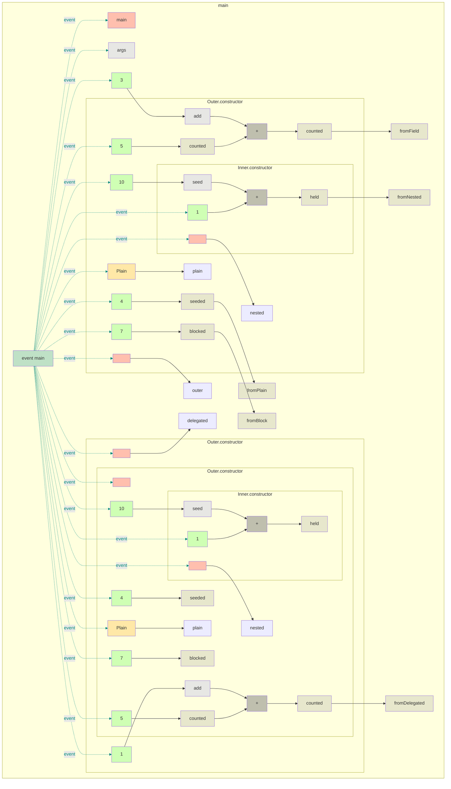

```mermaid
flowchart TD
  subgraph b0["main"]
    n1[event main]:::EVENT
    n2[main]:::RETURN
    n3[args]:::FUNC_PARAM
    n4[3]:::LITERAL
    n26[outer]:::OBJ_VARIABLE
    n27[fromField]:::VARIABLE
    n28[fromBlock]:::VARIABLE
    n29[fromNested]:::VARIABLE
    n30[fromPlain]:::VARIABLE
    n55[delegated]:::OBJ_VARIABLE
    n56[fromDelegated]:::VARIABLE
    n1[event main]:::EVENT -. event .-> n2[main]:::RETURN
    n1[event main]:::EVENT -. event .-> n3[args]:::FUNC_PARAM
    n1[event main]:::EVENT -. event .-> n4[3]:::LITERAL
    n1[event main]:::EVENT -. event .-> n6[<init>]:::RETURN
    n1[event main]:::EVENT -. event .-> n8[10]:::LITERAL
    n1[event main]:::EVENT -. event .-> n16[4]:::LITERAL
    n1[event main]:::EVENT -. event .-> n18[Plain]:::EXTERNAL
    n1[event main]:::EVENT -. event .-> n20[5]:::LITERAL
    n1[event main]:::EVENT -. event .-> n22[7]:::LITERAL
    n1[event main]:::EVENT -. event .-> n10[<init>]:::RETURN
    n1[event main]:::EVENT -. event .-> n12[1]:::LITERAL
    n1[event main]:::EVENT -. event .-> n32[<init>]:::RETURN
    n1[event main]:::EVENT -. event .-> n33[1]:::LITERAL
    n1[event main]:::EVENT -. event .-> n35[<init>]:::RETURN
    n1[event main]:::EVENT -. event .-> n37[10]:::LITERAL
    n1[event main]:::EVENT -. event .-> n45[4]:::LITERAL
    n1[event main]:::EVENT -. event .-> n47[Plain]:::EXTERNAL
    n1[event main]:::EVENT -. event .-> n49[5]:::LITERAL
    n1[event main]:::EVENT -. event .-> n51[7]:::LITERAL
    n1[event main]:::EVENT -. event .-> n39[<init>]:::RETURN
    n1[event main]:::EVENT -. event .-> n41[1]:::LITERAL
    n4[3]:::LITERAL --> n7[add]:::FUNC_PARAM
    n6[<init>]:::RETURN --> n26[outer]:::OBJ_VARIABLE
    n17[seeded]:::VARIABLE --> n30[fromPlain]:::VARIABLE
    n23[blocked]:::VARIABLE --> n28[fromBlock]:::VARIABLE
    n25[counted]:::VARIABLE --> n27[fromField]:::VARIABLE
    n14[held]:::VARIABLE --> n29[fromNested]:::VARIABLE
    n32[<init>]:::RETURN --> n55[delegated]:::OBJ_VARIABLE
    n54[counted]:::VARIABLE --> n56[fromDelegated]:::VARIABLE
    subgraph b5["Outer.constructor"]
      n6[<init>]:::RETURN
      n7[add]:::FUNC_PARAM
      n8[10]:::LITERAL
      n15[nested]:::OBJ_VARIABLE
      n16[4]:::LITERAL
      n17[seeded]:::VARIABLE
      n18[Plain]:::EXTERNAL
      n19[plain]:::OBJ_VARIABLE
      n20[5]:::LITERAL
      n21[counted]:::VARIABLE
      n22[7]:::LITERAL
      n23[blocked]:::VARIABLE
      n24[+]:::BIN_OP
      n25[counted]:::VARIABLE
      n7[add]:::FUNC_PARAM --> n24[+]:::BIN_OP
      n8[10]:::LITERAL --> n11[seed]:::FUNC_PARAM
      n16[4]:::LITERAL --> n17[seeded]:::VARIABLE
      n18[Plain]:::EXTERNAL --> n19[plain]:::OBJ_VARIABLE
      n20[5]:::LITERAL --> n21[counted]:::VARIABLE
      n21[counted]:::VARIABLE --> n24[+]:::BIN_OP
      n22[7]:::LITERAL --> n23[blocked]:::VARIABLE
      n24[+]:::BIN_OP --> n25[counted]:::VARIABLE
      n10[<init>]:::RETURN --> n15[nested]:::OBJ_VARIABLE
      subgraph b9["Inner.constructor"]
        n10[<init>]:::RETURN
        n11[seed]:::FUNC_PARAM
        n12[1]:::LITERAL
        n13[+]:::BIN_OP
        n14[held]:::VARIABLE
        n11[seed]:::FUNC_PARAM --> n13[+]:::BIN_OP
        n12[1]:::LITERAL --> n13[+]:::BIN_OP
        n13[+]:::BIN_OP --> n14[held]:::VARIABLE
      end
    end
    subgraph b31["Outer.constructor"]
      n32[<init>]:::RETURN
      n33[1]:::LITERAL
      n33[1]:::LITERAL --> n36[add]:::FUNC_PARAM
      subgraph b34["Outer.constructor"]
        n35[<init>]:::RETURN
        n36[add]:::FUNC_PARAM
        n37[10]:::LITERAL
        n44[nested]:::OBJ_VARIABLE
        n45[4]:::LITERAL
        n46[seeded]:::VARIABLE
        n47[Plain]:::EXTERNAL
        n48[plain]:::OBJ_VARIABLE
        n49[5]:::LITERAL
        n50[counted]:::VARIABLE
        n51[7]:::LITERAL
        n52[blocked]:::VARIABLE
        n53[+]:::BIN_OP
        n54[counted]:::VARIABLE
        n36[add]:::FUNC_PARAM --> n53[+]:::BIN_OP
        n37[10]:::LITERAL --> n40[seed]:::FUNC_PARAM
        n45[4]:::LITERAL --> n46[seeded]:::VARIABLE
        n47[Plain]:::EXTERNAL --> n48[plain]:::OBJ_VARIABLE
        n49[5]:::LITERAL --> n50[counted]:::VARIABLE
        n50[counted]:::VARIABLE --> n53[+]:::BIN_OP
        n51[7]:::LITERAL --> n52[blocked]:::VARIABLE
        n53[+]:::BIN_OP --> n54[counted]:::VARIABLE
        n39[<init>]:::RETURN --> n44[nested]:::OBJ_VARIABLE
        subgraph b38["Inner.constructor"]
          n39[<init>]:::RETURN
          n40[seed]:::FUNC_PARAM
          n41[1]:::LITERAL
          n42[+]:::BIN_OP
          n43[held]:::VARIABLE
          n40[seed]:::FUNC_PARAM --> n42[+]:::BIN_OP
          n41[1]:::LITERAL --> n42[+]:::BIN_OP
          n42[+]:::BIN_OP --> n43[held]:::VARIABLE
        end
      end
    end
  end
  linkStyle 0 stroke:#00897b,color:#00897b
  linkStyle 1 stroke:#00897b,color:#00897b
  linkStyle 2 stroke:#00897b,color:#00897b
  linkStyle 3 stroke:#00897b,color:#00897b
  linkStyle 4 stroke:#00897b,color:#00897b
  linkStyle 5 stroke:#00897b,color:#00897b
  linkStyle 6 stroke:#00897b,color:#00897b
  linkStyle 7 stroke:#00897b,color:#00897b
  linkStyle 8 stroke:#00897b,color:#00897b
  linkStyle 9 stroke:#00897b,color:#00897b
  linkStyle 10 stroke:#00897b,color:#00897b
  linkStyle 11 stroke:#00897b,color:#00897b
  linkStyle 12 stroke:#00897b,color:#00897b
  linkStyle 13 stroke:#00897b,color:#00897b
  linkStyle 14 stroke:#00897b,color:#00897b
  linkStyle 15 stroke:#00897b,color:#00897b
  linkStyle 16 stroke:#00897b,color:#00897b
  linkStyle 17 stroke:#00897b,color:#00897b
  linkStyle 18 stroke:#00897b,color:#00897b
  linkStyle 19 stroke:#00897b,color:#00897b
  linkStyle 20 stroke:#00897b,color:#00897b
  classDef LITERAL fill:#00FF0030
  classDef VARIABLE fill:#80808030
  classDef BIN_OP fill:#80808080
  classDef FUNC_PARAM fill:#8080FF30
  classDef RETURN fill:#FF808080
  classDef EXTERNAL fill:#FFA50040
  classDef UNMODELLED fill:#FF000030,stroke-dasharray: 4 2
  classDef EVENT fill:#00897B40
```
