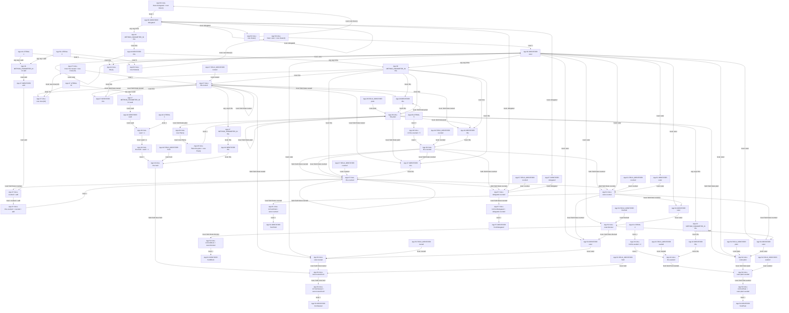

# fieldInitializer: spike value graph

```mermaid
flowchart TD
  n0["App:17 METHOD_PARAMETER_IN<br/>int seed"]
  n1["App:17 METHOD_PARAMETER_IN<br/>this"]
  n2["App:18 CALL<br/>seed + 1"]
  n3["App:18 CALL<br/>this.held"]
  n4["App:18 CALL<br/>this.held = seed + 1"]
  n5["App:18 FIELD_IDENTIFIER<br/>held"]
  n6["App:18 IDENTIFIER<br/>seed"]
  n7["App:18 IDENTIFIER<br/>this"]
  n8["App:18 LITERAL<br/>1"]
  n9["App:22 METHOD_PARAMETER_IN<br/>this"]
  n10["App:23 CALL<br/>int this.seeded = 4"]
  n11["App:23 CALL<br/>this.seeded"]
  n12["App:23 FIELD_IDENTIFIER<br/>seeded"]
  n13["App:23 IDENTIFIER<br/>this"]
  n14["App:23 LITERAL<br/>4"]
  n15["App:27 CALL<br/>Inner this.nested = new Inner(10)"]
  n16["App:27 CALL<br/>new Inner(10)"]
  n17["App:27 CALL<br/>this.nested"]
  n18["App:27 FIELD_IDENTIFIER<br/>nested"]
  n19["App:27 IDENTIFIER<br/>this"]
  n20["App:27 LITERAL<br/>10"]
  n21["App:28 CALL<br/>Plain this.plain = new Plain()"]
  n22["App:28 CALL<br/>new Plain()"]
  n23["App:28 CALL<br/>this.plain"]
  n24["App:28 FIELD_IDENTIFIER<br/>plain"]
  n25["App:28 IDENTIFIER<br/>this"]
  n26["App:29 CALL<br/>int this.counted = 5"]
  n27["App:29 CALL<br/>this.counted"]
  n28["App:29 FIELD_IDENTIFIER<br/>counted"]
  n29["App:29 IDENTIFIER<br/>this"]
  n30["App:29 LITERAL<br/>5"]
  n31["App:36 METHOD_PARAMETER_IN<br/>int add"]
  n32["App:36 METHOD_PARAMETER_IN<br/>this"]
  n33["App:37 CALL<br/>counted + add"]
  n34["App:37 CALL<br/>this.counted"]
  n35["App:37 CALL<br/>this.counted = counted + add"]
  n36["App:37 FIELD_IDENTIFIER<br/>counted"]
  n37["App:37 IDENTIFIER<br/>add"]
  n38["App:37 IDENTIFIER<br/>this"]
  n39["App:43 METHOD_PARAMETER_IN<br/>this"]
  n40["App:44 CALL<br/>this(1);"]
  n41["App:44 IDENTIFIER<br/>this"]
  n42["App:44 LITERAL<br/>1"]
  n43["App:50 CALL<br/>Outer outer = new Outer(3)"]
  n44["App:50 CALL<br/>new Outer(3)"]
  n45["App:50 IDENTIFIER<br/>outer"]
  n46["App:50 LITERAL<br/>3"]
  n47["App:51 CALL<br/>int fromField = outer.counted"]
  n48["App:51 CALL<br/>outer.counted"]
  n49["App:51 FIELD_IDENTIFIER<br/>counted"]
  n50["App:51 IDENTIFIER<br/>fromField"]
  n51["App:51 IDENTIFIER<br/>outer"]
  n52["App:52 CALL<br/>int fromBlock = outer.blocked"]
  n53["App:52 CALL<br/>outer.blocked"]
  n54["App:52 FIELD_IDENTIFIER<br/>blocked"]
  n55["App:52 IDENTIFIER<br/>fromBlock"]
  n56["App:52 IDENTIFIER<br/>outer"]
  n57["App:53 CALL<br/>int fromNested = outer.nested.held"]
  n58["App:53 CALL<br/>outer.nested"]
  n59["App:53 CALL<br/>outer.nested.held"]
  n60["App:53 FIELD_IDENTIFIER<br/>held"]
  n61["App:53 FIELD_IDENTIFIER<br/>nested"]
  n62["App:53 IDENTIFIER<br/>fromNested"]
  n63["App:53 IDENTIFIER<br/>outer"]
  n64["App:54 CALL<br/>int fromPlain = outer.plain.seeded"]
  n65["App:54 CALL<br/>outer.plain"]
  n66["App:54 CALL<br/>outer.plain.seeded"]
  n67["App:54 FIELD_IDENTIFIER<br/>plain"]
  n68["App:54 FIELD_IDENTIFIER<br/>seeded"]
  n69["App:54 IDENTIFIER<br/>fromPlain"]
  n70["App:54 IDENTIFIER<br/>outer"]
  n71["App:56 CALL<br/>Outer delegated = new Outer()"]
  n72["App:56 CALL<br/>new Outer()"]
  n73["App:56 IDENTIFIER<br/>delegated"]
  n74["App:57 CALL<br/>delegated.counted"]
  n75["App:57 CALL<br/>int fromDelegated = delegated.counted"]
  n76["App:57 FIELD_IDENTIFIER<br/>counted"]
  n77["App:57 IDENTIFIER<br/>delegated"]
  n78["App:57 IDENTIFIER<br/>fromDelegated"]
  n0 -->|"local: seed"| n6
  n1 -->|"local: this"| n7
  n10 -->|"local: ="| n11
  n11 -->|"field: field Plain.seeded"| n66
  n12 -->|"local: seeded"| n11
  n13 -->|"local: this"| n11
  n14 -->|"local: 4"| n10
  n15 -->|"local: ="| n17
  n16 -->|"local: new Inner(10)"| n15
  n17 -->|"arg: arg 0 this"| n1
  n17 -->|"field: field Outer.nested"| n17
  n17 -->|"field: field Outer.nested"| n58
  n17 -->|"local: field Outer.nested"| n16
  n17 -->|"local: field Outer.nested"| n17
  n17 -->|"local: field Outer.nested"| n19
  n17 -->|"local: field Outer.nested"| n25
  n17 -->|"local: field Outer.nested"| n29
  n17 -->|"local: field Outer.nested"| n38
  n18 -->|"local: nested"| n17
  n19 -->|"local: this"| n17
  n2 -->|"local: seed + 1"| n4
  n20 -->|"arg: arg 1 seed"| n0
  n20 -->|"local: 10"| n16
  n21 -->|"local: ="| n23
  n22 -->|"local: new Plain()"| n21
  n23 -->|"arg: arg 0 this"| n9
  n23 -->|"field: field Outer.plain"| n23
  n23 -->|"field: field Outer.plain"| n65
  n23 -->|"local: field Outer.plain"| n22
  n23 -->|"local: field Outer.plain"| n23
  n23 -->|"local: field Outer.plain"| n25
  n23 -->|"local: field Outer.plain"| n29
  n23 -->|"local: field Outer.plain"| n38
  n24 -->|"local: plain"| n23
  n25 -->|"local: this"| n23
  n26 -->|"local: ="| n27
  n27 -->|"field: field Outer.counted"| n34
  n27 -->|"field: field Outer.counted"| n48
  n27 -->|"field: field Outer.counted"| n74
  n27 -->|"local: field Outer.counted"| n34
  n27 -->|"local: field Outer.counted"| n38
  n28 -->|"local: counted"| n27
  n29 -->|"local: this"| n27
  n3 -->|"field: field Inner.held"| n59
  n30 -->|"local: 5"| n26
  n31 -->|"local: add"| n37
  n32 -->|"local: this"| n17
  n32 -->|"local: this"| n19
  n32 -->|"local: this"| n23
  n32 -->|"local: this"| n25
  n32 -->|"local: this"| n29
  n32 -->|"local: this"| n34
  n32 -->|"local: this"| n38
  n33 -->|"local: counted + add"| n35
  n34 -->|"field: field Outer.counted"| n34
  n34 -->|"field: field Outer.counted"| n48
  n34 -->|"field: field Outer.counted"| n74
  n34 -->|"local: field Outer.counted"| n33
  n35 -->|"local: ="| n34
  n36 -->|"local: counted"| n34
  n37 -->|"local: add"| n33
  n38 -->|"local: this"| n34
  n39 -->|"local: this"| n41
  n4 -->|"local: ="| n3
  n41 -->|"arg: arg 0 this"| n32
  n41 -->|"local: this"| n40
  n42 -->|"arg: arg 1 add"| n31
  n42 -->|"local: 1"| n40
  n43 -->|"local: ="| n45
  n44 -->|"local: new Outer(3)"| n43
  n45 -->|"arg: arg 0 this"| n32
  n45 -->|"local: outer"| n44
  n45 -->|"local: outer"| n45
  n45 -->|"local: outer"| n48
  n45 -->|"local: outer"| n51
  n45 -->|"local: outer"| n53
  n45 -->|"local: outer"| n56
  n45 -->|"local: outer"| n58
  n45 -->|"local: outer"| n63
  n45 -->|"local: outer"| n65
  n45 -->|"local: outer"| n70
  n46 -->|"arg: arg 1 add"| n31
  n46 -->|"local: 3"| n44
  n47 -->|"local: ="| n50
  n48 -->|"local: field Outer.counted"| n47
  n48 -->|"local: field Outer.counted"| n56
  n48 -->|"local: field Outer.counted"| n63
  n48 -->|"local: field Outer.counted"| n70
  n49 -->|"local: counted"| n48
  n5 -->|"local: held"| n3
  n51 -->|"local: outer"| n48
  n52 -->|"local: ="| n55
  n53 -->|"local: field Outer.blocked"| n52
  n53 -->|"local: field Outer.blocked"| n63
  n53 -->|"local: field Outer.blocked"| n70
  n54 -->|"local: blocked"| n53
  n56 -->|"local: outer"| n53
  n57 -->|"local: ="| n62
  n58 -->|"local: field Outer.nested"| n59
  n59 -->|"local: field Inner.held"| n57
  n6 -->|"local: seed"| n2
  n60 -->|"local: held"| n59
  n61 -->|"local: nested"| n58
  n63 -->|"local: outer"| n58
  n64 -->|"local: ="| n69
  n65 -->|"local: field Outer.plain"| n66
  n66 -->|"local: field Plain.seeded"| n64
  n67 -->|"local: plain"| n65
  n68 -->|"local: seeded"| n66
  n7 -->|"local: this"| n3
  n70 -->|"local: outer"| n65
  n71 -->|"local: ="| n73
  n72 -->|"local: new Outer()"| n71
  n73 -->|"arg: arg 0 this"| n39
  n73 -->|"local: delegated"| n72
  n73 -->|"local: delegated"| n73
  n73 -->|"local: delegated"| n74
  n73 -->|"local: delegated"| n77
  n74 -->|"local: field Outer.counted"| n75
  n75 -->|"local: ="| n78
  n76 -->|"local: counted"| n74
  n77 -->|"local: delegated"| n74
  n8 -->|"local: 1"| n2
  n9 -->|"local: this"| n13
```
