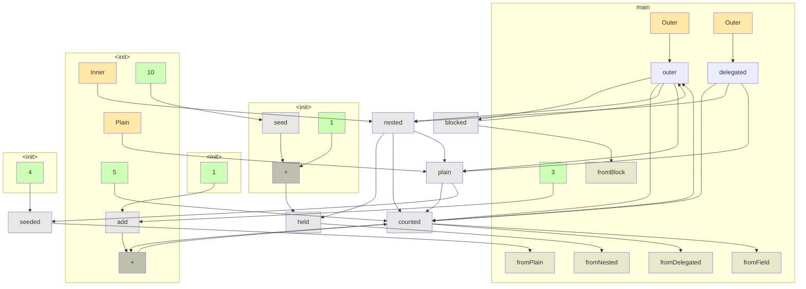

# fieldInitializer: spike value graph (condensed)

```mermaid
flowchart TD
  subgraph m0["main"]
    n0["Outer"]:::EXTERNAL
    n1["Outer"]:::EXTERNAL
    n2["3"]:::LITERAL
    n3["delegated"]:::OBJ_VARIABLE
    n4["fromBlock"]:::VARIABLE
    n5["fromDelegated"]:::VARIABLE
    n6["fromField"]:::VARIABLE
    n7["fromNested"]:::VARIABLE
    n8["fromPlain"]:::VARIABLE
    n9["outer"]:::OBJ_VARIABLE
  end
  subgraph m1["#lt;init#gt;"]
    n10["+"]:::BIN_OP
    n11["seed"]:::FUNC_PARAM
    n12["1"]:::LITERAL
  end
  subgraph m2["#lt;init#gt;"]
    n13["1"]:::LITERAL
  end
  subgraph m3["#lt;init#gt;"]
    n14["+"]:::BIN_OP
    n15["Inner"]:::EXTERNAL
    n16["Plain"]:::EXTERNAL
    n17["add"]:::FUNC_PARAM
    n18["10"]:::LITERAL
    n19["5"]:::LITERAL
  end
  subgraph m4["#lt;init#gt;"]
    n20["4"]:::LITERAL
  end
  n21["held"]:::VARIABLE
  n22["blocked"]:::VARIABLE
  n23["counted"]:::VARIABLE
  n24["nested"]:::VARIABLE
  n25["plain"]:::VARIABLE
  n26["seeded"]:::VARIABLE
  n0 --> n9
  n1 --> n3
  n10 --> n21
  n11 --> n10
  n12 --> n10
  n13 --> n17
  n14 --> n23
  n15 --> n24
  n16 --> n25
  n17 --> n14
  n18 --> n11
  n19 --> n23
  n2 --> n17
  n20 --> n26
  n21 --> n7
  n22 --> n4
  n22 --> n9
  n23 --> n14
  n23 --> n5
  n23 --> n6
  n23 --> n9
  n24 --> n21
  n24 --> n23
  n24 --> n25
  n25 --> n23
  n25 --> n26
  n26 --> n8
  n3 --> n23
  n3 --> n24
  n3 --> n25
  n9 --> n22
  n9 --> n23
  n9 --> n24
  n9 --> n25
  classDef LITERAL fill:#00FF0030
  classDef VARIABLE fill:#80808030
  classDef BIN_OP fill:#80808080
  classDef FUNC_PARAM fill:#8080FF30
  classDef RETURN fill:#FF808080
  classDef EXTERNAL fill:#FFA50040
  classDef UNMODELLED fill:#FF000030,stroke-dasharray: 4 2
```
