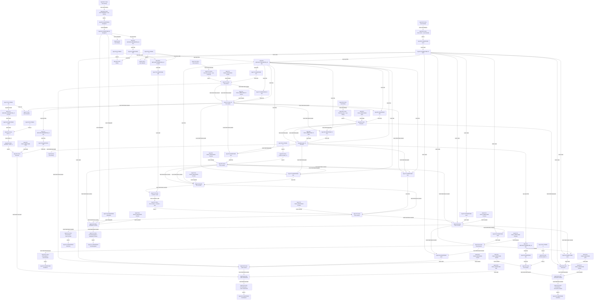

# fieldInitializer: spike value graph

```mermaid
flowchart TD
  n0["App:17:11 METHOD_PARAMETER_IN<br/>int seed"]
  n1["App:17:5 METHOD_PARAMETER_IN<br/>this"]
  n2["App:18:16 CALL<br/>seed + 1"]
  n3["App:18:16 IDENTIFIER<br/>seed"]
  n4["App:18:23 LITERAL<br/>1"]
  n5["App:18:9 CALL<br/>this.held"]
  n6["App:18:9 CALL<br/>this.held = seed + 1"]
  n7["App:18:9 FIELD_IDENTIFIER<br/>held"]
  n8["App:18:9 IDENTIFIER<br/>this"]
  n9["App:22:1 METHOD_PARAMETER_IN<br/>this"]
  n10["App:23:18 LITERAL<br/>4"]
  n11["App:23:5 CALL<br/>this.seeded"]
  n12["App:23:5 FIELD_IDENTIFIER<br/>seeded"]
  n13["App:23:5 IDENTIFIER<br/>this"]
  n14["App:23:9 CALL<br/>int this.seeded = 4"]
  n15["App:27 CALL<br/>new Inner(10)"]
  n16["App:27:11 CALL<br/>Inner this.nested = new Inner(10)"]
  n17["App:27:20 CALL<br/>new Inner(10)"]
  n18["App:27:30 LITERAL<br/>10"]
  n19["App:27:5 CALL #2<br/>this.nested"]
  n20["App:27:5 CALL<br/>this.nested"]
  n21["App:27:5 FIELD_IDENTIFIER #2<br/>nested"]
  n22["App:27:5 FIELD_IDENTIFIER<br/>nested"]
  n23["App:27:5 IDENTIFIER #2<br/>this"]
  n24["App:27:5 IDENTIFIER<br/>this"]
  n25["App:28 CALL<br/>new Plain()"]
  n26["App:28:11 CALL<br/>Plain this.plain = new Plain()"]
  n27["App:28:19 CALL<br/>new Plain()"]
  n28["App:28:5 CALL #2<br/>this.plain"]
  n29["App:28:5 CALL<br/>this.plain"]
  n30["App:28:5 FIELD_IDENTIFIER #2<br/>plain"]
  n31["App:28:5 FIELD_IDENTIFIER<br/>plain"]
  n32["App:28:5 IDENTIFIER #2<br/>this"]
  n33["App:28:5 IDENTIFIER<br/>this"]
  n34["App:29:19 LITERAL<br/>5"]
  n35["App:29:5 CALL<br/>this.counted"]
  n36["App:29:5 FIELD_IDENTIFIER<br/>counted"]
  n37["App:29:5 IDENTIFIER<br/>this"]
  n38["App:29:9 CALL<br/>int this.counted = 5"]
  n39["App:36:11 METHOD_PARAMETER_IN<br/>int add"]
  n40["App:36:5 METHOD_PARAMETER_IN<br/>this"]
  n41["App:37:19 CALL<br/>counted + add"]
  n42["App:37:19 CALL<br/>this.counted"]
  n43["App:37:19 FIELD_IDENTIFIER<br/>counted"]
  n44["App:37:19 IDENTIFIER<br/>this"]
  n45["App:37:29 IDENTIFIER<br/>add"]
  n46["App:37:9 CALL<br/>this.counted"]
  n47["App:37:9 CALL<br/>this.counted = counted + add"]
  n48["App:37:9 FIELD_IDENTIFIER<br/>counted"]
  n49["App:37:9 IDENTIFIER<br/>this"]
  n50["App:43:5 METHOD_PARAMETER_IN<br/>this"]
  n51["App:44:14 LITERAL<br/>1"]
  n52["App:44:9 CALL<br/>this(1);"]
  n53["App:44:9 IDENTIFIER<br/>this"]
  n54["App:50 CALL<br/>new Outer(3)"]
  n55["App:50:15 CALL<br/>Outer outer = new Outer(3)"]
  n56["App:50:15 IDENTIFIER #2<br/>outer"]
  n57["App:50:15 IDENTIFIER<br/>outer"]
  n58["App:50:23 CALL<br/>new Outer(3)"]
  n59["App:50:33 LITERAL<br/>3"]
  n60["App:51:13 CALL<br/>int fromField = outer.counted"]
  n61["App:51:13 IDENTIFIER<br/>fromField"]
  n62["App:51:25 CALL<br/>outer.counted"]
  n63["App:51:25 IDENTIFIER<br/>outer"]
  n64["App:51:31 FIELD_IDENTIFIER<br/>counted"]
  n65["App:52:13 CALL<br/>int fromBlock = outer.blocked"]
  n66["App:52:13 IDENTIFIER<br/>fromBlock"]
  n67["App:52:25 CALL<br/>outer.blocked"]
  n68["App:52:25 IDENTIFIER<br/>outer"]
  n69["App:52:31 FIELD_IDENTIFIER<br/>blocked"]
  n70["App:53:13 CALL<br/>int fromNested = outer.nested.held"]
  n71["App:53:13 IDENTIFIER<br/>fromNested"]
  n72["App:53:26 CALL<br/>outer.nested"]
  n73["App:53:26 CALL<br/>outer.nested.held"]
  n74["App:53:26 IDENTIFIER<br/>outer"]
  n75["App:53:32 FIELD_IDENTIFIER<br/>nested"]
  n76["App:53:39 FIELD_IDENTIFIER<br/>held"]
  n77["App:54:13 CALL<br/>int fromPlain = outer.plain.seeded"]
  n78["App:54:13 IDENTIFIER<br/>fromPlain"]
  n79["App:54:25 CALL<br/>outer.plain"]
  n80["App:54:25 CALL<br/>outer.plain.seeded"]
  n81["App:54:25 IDENTIFIER<br/>outer"]
  n82["App:54:31 FIELD_IDENTIFIER<br/>plain"]
  n83["App:54:37 FIELD_IDENTIFIER<br/>seeded"]
  n84["App:56 CALL<br/>new Outer()"]
  n85["App:56:15 CALL<br/>Outer delegated = new Outer()"]
  n86["App:56:15 IDENTIFIER #2<br/>delegated"]
  n87["App:56:15 IDENTIFIER<br/>delegated"]
  n88["App:56:27 CALL<br/>new Outer()"]
  n89["App:57:13 CALL<br/>int fromDelegated = delegated.counted"]
  n90["App:57:13 IDENTIFIER<br/>fromDelegated"]
  n91["App:57:29 CALL<br/>delegated.counted"]
  n92["App:57:29 IDENTIFIER<br/>delegated"]
  n93["App:57:39 FIELD_IDENTIFIER<br/>counted"]
  n0 -->|"local: seed"| n3
  n1 -->|"local: this"| n8
  n10 -->|"local: 4"| n14
  n11 -->|"field: field Plain.seeded"| n80
  n12 -->|"local: seeded"| n11
  n13 -->|"local: this"| n11
  n14 -->|"local: ="| n11
  n16 -->|"local: ="| n20
  n17 -->|"local: new Inner(10)"| n16
  n18 -->|"arg: arg 1 seed"| n0
  n18 -->|"local: 10"| n15
  n19 -->|"arg: arg 0 this"| n1
  n19 -->|"local: field Outer.nested"| n15
  n19 -->|"local: field Outer.nested"| n32
  n19 -->|"local: field Outer.nested"| n33
  n19 -->|"local: field Outer.nested"| n37
  n19 -->|"local: field Outer.nested"| n44
  n19 -->|"local: field Outer.nested"| n49
  n2 -->|"local: seed + 1"| n6
  n20 -->|"field: field Outer.nested"| n19
  n20 -->|"field: field Outer.nested"| n72
  n20 -->|"local: field Outer.nested"| n19
  n20 -->|"local: field Outer.nested"| n23
  n21 -->|"local: nested"| n19
  n22 -->|"local: nested"| n20
  n23 -->|"local: this"| n19
  n24 -->|"local: this"| n20
  n26 -->|"local: ="| n29
  n27 -->|"local: new Plain()"| n26
  n28 -->|"arg: arg 0 this"| n9
  n28 -->|"local: field Outer.plain"| n25
  n28 -->|"local: field Outer.plain"| n37
  n28 -->|"local: field Outer.plain"| n44
  n28 -->|"local: field Outer.plain"| n49
  n29 -->|"field: field Outer.plain"| n28
  n29 -->|"field: field Outer.plain"| n79
  n29 -->|"local: field Outer.plain"| n28
  n29 -->|"local: field Outer.plain"| n32
  n3 -->|"local: seed"| n2
  n30 -->|"local: plain"| n28
  n31 -->|"local: plain"| n29
  n32 -->|"local: this"| n28
  n33 -->|"local: this"| n29
  n34 -->|"local: 5"| n38
  n35 -->|"field: field Outer.counted"| n42
  n35 -->|"field: field Outer.counted"| n62
  n35 -->|"field: field Outer.counted"| n91
  n35 -->|"local: field Outer.counted"| n42
  n35 -->|"local: field Outer.counted"| n44
  n35 -->|"local: field Outer.counted"| n49
  n36 -->|"local: counted"| n35
  n37 -->|"local: this"| n35
  n38 -->|"local: ="| n35
  n39 -->|"local: add"| n45
  n4 -->|"local: 1"| n2
  n40 -->|"local: this"| n19
  n40 -->|"local: this"| n23
  n40 -->|"local: this"| n24
  n40 -->|"local: this"| n28
  n40 -->|"local: this"| n32
  n40 -->|"local: this"| n33
  n40 -->|"local: this"| n37
  n40 -->|"local: this"| n42
  n40 -->|"local: this"| n44
  n40 -->|"local: this"| n49
  n41 -->|"local: counted + add"| n47
  n42 -->|"local: field Outer.counted"| n41
  n43 -->|"local: counted"| n42
  n44 -->|"local: this"| n42
  n45 -->|"local: add"| n41
  n46 -->|"field: field Outer.counted"| n42
  n46 -->|"field: field Outer.counted"| n62
  n46 -->|"field: field Outer.counted"| n91
  n47 -->|"local: ="| n46
  n48 -->|"local: counted"| n46
  n49 -->|"local: this"| n46
  n5 -->|"field: field Inner.held"| n73
  n50 -->|"local: this"| n53
  n51 -->|"arg: arg 1 add"| n39
  n51 -->|"local: 1"| n52
  n53 -->|"arg: arg 0 this"| n40
  n53 -->|"local: this"| n52
  n55 -->|"local: ="| n57
  n56 -->|"arg: arg 0 this"| n40
  n56 -->|"local: outer"| n54
  n56 -->|"local: outer"| n62
  n56 -->|"local: outer"| n63
  n56 -->|"local: outer"| n67
  n56 -->|"local: outer"| n68
  n56 -->|"local: outer"| n72
  n56 -->|"local: outer"| n74
  n56 -->|"local: outer"| n79
  n56 -->|"local: outer"| n81
  n57 -->|"local: outer"| n56
  n58 -->|"local: new Outer(3)"| n55
  n59 -->|"arg: arg 1 add"| n39
  n59 -->|"local: 3"| n54
  n6 -->|"local: ="| n5
  n60 -->|"local: ="| n61
  n62 -->|"local: field Outer.counted"| n60
  n62 -->|"local: field Outer.counted"| n68
  n62 -->|"local: field Outer.counted"| n74
  n62 -->|"local: field Outer.counted"| n81
  n63 -->|"local: outer"| n62
  n64 -->|"local: counted"| n62
  n65 -->|"local: ="| n66
  n67 -->|"local: field Outer.blocked"| n65
  n67 -->|"local: field Outer.blocked"| n74
  n67 -->|"local: field Outer.blocked"| n81
  n68 -->|"local: outer"| n67
  n69 -->|"local: blocked"| n67
  n7 -->|"local: held"| n5
  n70 -->|"local: ="| n71
  n72 -->|"local: field Outer.nested"| n73
  n73 -->|"local: field Inner.held"| n70
  n74 -->|"local: outer"| n72
  n75 -->|"local: nested"| n72
  n76 -->|"local: held"| n73
  n77 -->|"local: ="| n78
  n79 -->|"local: field Outer.plain"| n80
  n8 -->|"local: this"| n5
  n80 -->|"local: field Plain.seeded"| n77
  n81 -->|"local: outer"| n79
  n82 -->|"local: plain"| n79
  n83 -->|"local: seeded"| n80
  n85 -->|"local: ="| n87
  n86 -->|"arg: arg 0 this"| n50
  n86 -->|"local: delegated"| n84
  n86 -->|"local: delegated"| n91
  n86 -->|"local: delegated"| n92
  n87 -->|"local: delegated"| n86
  n88 -->|"local: new Outer()"| n85
  n89 -->|"local: ="| n90
  n9 -->|"local: this"| n13
  n91 -->|"local: field Outer.counted"| n89
  n92 -->|"local: delegated"| n91
  n93 -->|"local: counted"| n91
```
