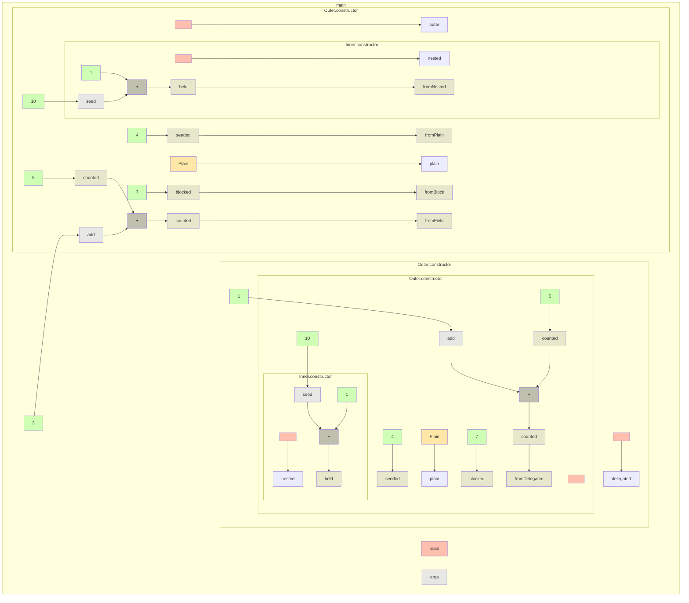

```mermaid
flowchart TD
  subgraph b0["main"]
    n1[main]:::RETURN
    n2[args]:::FUNC_PARAM
    n3[3]:::LITERAL
    n25[outer]:::OBJ_VARIABLE
    n26[fromField]:::VARIABLE
    n27[fromBlock]:::VARIABLE
    n28[fromNested]:::VARIABLE
    n29[fromPlain]:::VARIABLE
    n54[delegated]:::OBJ_VARIABLE
    n55[fromDelegated]:::VARIABLE
    n3[3]:::LITERAL --> n6[add]:::FUNC_PARAM
    subgraph b4["Outer.constructor"]
      n5[<init>]:::RETURN
      n6[add]:::FUNC_PARAM
      n7[10]:::LITERAL
      n14[nested]:::OBJ_VARIABLE
      n15[4]:::LITERAL
      n16[seeded]:::VARIABLE
      n17[Plain]:::EXTERNAL
      n18[plain]:::OBJ_VARIABLE
      n19[5]:::LITERAL
      n20[counted]:::VARIABLE
      n21[7]:::LITERAL
      n22[blocked]:::VARIABLE
      n23[+]:::BIN_OP
      n24[counted]:::VARIABLE
      n5[<init>]:::RETURN --> n25[outer]:::OBJ_VARIABLE
      n6[add]:::FUNC_PARAM --> n23[+]:::BIN_OP
      n7[10]:::LITERAL --> n10[seed]:::FUNC_PARAM
      n15[4]:::LITERAL --> n16[seeded]:::VARIABLE
      n16[seeded]:::VARIABLE --> n29[fromPlain]:::VARIABLE
      n17[Plain]:::EXTERNAL --> n18[plain]:::OBJ_VARIABLE
      n19[5]:::LITERAL --> n20[counted]:::VARIABLE
      n20[counted]:::VARIABLE --> n23[+]:::BIN_OP
      n21[7]:::LITERAL --> n22[blocked]:::VARIABLE
      n22[blocked]:::VARIABLE --> n27[fromBlock]:::VARIABLE
      n23[+]:::BIN_OP --> n24[counted]:::VARIABLE
      n24[counted]:::VARIABLE --> n26[fromField]:::VARIABLE
      subgraph b8["Inner.constructor"]
        n9[<init>]:::RETURN
        n10[seed]:::FUNC_PARAM
        n11[1]:::LITERAL
        n12[+]:::BIN_OP
        n13[held]:::VARIABLE
        n9[<init>]:::RETURN --> n14[nested]:::OBJ_VARIABLE
        n10[seed]:::FUNC_PARAM --> n12[+]:::BIN_OP
        n11[1]:::LITERAL --> n12[+]:::BIN_OP
        n12[+]:::BIN_OP --> n13[held]:::VARIABLE
        n13[held]:::VARIABLE --> n28[fromNested]:::VARIABLE
      end
    end
    subgraph b30["Outer.constructor"]
      n31[<init>]:::RETURN
      n35[1]:::LITERAL
      n31[<init>]:::RETURN --> n54[delegated]:::OBJ_VARIABLE
      n35[1]:::LITERAL --> n34[add]:::FUNC_PARAM
      subgraph b32["Outer.constructor"]
        n33[<init>]:::RETURN
        n34[add]:::FUNC_PARAM
        n36[10]:::LITERAL
        n43[nested]:::OBJ_VARIABLE
        n44[4]:::LITERAL
        n45[seeded]:::VARIABLE
        n46[Plain]:::EXTERNAL
        n47[plain]:::OBJ_VARIABLE
        n48[5]:::LITERAL
        n49[counted]:::VARIABLE
        n50[7]:::LITERAL
        n51[blocked]:::VARIABLE
        n52[+]:::BIN_OP
        n53[counted]:::VARIABLE
        n34[add]:::FUNC_PARAM --> n52[+]:::BIN_OP
        n36[10]:::LITERAL --> n39[seed]:::FUNC_PARAM
        n44[4]:::LITERAL --> n45[seeded]:::VARIABLE
        n46[Plain]:::EXTERNAL --> n47[plain]:::OBJ_VARIABLE
        n48[5]:::LITERAL --> n49[counted]:::VARIABLE
        n49[counted]:::VARIABLE --> n52[+]:::BIN_OP
        n50[7]:::LITERAL --> n51[blocked]:::VARIABLE
        n52[+]:::BIN_OP --> n53[counted]:::VARIABLE
        n53[counted]:::VARIABLE --> n55[fromDelegated]:::VARIABLE
        subgraph b37["Inner.constructor"]
          n38[<init>]:::RETURN
          n39[seed]:::FUNC_PARAM
          n40[1]:::LITERAL
          n41[+]:::BIN_OP
          n42[held]:::VARIABLE
          n38[<init>]:::RETURN --> n43[nested]:::OBJ_VARIABLE
          n39[seed]:::FUNC_PARAM --> n41[+]:::BIN_OP
          n40[1]:::LITERAL --> n41[+]:::BIN_OP
          n41[+]:::BIN_OP --> n42[held]:::VARIABLE
        end
      end
    end
  end
  classDef LITERAL fill:#00FF0030
  classDef VARIABLE fill:#80808030
  classDef BIN_OP fill:#80808080
  classDef FUNC_PARAM fill:#8080FF30
  classDef RETURN fill:#FF808080
  classDef EXTERNAL fill:#FFA50040
```
