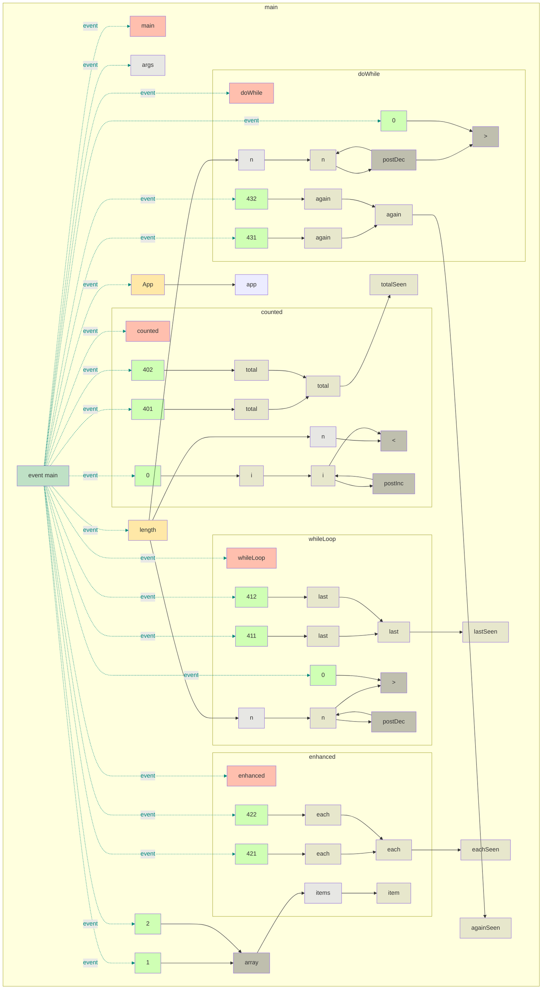

```mermaid
flowchart TD
  subgraph b0["main"]
    n1[event main]:::EVENT
    n2[main]:::RETURN
    n3[args]:::FUNC_PARAM
    n4[App]:::EXTERNAL
    n5[app]:::OBJ_VARIABLE
    n6[length]:::EXTERNAL
    n20[totalSeen]:::VARIABLE
    n33[lastSeen]:::VARIABLE
    n34[1]:::LITERAL
    n35[2]:::LITERAL
    n36[array]:::BIN_OP
    n46[eachSeen]:::VARIABLE
    n59[againSeen]:::VARIABLE
    n1[event main]:::EVENT -. event .-> n2[main]:::RETURN
    n1[event main]:::EVENT -. event .-> n3[args]:::FUNC_PARAM
    n1[event main]:::EVENT -. event .-> n4[App]:::EXTERNAL
    n1[event main]:::EVENT -. event .-> n6[length]:::EXTERNAL
    n1[event main]:::EVENT -. event .-> n34[1]:::LITERAL
    n1[event main]:::EVENT -. event .-> n35[2]:::LITERAL
    n1[event main]:::EVENT -. event .-> n8[counted]:::RETURN
    n1[event main]:::EVENT -. event .-> n10[401]:::LITERAL
    n1[event main]:::EVENT -. event .-> n12[0]:::LITERAL
    n1[event main]:::EVENT -. event .-> n16[402]:::LITERAL
    n1[event main]:::EVENT -. event .-> n22[whileLoop]:::RETURN
    n1[event main]:::EVENT -. event .-> n24[411]:::LITERAL
    n1[event main]:::EVENT -. event .-> n27[0]:::LITERAL
    n1[event main]:::EVENT -. event .-> n29[412]:::LITERAL
    n1[event main]:::EVENT -. event .-> n38[enhanced]:::RETURN
    n1[event main]:::EVENT -. event .-> n40[421]:::LITERAL
    n1[event main]:::EVENT -. event .-> n43[422]:::LITERAL
    n1[event main]:::EVENT -. event .-> n48[doWhile]:::RETURN
    n1[event main]:::EVENT -. event .-> n50[431]:::LITERAL
    n1[event main]:::EVENT -. event .-> n53[432]:::LITERAL
    n1[event main]:::EVENT -. event .-> n56[0]:::LITERAL
    n4[App]:::EXTERNAL --> n5[app]:::OBJ_VARIABLE
    n6[length]:::EXTERNAL --> n9[n]:::FUNC_PARAM
    n6[length]:::EXTERNAL --> n23[n]:::FUNC_PARAM
    n6[length]:::EXTERNAL --> n49[n]:::FUNC_PARAM
    n34[1]:::LITERAL --> n36[array]:::BIN_OP
    n35[2]:::LITERAL --> n36[array]:::BIN_OP
    n36[array]:::BIN_OP --> n39[items]:::FUNC_PARAM
    n19[total]:::VARIABLE --> n20[totalSeen]:::VARIABLE
    n32[last]:::VARIABLE --> n33[lastSeen]:::VARIABLE
    n45[each]:::VARIABLE --> n46[eachSeen]:::VARIABLE
    n58[again]:::VARIABLE --> n59[againSeen]:::VARIABLE
    subgraph b7["counted"]
      n8[counted]:::RETURN
      n9[n]:::FUNC_PARAM
      n10[401]:::LITERAL
      n11[total]:::VARIABLE
      n12[0]:::LITERAL
      n13[i]:::VARIABLE
      n14[i]:::VARIABLE
      n15[<]:::BIN_OP
      n16[402]:::LITERAL
      n17[total]:::VARIABLE
      n18[postInc]:::BIN_OP
      n19[total]:::VARIABLE
      n9[n]:::FUNC_PARAM --> n15[<]:::BIN_OP
      n10[401]:::LITERAL --> n11[total]:::VARIABLE
      n11[total]:::VARIABLE --> n19[total]:::VARIABLE
      n12[0]:::LITERAL --> n13[i]:::VARIABLE
      n13[i]:::VARIABLE --> n14[i]:::VARIABLE
      n14[i]:::VARIABLE --> n15[<]:::BIN_OP
      n14[i]:::VARIABLE --> n18[postInc]:::BIN_OP
      n16[402]:::LITERAL --> n17[total]:::VARIABLE
      n17[total]:::VARIABLE --> n19[total]:::VARIABLE
      n18[postInc]:::BIN_OP --> n14[i]:::VARIABLE
    end
    subgraph b21["whileLoop"]
      n22[whileLoop]:::RETURN
      n23[n]:::FUNC_PARAM
      n24[411]:::LITERAL
      n25[last]:::VARIABLE
      n26[n]:::VARIABLE
      n27[0]:::LITERAL
      n28[>]:::BIN_OP
      n29[412]:::LITERAL
      n30[last]:::VARIABLE
      n31[postDec]:::BIN_OP
      n32[last]:::VARIABLE
      n23[n]:::FUNC_PARAM --> n26[n]:::VARIABLE
      n24[411]:::LITERAL --> n25[last]:::VARIABLE
      n25[last]:::VARIABLE --> n32[last]:::VARIABLE
      n26[n]:::VARIABLE --> n28[>]:::BIN_OP
      n26[n]:::VARIABLE --> n31[postDec]:::BIN_OP
      n27[0]:::LITERAL --> n28[>]:::BIN_OP
      n29[412]:::LITERAL --> n30[last]:::VARIABLE
      n30[last]:::VARIABLE --> n32[last]:::VARIABLE
      n31[postDec]:::BIN_OP --> n26[n]:::VARIABLE
    end
    subgraph b37["enhanced"]
      n38[enhanced]:::RETURN
      n39[items]:::FUNC_PARAM
      n40[421]:::LITERAL
      n41[each]:::VARIABLE
      n42[item]:::VARIABLE
      n43[422]:::LITERAL
      n44[each]:::VARIABLE
      n45[each]:::VARIABLE
      n39[items]:::FUNC_PARAM --> n42[item]:::VARIABLE
      n40[421]:::LITERAL --> n41[each]:::VARIABLE
      n41[each]:::VARIABLE --> n45[each]:::VARIABLE
      n43[422]:::LITERAL --> n44[each]:::VARIABLE
      n44[each]:::VARIABLE --> n45[each]:::VARIABLE
    end
    subgraph b47["doWhile"]
      n48[doWhile]:::RETURN
      n49[n]:::FUNC_PARAM
      n50[431]:::LITERAL
      n51[again]:::VARIABLE
      n52[n]:::VARIABLE
      n53[432]:::LITERAL
      n54[again]:::VARIABLE
      n55[postDec]:::BIN_OP
      n56[0]:::LITERAL
      n57[>]:::BIN_OP
      n58[again]:::VARIABLE
      n49[n]:::FUNC_PARAM --> n52[n]:::VARIABLE
      n50[431]:::LITERAL --> n51[again]:::VARIABLE
      n51[again]:::VARIABLE --> n58[again]:::VARIABLE
      n52[n]:::VARIABLE --> n55[postDec]:::BIN_OP
      n53[432]:::LITERAL --> n54[again]:::VARIABLE
      n54[again]:::VARIABLE --> n58[again]:::VARIABLE
      n55[postDec]:::BIN_OP --> n57[>]:::BIN_OP
      n55[postDec]:::BIN_OP --> n52[n]:::VARIABLE
      n56[0]:::LITERAL --> n57[>]:::BIN_OP
    end
  end
  linkStyle 0 stroke:#00897b,color:#00897b
  linkStyle 1 stroke:#00897b,color:#00897b
  linkStyle 2 stroke:#00897b,color:#00897b
  linkStyle 3 stroke:#00897b,color:#00897b
  linkStyle 4 stroke:#00897b,color:#00897b
  linkStyle 5 stroke:#00897b,color:#00897b
  linkStyle 6 stroke:#00897b,color:#00897b
  linkStyle 7 stroke:#00897b,color:#00897b
  linkStyle 8 stroke:#00897b,color:#00897b
  linkStyle 9 stroke:#00897b,color:#00897b
  linkStyle 10 stroke:#00897b,color:#00897b
  linkStyle 11 stroke:#00897b,color:#00897b
  linkStyle 12 stroke:#00897b,color:#00897b
  linkStyle 13 stroke:#00897b,color:#00897b
  linkStyle 14 stroke:#00897b,color:#00897b
  linkStyle 15 stroke:#00897b,color:#00897b
  linkStyle 16 stroke:#00897b,color:#00897b
  linkStyle 17 stroke:#00897b,color:#00897b
  linkStyle 18 stroke:#00897b,color:#00897b
  linkStyle 19 stroke:#00897b,color:#00897b
  linkStyle 20 stroke:#00897b,color:#00897b
  classDef LITERAL fill:#00FF0030
  classDef VARIABLE fill:#80808030
  classDef BIN_OP fill:#80808080
  classDef FUNC_PARAM fill:#8080FF30
  classDef RETURN fill:#FF808080
  classDef EXTERNAL fill:#FFA50040
  classDef UNMODELLED fill:#FF000030,stroke-dasharray: 4 2
  classDef EVENT fill:#00897B40
```
