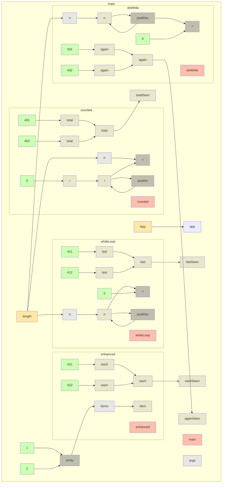

```mermaid
flowchart TD
  subgraph b0["main"]
    n1[main]:::RETURN
    n2[args]:::FUNC_PARAM
    n3[App]:::EXTERNAL
    n4[app]:::OBJ_VARIABLE
    n5[length]:::EXTERNAL
    n19[totalSeen]:::VARIABLE
    n32[lastSeen]:::VARIABLE
    n33[1]:::LITERAL
    n34[2]:::LITERAL
    n35[array]:::BIN_OP
    n45[eachSeen]:::VARIABLE
    n58[againSeen]:::VARIABLE
    n3[App]:::EXTERNAL --> n4[app]:::OBJ_VARIABLE
    n5[length]:::EXTERNAL --> n8[n]:::FUNC_PARAM
    n5[length]:::EXTERNAL --> n22[n]:::FUNC_PARAM
    n5[length]:::EXTERNAL --> n48[n]:::FUNC_PARAM
    n33[1]:::LITERAL --> n35[array]:::BIN_OP
    n34[2]:::LITERAL --> n35[array]:::BIN_OP
    n35[array]:::BIN_OP --> n38[items]:::FUNC_PARAM
    n18[total]:::VARIABLE --> n19[totalSeen]:::VARIABLE
    n31[last]:::VARIABLE --> n32[lastSeen]:::VARIABLE
    n44[each]:::VARIABLE --> n45[eachSeen]:::VARIABLE
    n57[again]:::VARIABLE --> n58[againSeen]:::VARIABLE
    subgraph b6["counted"]
      n7[counted]:::RETURN
      n8[n]:::FUNC_PARAM
      n9[401]:::LITERAL
      n10[total]:::VARIABLE
      n11[0]:::LITERAL
      n12[i]:::VARIABLE
      n13[i]:::VARIABLE
      n14[<]:::BIN_OP
      n15[402]:::LITERAL
      n16[total]:::VARIABLE
      n17[postInc]:::BIN_OP
      n18[total]:::VARIABLE
      n8[n]:::FUNC_PARAM --> n14[<]:::BIN_OP
      n9[401]:::LITERAL --> n10[total]:::VARIABLE
      n10[total]:::VARIABLE --> n18[total]:::VARIABLE
      n11[0]:::LITERAL --> n12[i]:::VARIABLE
      n12[i]:::VARIABLE --> n13[i]:::VARIABLE
      n13[i]:::VARIABLE --> n14[<]:::BIN_OP
      n13[i]:::VARIABLE --> n17[postInc]:::BIN_OP
      n15[402]:::LITERAL --> n16[total]:::VARIABLE
      n16[total]:::VARIABLE --> n18[total]:::VARIABLE
      n17[postInc]:::BIN_OP --> n13[i]:::VARIABLE
    end
    subgraph b20["whileLoop"]
      n21[whileLoop]:::RETURN
      n22[n]:::FUNC_PARAM
      n23[411]:::LITERAL
      n24[last]:::VARIABLE
      n25[n]:::VARIABLE
      n26[0]:::LITERAL
      n27[>]:::BIN_OP
      n28[412]:::LITERAL
      n29[last]:::VARIABLE
      n30[postDec]:::BIN_OP
      n31[last]:::VARIABLE
      n22[n]:::FUNC_PARAM --> n25[n]:::VARIABLE
      n23[411]:::LITERAL --> n24[last]:::VARIABLE
      n24[last]:::VARIABLE --> n31[last]:::VARIABLE
      n25[n]:::VARIABLE --> n27[>]:::BIN_OP
      n25[n]:::VARIABLE --> n30[postDec]:::BIN_OP
      n26[0]:::LITERAL --> n27[>]:::BIN_OP
      n28[412]:::LITERAL --> n29[last]:::VARIABLE
      n29[last]:::VARIABLE --> n31[last]:::VARIABLE
      n30[postDec]:::BIN_OP --> n25[n]:::VARIABLE
    end
    subgraph b36["enhanced"]
      n37[enhanced]:::RETURN
      n38[items]:::FUNC_PARAM
      n39[421]:::LITERAL
      n40[each]:::VARIABLE
      n41[item]:::VARIABLE
      n42[422]:::LITERAL
      n43[each]:::VARIABLE
      n44[each]:::VARIABLE
      n38[items]:::FUNC_PARAM --> n41[item]:::VARIABLE
      n39[421]:::LITERAL --> n40[each]:::VARIABLE
      n40[each]:::VARIABLE --> n44[each]:::VARIABLE
      n42[422]:::LITERAL --> n43[each]:::VARIABLE
      n43[each]:::VARIABLE --> n44[each]:::VARIABLE
    end
    subgraph b46["doWhile"]
      n47[doWhile]:::RETURN
      n48[n]:::FUNC_PARAM
      n49[431]:::LITERAL
      n50[again]:::VARIABLE
      n51[n]:::VARIABLE
      n52[432]:::LITERAL
      n53[again]:::VARIABLE
      n54[postDec]:::BIN_OP
      n55[0]:::LITERAL
      n56[>]:::BIN_OP
      n57[again]:::VARIABLE
      n48[n]:::FUNC_PARAM --> n51[n]:::VARIABLE
      n49[431]:::LITERAL --> n50[again]:::VARIABLE
      n50[again]:::VARIABLE --> n57[again]:::VARIABLE
      n51[n]:::VARIABLE --> n54[postDec]:::BIN_OP
      n52[432]:::LITERAL --> n53[again]:::VARIABLE
      n53[again]:::VARIABLE --> n57[again]:::VARIABLE
      n54[postDec]:::BIN_OP --> n56[>]:::BIN_OP
      n54[postDec]:::BIN_OP --> n51[n]:::VARIABLE
      n55[0]:::LITERAL --> n56[>]:::BIN_OP
    end
  end
  classDef LITERAL fill:#00FF0030
  classDef VARIABLE fill:#80808030
  classDef BIN_OP fill:#80808080
  classDef FUNC_PARAM fill:#8080FF30
  classDef RETURN fill:#FF808080
  classDef EXTERNAL fill:#FFA50040
  classDef UNMODELLED fill:#FF000030,stroke-dasharray: 4 2
```
