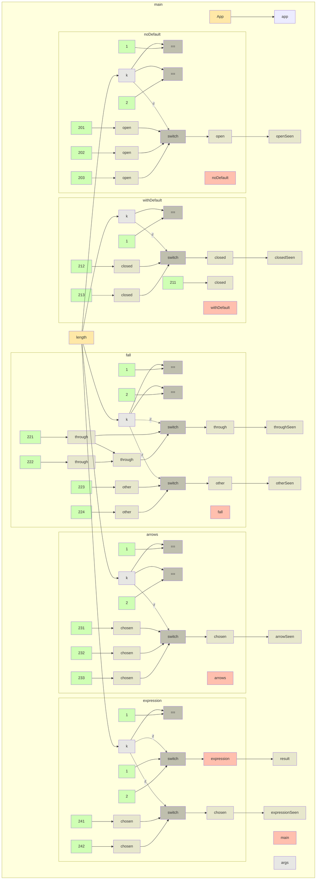

```mermaid
flowchart TD
  subgraph b0["main"]
    n1[main]:::RETURN
    n2[args]:::FUNC_PARAM
    n3[App]:::EXTERNAL
    n4[app]:::OBJ_VARIABLE
    n5[length]:::EXTERNAL
    n21[openSeen]:::VARIABLE
    n35[closedSeen]:::VARIABLE
    n56[throughSeen]:::VARIABLE
    n57[otherSeen]:::VARIABLE
    n73[arrowSeen]:::VARIABLE
    n88[result]:::VARIABLE
    n89[expressionSeen]:::VARIABLE
    n3[App]:::EXTERNAL --> n4[app]:::OBJ_VARIABLE
    n5[length]:::EXTERNAL --> n8[k]:::FUNC_PARAM
    n5[length]:::EXTERNAL --> n24[k]:::FUNC_PARAM
    n5[length]:::EXTERNAL --> n38[k]:::FUNC_PARAM
    n5[length]:::EXTERNAL --> n60[k]:::FUNC_PARAM
    n5[length]:::EXTERNAL --> n76[k]:::FUNC_PARAM
    n20[open]:::VARIABLE --> n21[openSeen]:::VARIABLE
    n34[closed]:::VARIABLE --> n35[closedSeen]:::VARIABLE
    n53[through]:::VARIABLE --> n56[throughSeen]:::VARIABLE
    n55[other]:::VARIABLE --> n57[otherSeen]:::VARIABLE
    n72[chosen]:::VARIABLE --> n73[arrowSeen]:::VARIABLE
    n75[expression]:::RETURN --> n88[result]:::VARIABLE
    n86[chosen]:::VARIABLE --> n89[expressionSeen]:::VARIABLE
    subgraph b6["noDefault"]
      n7[noDefault]:::RETURN
      n8[k]:::FUNC_PARAM
      n9[201]:::LITERAL
      n10[open]:::VARIABLE
      n11[1]:::LITERAL
      n12[==]:::BIN_OP
      n13[202]:::LITERAL
      n14[open]:::VARIABLE
      n15[2]:::LITERAL
      n16[==]:::BIN_OP
      n17[203]:::LITERAL
      n18[open]:::VARIABLE
      n19[switch]:::BIN_OP
      n20[open]:::VARIABLE
      n8[k]:::FUNC_PARAM --> n12[==]:::BIN_OP
      n8[k]:::FUNC_PARAM --> n16[==]:::BIN_OP
      n8[k]:::FUNC_PARAM -->|if| n19[switch]:::BIN_OP
      n9[201]:::LITERAL --> n10[open]:::VARIABLE
      n10[open]:::VARIABLE --> n19[switch]:::BIN_OP
      n11[1]:::LITERAL --> n12[==]:::BIN_OP
      n13[202]:::LITERAL --> n14[open]:::VARIABLE
      n14[open]:::VARIABLE --> n19[switch]:::BIN_OP
      n15[2]:::LITERAL --> n16[==]:::BIN_OP
      n17[203]:::LITERAL --> n18[open]:::VARIABLE
      n18[open]:::VARIABLE --> n19[switch]:::BIN_OP
      n19[switch]:::BIN_OP --> n20[open]:::VARIABLE
    end
    subgraph b22["withDefault"]
      n23[withDefault]:::RETURN
      n24[k]:::FUNC_PARAM
      n25[211]:::LITERAL
      n26[closed]:::VARIABLE
      n27[1]:::LITERAL
      n28[==]:::BIN_OP
      n29[212]:::LITERAL
      n30[closed]:::VARIABLE
      n31[213]:::LITERAL
      n32[closed]:::VARIABLE
      n33[switch]:::BIN_OP
      n34[closed]:::VARIABLE
      n24[k]:::FUNC_PARAM --> n28[==]:::BIN_OP
      n24[k]:::FUNC_PARAM -->|if| n33[switch]:::BIN_OP
      n25[211]:::LITERAL --> n26[closed]:::VARIABLE
      n27[1]:::LITERAL --> n28[==]:::BIN_OP
      n29[212]:::LITERAL --> n30[closed]:::VARIABLE
      n30[closed]:::VARIABLE --> n33[switch]:::BIN_OP
      n31[213]:::LITERAL --> n32[closed]:::VARIABLE
      n32[closed]:::VARIABLE --> n33[switch]:::BIN_OP
      n33[switch]:::BIN_OP --> n34[closed]:::VARIABLE
    end
    subgraph b36["fall"]
      n37[fall]:::RETURN
      n38[k]:::FUNC_PARAM
      n39[221]:::LITERAL
      n40[through]:::VARIABLE
      n41[1]:::LITERAL
      n42[==]:::BIN_OP
      n43[222]:::LITERAL
      n44[through]:::VARIABLE
      n45[through]:::VARIABLE
      n46[2]:::LITERAL
      n47[==]:::BIN_OP
      n48[223]:::LITERAL
      n49[other]:::VARIABLE
      n50[224]:::LITERAL
      n51[other]:::VARIABLE
      n52[switch]:::BIN_OP
      n53[through]:::VARIABLE
      n54[switch]:::BIN_OP
      n55[other]:::VARIABLE
      n38[k]:::FUNC_PARAM --> n42[==]:::BIN_OP
      n38[k]:::FUNC_PARAM --> n47[==]:::BIN_OP
      n38[k]:::FUNC_PARAM -->|if| n52[switch]:::BIN_OP
      n38[k]:::FUNC_PARAM -->|if| n54[switch]:::BIN_OP
      n39[221]:::LITERAL --> n40[through]:::VARIABLE
      n40[through]:::VARIABLE --> n45[through]:::VARIABLE
      n40[through]:::VARIABLE --> n52[switch]:::BIN_OP
      n41[1]:::LITERAL --> n42[==]:::BIN_OP
      n43[222]:::LITERAL --> n44[through]:::VARIABLE
      n44[through]:::VARIABLE --> n45[through]:::VARIABLE
      n45[through]:::VARIABLE --> n52[switch]:::BIN_OP
      n46[2]:::LITERAL --> n47[==]:::BIN_OP
      n48[223]:::LITERAL --> n49[other]:::VARIABLE
      n49[other]:::VARIABLE --> n54[switch]:::BIN_OP
      n50[224]:::LITERAL --> n51[other]:::VARIABLE
      n51[other]:::VARIABLE --> n54[switch]:::BIN_OP
      n52[switch]:::BIN_OP --> n53[through]:::VARIABLE
      n54[switch]:::BIN_OP --> n55[other]:::VARIABLE
    end
    subgraph b58["arrows"]
      n59[arrows]:::RETURN
      n60[k]:::FUNC_PARAM
      n61[1]:::LITERAL
      n62[==]:::BIN_OP
      n63[231]:::LITERAL
      n64[chosen]:::VARIABLE
      n65[2]:::LITERAL
      n66[==]:::BIN_OP
      n67[232]:::LITERAL
      n68[chosen]:::VARIABLE
      n69[233]:::LITERAL
      n70[chosen]:::VARIABLE
      n71[switch]:::BIN_OP
      n72[chosen]:::VARIABLE
      n60[k]:::FUNC_PARAM --> n62[==]:::BIN_OP
      n60[k]:::FUNC_PARAM --> n66[==]:::BIN_OP
      n60[k]:::FUNC_PARAM -->|if| n71[switch]:::BIN_OP
      n61[1]:::LITERAL --> n62[==]:::BIN_OP
      n63[231]:::LITERAL --> n64[chosen]:::VARIABLE
      n64[chosen]:::VARIABLE --> n71[switch]:::BIN_OP
      n65[2]:::LITERAL --> n66[==]:::BIN_OP
      n67[232]:::LITERAL --> n68[chosen]:::VARIABLE
      n68[chosen]:::VARIABLE --> n71[switch]:::BIN_OP
      n69[233]:::LITERAL --> n70[chosen]:::VARIABLE
      n70[chosen]:::VARIABLE --> n71[switch]:::BIN_OP
      n71[switch]:::BIN_OP --> n72[chosen]:::VARIABLE
    end
    subgraph b74["expression"]
      n75[expression]:::RETURN
      n76[k]:::FUNC_PARAM
      n77[1]:::LITERAL
      n78[==]:::BIN_OP
      n79[241]:::LITERAL
      n80[chosen]:::VARIABLE
      n81[1]:::LITERAL
      n82[242]:::LITERAL
      n83[chosen]:::VARIABLE
      n84[2]:::LITERAL
      n85[switch]:::BIN_OP
      n86[chosen]:::VARIABLE
      n87[switch]:::BIN_OP
      n76[k]:::FUNC_PARAM --> n78[==]:::BIN_OP
      n76[k]:::FUNC_PARAM -->|if| n85[switch]:::BIN_OP
      n76[k]:::FUNC_PARAM -->|if| n87[switch]:::BIN_OP
      n77[1]:::LITERAL --> n78[==]:::BIN_OP
      n79[241]:::LITERAL --> n80[chosen]:::VARIABLE
      n80[chosen]:::VARIABLE --> n85[switch]:::BIN_OP
      n81[1]:::LITERAL --> n87[switch]:::BIN_OP
      n82[242]:::LITERAL --> n83[chosen]:::VARIABLE
      n83[chosen]:::VARIABLE --> n85[switch]:::BIN_OP
      n84[2]:::LITERAL --> n87[switch]:::BIN_OP
      n85[switch]:::BIN_OP --> n86[chosen]:::VARIABLE
      n87[switch]:::BIN_OP --> n75[expression]:::RETURN
    end
  end
  linkStyle 15 stroke:#6a6a6a,color:#6a6a6a
  linkStyle 26 stroke:#6a6a6a,color:#6a6a6a
  linkStyle 36 stroke:#6a6a6a,color:#6a6a6a
  linkStyle 37 stroke:#6a6a6a,color:#6a6a6a
  linkStyle 54 stroke:#6a6a6a,color:#6a6a6a
  linkStyle 65 stroke:#6a6a6a,color:#6a6a6a
  linkStyle 66 stroke:#6a6a6a,color:#6a6a6a
  classDef LITERAL fill:#00FF0030
  classDef VARIABLE fill:#80808030
  classDef BIN_OP fill:#80808080
  classDef FUNC_PARAM fill:#8080FF30
  classDef RETURN fill:#FF808080
  classDef EXTERNAL fill:#FFA50040
  classDef UNMODELLED fill:#FF000030,stroke-dasharray: 4 2
```
