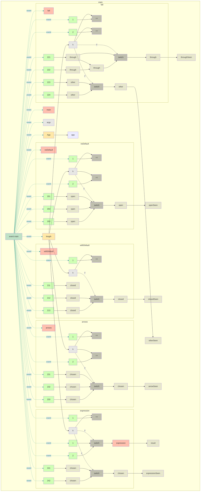

```mermaid
flowchart TD
  subgraph b0["main"]
    n1[event main]:::EVENT
    n2[main]:::RETURN
    n3[args]:::FUNC_PARAM
    n4[App]:::EXTERNAL
    n5[app]:::OBJ_VARIABLE
    n6[length]:::EXTERNAL
    n22[openSeen]:::VARIABLE
    n36[closedSeen]:::VARIABLE
    n57[throughSeen]:::VARIABLE
    n58[otherSeen]:::VARIABLE
    n74[arrowSeen]:::VARIABLE
    n89[result]:::VARIABLE
    n90[expressionSeen]:::VARIABLE
    n1[event main]:::EVENT -. event .-> n2[main]:::RETURN
    n1[event main]:::EVENT -. event .-> n3[args]:::FUNC_PARAM
    n1[event main]:::EVENT -. event .-> n4[App]:::EXTERNAL
    n1[event main]:::EVENT -. event .-> n6[length]:::EXTERNAL
    n1[event main]:::EVENT -. event .-> n8[noDefault]:::RETURN
    n1[event main]:::EVENT -. event .-> n10[201]:::LITERAL
    n1[event main]:::EVENT -. event .-> n12[1]:::LITERAL
    n1[event main]:::EVENT -. event .-> n14[202]:::LITERAL
    n1[event main]:::EVENT -. event .-> n16[2]:::LITERAL
    n1[event main]:::EVENT -. event .-> n18[203]:::LITERAL
    n1[event main]:::EVENT -. event .-> n24[withDefault]:::RETURN
    n1[event main]:::EVENT -. event .-> n26[211]:::LITERAL
    n1[event main]:::EVENT -. event .-> n28[1]:::LITERAL
    n1[event main]:::EVENT -. event .-> n30[212]:::LITERAL
    n1[event main]:::EVENT -. event .-> n32[213]:::LITERAL
    n1[event main]:::EVENT -. event .-> n38[fall]:::RETURN
    n1[event main]:::EVENT -. event .-> n40[221]:::LITERAL
    n1[event main]:::EVENT -. event .-> n42[1]:::LITERAL
    n1[event main]:::EVENT -. event .-> n44[222]:::LITERAL
    n1[event main]:::EVENT -. event .-> n47[2]:::LITERAL
    n1[event main]:::EVENT -. event .-> n49[223]:::LITERAL
    n1[event main]:::EVENT -. event .-> n51[224]:::LITERAL
    n1[event main]:::EVENT -. event .-> n60[arrows]:::RETURN
    n1[event main]:::EVENT -. event .-> n62[1]:::LITERAL
    n1[event main]:::EVENT -. event .-> n64[231]:::LITERAL
    n1[event main]:::EVENT -. event .-> n66[2]:::LITERAL
    n1[event main]:::EVENT -. event .-> n68[232]:::LITERAL
    n1[event main]:::EVENT -. event .-> n70[233]:::LITERAL
    n1[event main]:::EVENT -. event .-> n78[1]:::LITERAL
    n1[event main]:::EVENT -. event .-> n80[241]:::LITERAL
    n1[event main]:::EVENT -. event .-> n82[1]:::LITERAL
    n1[event main]:::EVENT -. event .-> n83[242]:::LITERAL
    n1[event main]:::EVENT -. event .-> n85[2]:::LITERAL
    n4[App]:::EXTERNAL --> n5[app]:::OBJ_VARIABLE
    n6[length]:::EXTERNAL --> n9[k]:::FUNC_PARAM
    n6[length]:::EXTERNAL --> n25[k]:::FUNC_PARAM
    n6[length]:::EXTERNAL --> n39[k]:::FUNC_PARAM
    n6[length]:::EXTERNAL --> n61[k]:::FUNC_PARAM
    n6[length]:::EXTERNAL --> n77[k]:::FUNC_PARAM
    n21[open]:::VARIABLE --> n22[openSeen]:::VARIABLE
    n35[closed]:::VARIABLE --> n36[closedSeen]:::VARIABLE
    n54[through]:::VARIABLE --> n57[throughSeen]:::VARIABLE
    n56[other]:::VARIABLE --> n58[otherSeen]:::VARIABLE
    n73[chosen]:::VARIABLE --> n74[arrowSeen]:::VARIABLE
    n76[expression]:::RETURN --> n89[result]:::VARIABLE
    n87[chosen]:::VARIABLE --> n90[expressionSeen]:::VARIABLE
    subgraph b7["noDefault"]
      n8[noDefault]:::RETURN
      n9[k]:::FUNC_PARAM
      n10[201]:::LITERAL
      n11[open]:::VARIABLE
      n12[1]:::LITERAL
      n13[==]:::BIN_OP
      n14[202]:::LITERAL
      n15[open]:::VARIABLE
      n16[2]:::LITERAL
      n17[==]:::BIN_OP
      n18[203]:::LITERAL
      n19[open]:::VARIABLE
      n20[switch]:::BIN_OP
      n21[open]:::VARIABLE
      n9[k]:::FUNC_PARAM --> n13[==]:::BIN_OP
      n9[k]:::FUNC_PARAM --> n17[==]:::BIN_OP
      n9[k]:::FUNC_PARAM -->|if| n20[switch]:::BIN_OP
      n10[201]:::LITERAL --> n11[open]:::VARIABLE
      n11[open]:::VARIABLE --> n20[switch]:::BIN_OP
      n12[1]:::LITERAL --> n13[==]:::BIN_OP
      n14[202]:::LITERAL --> n15[open]:::VARIABLE
      n15[open]:::VARIABLE --> n20[switch]:::BIN_OP
      n16[2]:::LITERAL --> n17[==]:::BIN_OP
      n18[203]:::LITERAL --> n19[open]:::VARIABLE
      n19[open]:::VARIABLE --> n20[switch]:::BIN_OP
      n20[switch]:::BIN_OP --> n21[open]:::VARIABLE
    end
    subgraph b23["withDefault"]
      n24[withDefault]:::RETURN
      n25[k]:::FUNC_PARAM
      n26[211]:::LITERAL
      n27[closed]:::VARIABLE
      n28[1]:::LITERAL
      n29[==]:::BIN_OP
      n30[212]:::LITERAL
      n31[closed]:::VARIABLE
      n32[213]:::LITERAL
      n33[closed]:::VARIABLE
      n34[switch]:::BIN_OP
      n35[closed]:::VARIABLE
      n25[k]:::FUNC_PARAM --> n29[==]:::BIN_OP
      n25[k]:::FUNC_PARAM -->|if| n34[switch]:::BIN_OP
      n26[211]:::LITERAL --> n27[closed]:::VARIABLE
      n28[1]:::LITERAL --> n29[==]:::BIN_OP
      n30[212]:::LITERAL --> n31[closed]:::VARIABLE
      n31[closed]:::VARIABLE --> n34[switch]:::BIN_OP
      n32[213]:::LITERAL --> n33[closed]:::VARIABLE
      n33[closed]:::VARIABLE --> n34[switch]:::BIN_OP
      n34[switch]:::BIN_OP --> n35[closed]:::VARIABLE
    end
    subgraph b37["fall"]
      n38[fall]:::RETURN
      n39[k]:::FUNC_PARAM
      n40[221]:::LITERAL
      n41[through]:::VARIABLE
      n42[1]:::LITERAL
      n43[==]:::BIN_OP
      n44[222]:::LITERAL
      n45[through]:::VARIABLE
      n46[through]:::VARIABLE
      n47[2]:::LITERAL
      n48[==]:::BIN_OP
      n49[223]:::LITERAL
      n50[other]:::VARIABLE
      n51[224]:::LITERAL
      n52[other]:::VARIABLE
      n53[switch]:::BIN_OP
      n54[through]:::VARIABLE
      n55[switch]:::BIN_OP
      n56[other]:::VARIABLE
      n39[k]:::FUNC_PARAM --> n43[==]:::BIN_OP
      n39[k]:::FUNC_PARAM --> n48[==]:::BIN_OP
      n39[k]:::FUNC_PARAM -->|if| n53[switch]:::BIN_OP
      n39[k]:::FUNC_PARAM -->|if| n55[switch]:::BIN_OP
      n40[221]:::LITERAL --> n41[through]:::VARIABLE
      n41[through]:::VARIABLE --> n46[through]:::VARIABLE
      n41[through]:::VARIABLE --> n53[switch]:::BIN_OP
      n42[1]:::LITERAL --> n43[==]:::BIN_OP
      n44[222]:::LITERAL --> n45[through]:::VARIABLE
      n45[through]:::VARIABLE --> n46[through]:::VARIABLE
      n46[through]:::VARIABLE --> n53[switch]:::BIN_OP
      n47[2]:::LITERAL --> n48[==]:::BIN_OP
      n49[223]:::LITERAL --> n50[other]:::VARIABLE
      n50[other]:::VARIABLE --> n55[switch]:::BIN_OP
      n51[224]:::LITERAL --> n52[other]:::VARIABLE
      n52[other]:::VARIABLE --> n55[switch]:::BIN_OP
      n53[switch]:::BIN_OP --> n54[through]:::VARIABLE
      n55[switch]:::BIN_OP --> n56[other]:::VARIABLE
    end
    subgraph b59["arrows"]
      n60[arrows]:::RETURN
      n61[k]:::FUNC_PARAM
      n62[1]:::LITERAL
      n63[==]:::BIN_OP
      n64[231]:::LITERAL
      n65[chosen]:::VARIABLE
      n66[2]:::LITERAL
      n67[==]:::BIN_OP
      n68[232]:::LITERAL
      n69[chosen]:::VARIABLE
      n70[233]:::LITERAL
      n71[chosen]:::VARIABLE
      n72[switch]:::BIN_OP
      n73[chosen]:::VARIABLE
      n61[k]:::FUNC_PARAM --> n63[==]:::BIN_OP
      n61[k]:::FUNC_PARAM --> n67[==]:::BIN_OP
      n61[k]:::FUNC_PARAM -->|if| n72[switch]:::BIN_OP
      n62[1]:::LITERAL --> n63[==]:::BIN_OP
      n64[231]:::LITERAL --> n65[chosen]:::VARIABLE
      n65[chosen]:::VARIABLE --> n72[switch]:::BIN_OP
      n66[2]:::LITERAL --> n67[==]:::BIN_OP
      n68[232]:::LITERAL --> n69[chosen]:::VARIABLE
      n69[chosen]:::VARIABLE --> n72[switch]:::BIN_OP
      n70[233]:::LITERAL --> n71[chosen]:::VARIABLE
      n71[chosen]:::VARIABLE --> n72[switch]:::BIN_OP
      n72[switch]:::BIN_OP --> n73[chosen]:::VARIABLE
    end
    subgraph b75["expression"]
      n76[expression]:::RETURN
      n77[k]:::FUNC_PARAM
      n78[1]:::LITERAL
      n79[==]:::BIN_OP
      n80[241]:::LITERAL
      n81[chosen]:::VARIABLE
      n82[1]:::LITERAL
      n83[242]:::LITERAL
      n84[chosen]:::VARIABLE
      n85[2]:::LITERAL
      n86[switch]:::BIN_OP
      n87[chosen]:::VARIABLE
      n88[switch]:::BIN_OP
      n77[k]:::FUNC_PARAM --> n79[==]:::BIN_OP
      n77[k]:::FUNC_PARAM -->|if| n86[switch]:::BIN_OP
      n77[k]:::FUNC_PARAM -->|if| n88[switch]:::BIN_OP
      n78[1]:::LITERAL --> n79[==]:::BIN_OP
      n80[241]:::LITERAL --> n81[chosen]:::VARIABLE
      n81[chosen]:::VARIABLE --> n86[switch]:::BIN_OP
      n82[1]:::LITERAL --> n88[switch]:::BIN_OP
      n83[242]:::LITERAL --> n84[chosen]:::VARIABLE
      n84[chosen]:::VARIABLE --> n86[switch]:::BIN_OP
      n85[2]:::LITERAL --> n88[switch]:::BIN_OP
      n86[switch]:::BIN_OP --> n87[chosen]:::VARIABLE
      n88[switch]:::BIN_OP --> n76[expression]:::RETURN
    end
  end
  linkStyle 0 stroke:#00897b,color:#00897b
  linkStyle 1 stroke:#00897b,color:#00897b
  linkStyle 2 stroke:#00897b,color:#00897b
  linkStyle 3 stroke:#00897b,color:#00897b
  linkStyle 4 stroke:#00897b,color:#00897b
  linkStyle 5 stroke:#00897b,color:#00897b
  linkStyle 6 stroke:#00897b,color:#00897b
  linkStyle 7 stroke:#00897b,color:#00897b
  linkStyle 8 stroke:#00897b,color:#00897b
  linkStyle 9 stroke:#00897b,color:#00897b
  linkStyle 10 stroke:#00897b,color:#00897b
  linkStyle 11 stroke:#00897b,color:#00897b
  linkStyle 12 stroke:#00897b,color:#00897b
  linkStyle 13 stroke:#00897b,color:#00897b
  linkStyle 14 stroke:#00897b,color:#00897b
  linkStyle 15 stroke:#00897b,color:#00897b
  linkStyle 16 stroke:#00897b,color:#00897b
  linkStyle 17 stroke:#00897b,color:#00897b
  linkStyle 18 stroke:#00897b,color:#00897b
  linkStyle 19 stroke:#00897b,color:#00897b
  linkStyle 20 stroke:#00897b,color:#00897b
  linkStyle 21 stroke:#00897b,color:#00897b
  linkStyle 22 stroke:#00897b,color:#00897b
  linkStyle 23 stroke:#00897b,color:#00897b
  linkStyle 24 stroke:#00897b,color:#00897b
  linkStyle 25 stroke:#00897b,color:#00897b
  linkStyle 26 stroke:#00897b,color:#00897b
  linkStyle 27 stroke:#00897b,color:#00897b
  linkStyle 28 stroke:#00897b,color:#00897b
  linkStyle 29 stroke:#00897b,color:#00897b
  linkStyle 30 stroke:#00897b,color:#00897b
  linkStyle 31 stroke:#00897b,color:#00897b
  linkStyle 32 stroke:#00897b,color:#00897b
  linkStyle 48 stroke:#6a6a6a,color:#6a6a6a
  linkStyle 59 stroke:#6a6a6a,color:#6a6a6a
  linkStyle 69 stroke:#6a6a6a,color:#6a6a6a
  linkStyle 70 stroke:#6a6a6a,color:#6a6a6a
  linkStyle 87 stroke:#6a6a6a,color:#6a6a6a
  linkStyle 98 stroke:#6a6a6a,color:#6a6a6a
  linkStyle 99 stroke:#6a6a6a,color:#6a6a6a
  classDef LITERAL fill:#00FF0030
  classDef VARIABLE fill:#80808030
  classDef BIN_OP fill:#80808080
  classDef FUNC_PARAM fill:#8080FF30
  classDef RETURN fill:#FF808080
  classDef EXTERNAL fill:#FFA50040
  classDef UNMODELLED fill:#FF000030,stroke-dasharray: 4 2
  classDef EVENT fill:#00897B40
```
