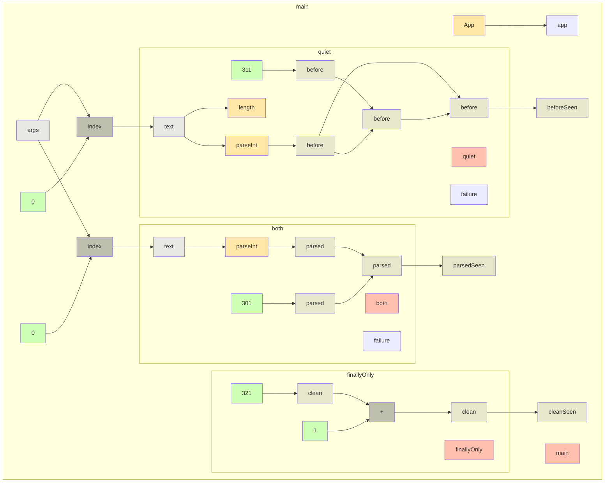

```mermaid
flowchart TD
  subgraph b0["main"]
    n1[main]:::RETURN
    n2[args]:::FUNC_PARAM
    n3[App]:::EXTERNAL
    n4[app]:::OBJ_VARIABLE
    n5[0]:::LITERAL
    n6[index]:::BIN_OP
    n16[parsedSeen]:::VARIABLE
    n17[0]:::LITERAL
    n18[index]:::BIN_OP
    n30[beforeSeen]:::VARIABLE
    n38[cleanSeen]:::VARIABLE
    n2[args]:::FUNC_PARAM --> n6[index]:::BIN_OP
    n2[args]:::FUNC_PARAM --> n18[index]:::BIN_OP
    n3[App]:::EXTERNAL --> n4[app]:::OBJ_VARIABLE
    n5[0]:::LITERAL --> n6[index]:::BIN_OP
    n6[index]:::BIN_OP --> n9[text]:::FUNC_PARAM
    n17[0]:::LITERAL --> n18[index]:::BIN_OP
    n18[index]:::BIN_OP --> n21[text]:::FUNC_PARAM
    n15[parsed]:::VARIABLE --> n16[parsedSeen]:::VARIABLE
    n29[before]:::VARIABLE --> n30[beforeSeen]:::VARIABLE
    n37[clean]:::VARIABLE --> n38[cleanSeen]:::VARIABLE
    subgraph b7["both"]
      n8[both]:::RETURN
      n9[text]:::FUNC_PARAM
      n10[parseInt]:::EXTERNAL
      n11[parsed]:::VARIABLE
      n12[failure]:::OBJ_VARIABLE
      n13[301]:::LITERAL
      n14[parsed]:::VARIABLE
      n15[parsed]:::VARIABLE
      n9[text]:::FUNC_PARAM --> n10[parseInt]:::EXTERNAL
      n10[parseInt]:::EXTERNAL --> n11[parsed]:::VARIABLE
      n11[parsed]:::VARIABLE --> n15[parsed]:::VARIABLE
      n13[301]:::LITERAL --> n14[parsed]:::VARIABLE
      n14[parsed]:::VARIABLE --> n15[parsed]:::VARIABLE
    end
    subgraph b19["quiet"]
      n20[quiet]:::RETURN
      n21[text]:::FUNC_PARAM
      n22[311]:::LITERAL
      n23[before]:::VARIABLE
      n24[parseInt]:::EXTERNAL
      n25[before]:::VARIABLE
      n26[before]:::VARIABLE
      n27[failure]:::OBJ_VARIABLE
      n28[length]:::EXTERNAL
      n29[before]:::VARIABLE
      n21[text]:::FUNC_PARAM --> n24[parseInt]:::EXTERNAL
      n21[text]:::FUNC_PARAM --> n28[length]:::EXTERNAL
      n22[311]:::LITERAL --> n23[before]:::VARIABLE
      n23[before]:::VARIABLE --> n26[before]:::VARIABLE
      n24[parseInt]:::EXTERNAL --> n25[before]:::VARIABLE
      n25[before]:::VARIABLE --> n26[before]:::VARIABLE
      n25[before]:::VARIABLE --> n29[before]:::VARIABLE
      n26[before]:::VARIABLE --> n29[before]:::VARIABLE
    end
    subgraph b31["finallyOnly"]
      n32[finallyOnly]:::RETURN
      n33[321]:::LITERAL
      n34[clean]:::VARIABLE
      n35[1]:::LITERAL
      n36[+]:::BIN_OP
      n37[clean]:::VARIABLE
      n33[321]:::LITERAL --> n34[clean]:::VARIABLE
      n34[clean]:::VARIABLE --> n36[+]:::BIN_OP
      n35[1]:::LITERAL --> n36[+]:::BIN_OP
      n36[+]:::BIN_OP --> n37[clean]:::VARIABLE
    end
  end
  classDef LITERAL fill:#00FF0030
  classDef VARIABLE fill:#80808030
  classDef BIN_OP fill:#80808080
  classDef FUNC_PARAM fill:#8080FF30
  classDef RETURN fill:#FF808080
  classDef EXTERNAL fill:#FFA50040
  classDef UNMODELLED fill:#FF000030,stroke-dasharray: 4 2
```
