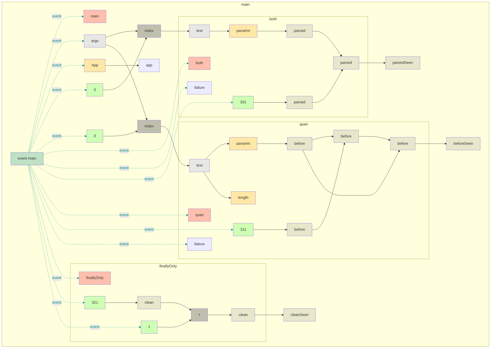

```mermaid
flowchart TD
  subgraph b0["main"]
    n1[event main]:::EVENT
    n2[main]:::RETURN
    n3[args]:::FUNC_PARAM
    n4[App]:::EXTERNAL
    n5[app]:::OBJ_VARIABLE
    n6[0]:::LITERAL
    n7[index]:::BIN_OP
    n17[parsedSeen]:::VARIABLE
    n18[0]:::LITERAL
    n19[index]:::BIN_OP
    n31[beforeSeen]:::VARIABLE
    n39[cleanSeen]:::VARIABLE
    n1[event main]:::EVENT -. event .-> n2[main]:::RETURN
    n1[event main]:::EVENT -. event .-> n3[args]:::FUNC_PARAM
    n1[event main]:::EVENT -. event .-> n4[App]:::EXTERNAL
    n1[event main]:::EVENT -. event .-> n6[0]:::LITERAL
    n1[event main]:::EVENT -. event .-> n18[0]:::LITERAL
    n1[event main]:::EVENT -. event .-> n9[both]:::RETURN
    n1[event main]:::EVENT -. event .-> n13[failure]:::OBJ_VARIABLE
    n1[event main]:::EVENT -. event .-> n14[301]:::LITERAL
    n1[event main]:::EVENT -. event .-> n21[quiet]:::RETURN
    n1[event main]:::EVENT -. event .-> n23[311]:::LITERAL
    n1[event main]:::EVENT -. event .-> n28[failure]:::OBJ_VARIABLE
    n1[event main]:::EVENT -. event .-> n33[finallyOnly]:::RETURN
    n1[event main]:::EVENT -. event .-> n34[321]:::LITERAL
    n1[event main]:::EVENT -. event .-> n36[1]:::LITERAL
    n3[args]:::FUNC_PARAM --> n7[index]:::BIN_OP
    n3[args]:::FUNC_PARAM --> n19[index]:::BIN_OP
    n4[App]:::EXTERNAL --> n5[app]:::OBJ_VARIABLE
    n6[0]:::LITERAL --> n7[index]:::BIN_OP
    n7[index]:::BIN_OP --> n10[text]:::FUNC_PARAM
    n18[0]:::LITERAL --> n19[index]:::BIN_OP
    n19[index]:::BIN_OP --> n22[text]:::FUNC_PARAM
    n16[parsed]:::VARIABLE --> n17[parsedSeen]:::VARIABLE
    n30[before]:::VARIABLE --> n31[beforeSeen]:::VARIABLE
    n38[clean]:::VARIABLE --> n39[cleanSeen]:::VARIABLE
    subgraph b8["both"]
      n9[both]:::RETURN
      n10[text]:::FUNC_PARAM
      n11[parseInt]:::EXTERNAL
      n12[parsed]:::VARIABLE
      n13[failure]:::OBJ_VARIABLE
      n14[301]:::LITERAL
      n15[parsed]:::VARIABLE
      n16[parsed]:::VARIABLE
      n10[text]:::FUNC_PARAM --> n11[parseInt]:::EXTERNAL
      n11[parseInt]:::EXTERNAL --> n12[parsed]:::VARIABLE
      n12[parsed]:::VARIABLE --> n16[parsed]:::VARIABLE
      n14[301]:::LITERAL --> n15[parsed]:::VARIABLE
      n15[parsed]:::VARIABLE --> n16[parsed]:::VARIABLE
    end
    subgraph b20["quiet"]
      n21[quiet]:::RETURN
      n22[text]:::FUNC_PARAM
      n23[311]:::LITERAL
      n24[before]:::VARIABLE
      n25[parseInt]:::EXTERNAL
      n26[before]:::VARIABLE
      n27[before]:::VARIABLE
      n28[failure]:::OBJ_VARIABLE
      n29[length]:::EXTERNAL
      n30[before]:::VARIABLE
      n22[text]:::FUNC_PARAM --> n25[parseInt]:::EXTERNAL
      n22[text]:::FUNC_PARAM --> n29[length]:::EXTERNAL
      n23[311]:::LITERAL --> n24[before]:::VARIABLE
      n24[before]:::VARIABLE --> n27[before]:::VARIABLE
      n25[parseInt]:::EXTERNAL --> n26[before]:::VARIABLE
      n26[before]:::VARIABLE --> n27[before]:::VARIABLE
      n26[before]:::VARIABLE --> n30[before]:::VARIABLE
      n27[before]:::VARIABLE --> n30[before]:::VARIABLE
    end
    subgraph b32["finallyOnly"]
      n33[finallyOnly]:::RETURN
      n34[321]:::LITERAL
      n35[clean]:::VARIABLE
      n36[1]:::LITERAL
      n37[+]:::BIN_OP
      n38[clean]:::VARIABLE
      n34[321]:::LITERAL --> n35[clean]:::VARIABLE
      n35[clean]:::VARIABLE --> n37[+]:::BIN_OP
      n36[1]:::LITERAL --> n37[+]:::BIN_OP
      n37[+]:::BIN_OP --> n38[clean]:::VARIABLE
    end
  end
  linkStyle 0 stroke:#00897b,color:#00897b
  linkStyle 1 stroke:#00897b,color:#00897b
  linkStyle 2 stroke:#00897b,color:#00897b
  linkStyle 3 stroke:#00897b,color:#00897b
  linkStyle 4 stroke:#00897b,color:#00897b
  linkStyle 5 stroke:#00897b,color:#00897b
  linkStyle 6 stroke:#00897b,color:#00897b
  linkStyle 7 stroke:#00897b,color:#00897b
  linkStyle 8 stroke:#00897b,color:#00897b
  linkStyle 9 stroke:#00897b,color:#00897b
  linkStyle 10 stroke:#00897b,color:#00897b
  linkStyle 11 stroke:#00897b,color:#00897b
  linkStyle 12 stroke:#00897b,color:#00897b
  linkStyle 13 stroke:#00897b,color:#00897b
  classDef LITERAL fill:#00FF0030
  classDef VARIABLE fill:#80808030
  classDef BIN_OP fill:#80808080
  classDef FUNC_PARAM fill:#8080FF30
  classDef RETURN fill:#FF808080
  classDef EXTERNAL fill:#FFA50040
  classDef UNMODELLED fill:#FF000030,stroke-dasharray: 4 2
  classDef EVENT fill:#00897B40
```
