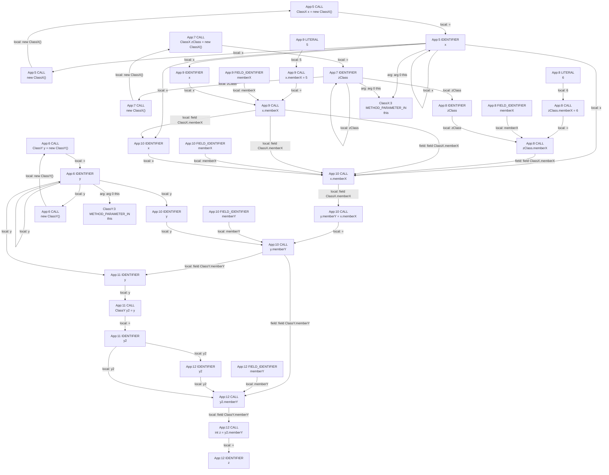

# files: spike value graph

```mermaid
flowchart TD
  n0["App:10 CALL<br/>x.memberX"]
  n1["App:10 CALL<br/>y.memberY"]
  n2["App:10 CALL<br/>y.memberY = x.memberX"]
  n3["App:10 FIELD_IDENTIFIER<br/>memberX"]
  n4["App:10 FIELD_IDENTIFIER<br/>memberY"]
  n5["App:10 IDENTIFIER<br/>x"]
  n6["App:10 IDENTIFIER<br/>y"]
  n7["App:11 CALL<br/>ClassY y2 = y"]
  n8["App:11 IDENTIFIER<br/>y"]
  n9["App:11 IDENTIFIER<br/>y2"]
  n10["App:12 CALL<br/>int z = y2.memberY"]
  n11["App:12 CALL<br/>y2.memberY"]
  n12["App:12 FIELD_IDENTIFIER<br/>memberY"]
  n13["App:12 IDENTIFIER<br/>y2"]
  n14["App:12 IDENTIFIER<br/>z"]
  n15["App:5 CALL<br/>ClassX x = new ClassX()"]
  n16["App:5 CALL<br/>new ClassX()"]
  n17["App:5 IDENTIFIER<br/>x"]
  n18["App:6 CALL<br/>ClassY y = new ClassY()"]
  n19["App:6 CALL<br/>new ClassY()"]
  n20["App:6 IDENTIFIER<br/>y"]
  n21["App:7 CALL<br/>ClassX zClass = new ClassX()"]
  n22["App:7 CALL<br/>new ClassX()"]
  n23["App:7 IDENTIFIER<br/>zClass"]
  n24["App:8 CALL<br/>zClass.memberX"]
  n25["App:8 CALL<br/>zClass.memberX = 6"]
  n26["App:8 FIELD_IDENTIFIER<br/>memberX"]
  n27["App:8 IDENTIFIER<br/>zClass"]
  n28["App:8 LITERAL<br/>6"]
  n29["App:9 CALL<br/>x.memberX"]
  n30["App:9 CALL<br/>x.memberX = 5"]
  n31["App:9 FIELD_IDENTIFIER<br/>memberX"]
  n32["App:9 IDENTIFIER<br/>x"]
  n33["App:9 LITERAL<br/>5"]
  n34["ClassX:3 METHOD_PARAMETER_IN<br/>this"]
  n35["ClassY:3 METHOD_PARAMETER_IN<br/>this"]
  n0 -->|"local: field ClassX.memberX"| n2
  n1 -->|"field: field ClassY.memberY"| n11
  n1 -->|"local: field ClassY.memberY"| n8
  n10 -->|"local: ="| n14
  n11 -->|"local: field ClassY.memberY"| n10
  n12 -->|"local: memberY"| n11
  n13 -->|"local: y2"| n11
  n15 -->|"local: ="| n17
  n16 -->|"local: new ClassX()"| n15
  n17 -->|"arg: arg 0 this"| n34
  n17 -->|"local: x"| n0
  n17 -->|"local: x"| n16
  n17 -->|"local: x"| n17
  n17 -->|"local: x"| n32
  n17 -->|"local: x"| n5
  n18 -->|"local: ="| n20
  n19 -->|"local: new ClassY()"| n18
  n2 -->|"local: ="| n1
  n20 -->|"arg: arg 0 this"| n35
  n20 -->|"local: y"| n19
  n20 -->|"local: y"| n20
  n20 -->|"local: y"| n6
  n20 -->|"local: y"| n8
  n21 -->|"local: ="| n23
  n22 -->|"local: new ClassX()"| n21
  n23 -->|"arg: arg 0 this"| n34
  n23 -->|"local: zClass"| n22
  n23 -->|"local: zClass"| n23
  n23 -->|"local: zClass"| n27
  n24 -->|"field: field ClassX.memberX"| n0
  n25 -->|"local: ="| n24
  n26 -->|"local: memberX"| n24
  n27 -->|"local: zClass"| n24
  n28 -->|"local: 6"| n25
  n29 -->|"field: field ClassX.memberX"| n0
  n29 -->|"local: field ClassX.memberX"| n0
  n29 -->|"local: field ClassX.memberX"| n5
  n3 -->|"local: memberX"| n0
  n30 -->|"local: ="| n29
  n31 -->|"local: memberX"| n29
  n32 -->|"local: x"| n29
  n33 -->|"local: 5"| n30
  n4 -->|"local: memberY"| n1
  n5 -->|"local: x"| n0
  n6 -->|"local: y"| n1
  n7 -->|"local: ="| n9
  n8 -->|"local: y"| n7
  n9 -->|"local: y2"| n11
  n9 -->|"local: y2"| n13
```
