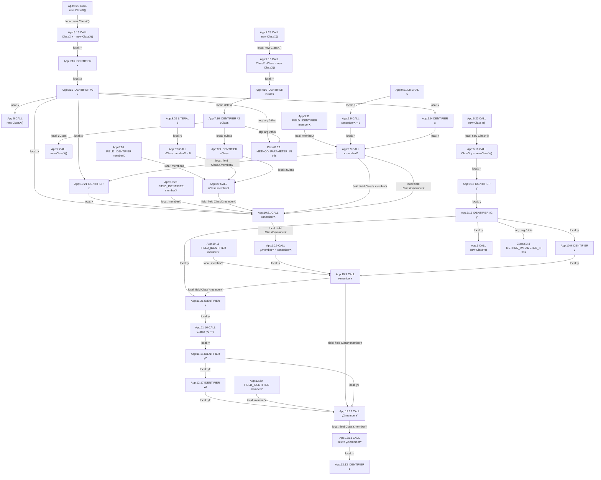

# files: spike value graph

```mermaid
flowchart TD
  n0["App:10:11 FIELD_IDENTIFIER<br/>memberY"]
  n1["App:10:21 CALL<br/>x.memberX"]
  n2["App:10:21 IDENTIFIER<br/>x"]
  n3["App:10:23 FIELD_IDENTIFIER<br/>memberX"]
  n4["App:10:9 CALL<br/>y.memberY"]
  n5["App:10:9 CALL<br/>y.memberY = x.memberX"]
  n6["App:10:9 IDENTIFIER<br/>y"]
  n7["App:11:16 CALL<br/>ClassY y2 = y"]
  n8["App:11:16 IDENTIFIER<br/>y2"]
  n9["App:11:21 IDENTIFIER<br/>y"]
  n10["App:12:13 CALL<br/>int z = y2.memberY"]
  n11["App:12:13 IDENTIFIER<br/>z"]
  n12["App:12:17 CALL<br/>y2.memberY"]
  n13["App:12:17 IDENTIFIER<br/>y2"]
  n14["App:12:20 FIELD_IDENTIFIER<br/>memberY"]
  n15["App:5 CALL<br/>new ClassX()"]
  n16["App:5:16 CALL<br/>ClassX x = new ClassX()"]
  n17["App:5:16 IDENTIFIER #2<br/>x"]
  n18["App:5:16 IDENTIFIER<br/>x"]
  n19["App:5:20 CALL<br/>new ClassX()"]
  n20["App:6 CALL<br/>new ClassY()"]
  n21["App:6:16 CALL<br/>ClassY y = new ClassY()"]
  n22["App:6:16 IDENTIFIER #2<br/>y"]
  n23["App:6:16 IDENTIFIER<br/>y"]
  n24["App:6:20 CALL<br/>new ClassY()"]
  n25["App:7 CALL<br/>new ClassX()"]
  n26["App:7:16 CALL<br/>ClassX zClass = new ClassX()"]
  n27["App:7:16 IDENTIFIER #2<br/>zClass"]
  n28["App:7:16 IDENTIFIER<br/>zClass"]
  n29["App:7:25 CALL<br/>new ClassX()"]
  n30["App:8:16 FIELD_IDENTIFIER<br/>memberX"]
  n31["App:8:26 LITERAL<br/>6"]
  n32["App:8:9 CALL<br/>zClass.memberX"]
  n33["App:8:9 CALL<br/>zClass.memberX = 6"]
  n34["App:8:9 IDENTIFIER<br/>zClass"]
  n35["App:9:11 FIELD_IDENTIFIER<br/>memberX"]
  n36["App:9:21 LITERAL<br/>5"]
  n37["App:9:9 CALL<br/>x.memberX"]
  n38["App:9:9 CALL<br/>x.memberX = 5"]
  n39["App:9:9 IDENTIFIER<br/>x"]
  n40["ClassX:3:1 METHOD_PARAMETER_IN<br/>this"]
  n41["ClassY:3:1 METHOD_PARAMETER_IN<br/>this"]
  n0 -->|"local: memberY"| n4
  n1 -->|"local: field ClassX.memberX"| n5
  n10 -->|"local: ="| n11
  n12 -->|"local: field ClassY.memberY"| n10
  n13 -->|"local: y2"| n12
  n14 -->|"local: memberY"| n12
  n16 -->|"local: ="| n18
  n17 -->|"arg: arg 0 this"| n40
  n17 -->|"local: x"| n1
  n17 -->|"local: x"| n15
  n17 -->|"local: x"| n2
  n17 -->|"local: x"| n39
  n18 -->|"local: x"| n17
  n19 -->|"local: new ClassX()"| n16
  n2 -->|"local: x"| n1
  n21 -->|"local: ="| n23
  n22 -->|"arg: arg 0 this"| n41
  n22 -->|"local: y"| n20
  n22 -->|"local: y"| n6
  n22 -->|"local: y"| n9
  n23 -->|"local: y"| n22
  n24 -->|"local: new ClassY()"| n21
  n26 -->|"local: ="| n28
  n27 -->|"arg: arg 0 this"| n40
  n27 -->|"local: zClass"| n25
  n27 -->|"local: zClass"| n34
  n28 -->|"local: zClass"| n27
  n29 -->|"local: new ClassX()"| n26
  n3 -->|"local: memberX"| n1
  n30 -->|"local: memberX"| n32
  n31 -->|"local: 6"| n33
  n32 -->|"field: field ClassX.memberX"| n1
  n33 -->|"local: ="| n32
  n34 -->|"local: zClass"| n32
  n35 -->|"local: memberX"| n37
  n36 -->|"local: 5"| n38
  n37 -->|"field: field ClassX.memberX"| n1
  n37 -->|"local: field ClassX.memberX"| n1
  n37 -->|"local: field ClassX.memberX"| n2
  n38 -->|"local: ="| n37
  n39 -->|"local: x"| n37
  n4 -->|"field: field ClassY.memberY"| n12
  n4 -->|"local: field ClassY.memberY"| n9
  n5 -->|"local: ="| n4
  n6 -->|"local: y"| n4
  n7 -->|"local: ="| n8
  n8 -->|"local: y2"| n12
  n8 -->|"local: y2"| n13
  n9 -->|"local: y"| n7
```
