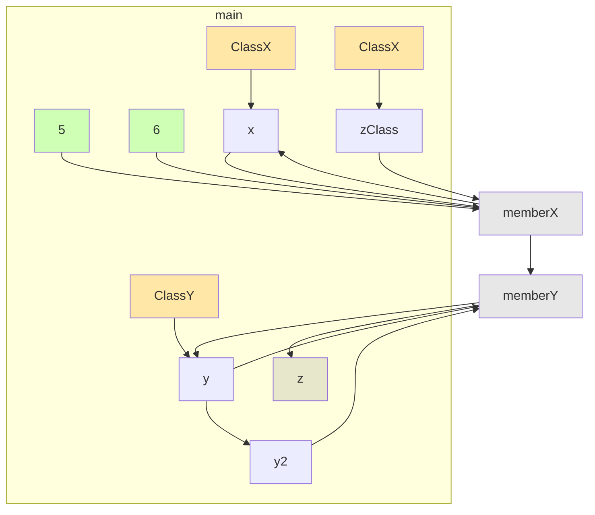

# files: spike value graph (condensed)

```mermaid
flowchart TD
  subgraph m0["main"]
    n0["ClassX"]:::EXTERNAL
    n1["ClassX"]:::EXTERNAL
    n2["ClassY"]:::EXTERNAL
    n3["5"]:::LITERAL
    n4["6"]:::LITERAL
    n5["x"]:::OBJ_VARIABLE
    n6["y"]:::OBJ_VARIABLE
    n7["y2"]:::OBJ_VARIABLE
    n8["z"]:::VARIABLE
    n9["zClass"]:::OBJ_VARIABLE
  end
  n10["memberX"]:::VARIABLE
  n11["memberY"]:::VARIABLE
  n0 --> n5
  n1 --> n9
  n10 --> n11
  n10 --> n5
  n11 --> n6
  n11 --> n8
  n2 --> n6
  n3 --> n10
  n4 --> n10
  n5 --> n10
  n6 --> n11
  n6 --> n7
  n7 --> n11
  n9 --> n10
  classDef LITERAL fill:#00FF0030
  classDef VARIABLE fill:#80808030
  classDef BIN_OP fill:#80808080
  classDef FUNC_PARAM fill:#8080FF30
  classDef RETURN fill:#FF808080
  classDef EXTERNAL fill:#FFA50040
  classDef UNMODELLED fill:#FF000030,stroke-dasharray: 4 2
```
