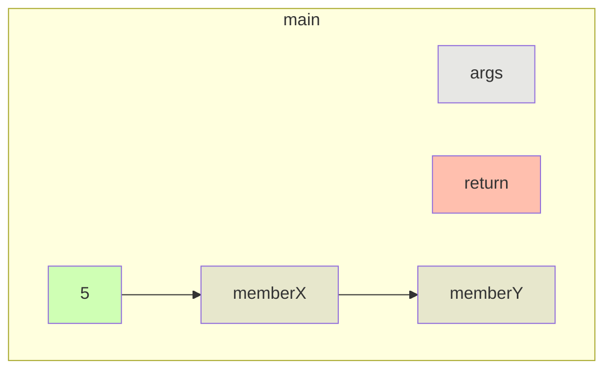

```mermaid
flowchart TD
  subgraph main
    -1044679101[memberX]:::VARIABLE
    13678[args]:::FUNC_PARAM
    890261[return]:::RETURN
    983796[5]:::LITERAL
    1861021189[memberY]:::VARIABLE
    -1044679101[memberX]:::VARIABLE --> 1861021189[memberY]:::VARIABLE
    983796[5]:::LITERAL --> -1044679101[memberX]:::VARIABLE
  end
  classDef LITERAL fill:#00FF0030
  classDef VARIABLE fill:#80808030
  classDef BIN_OP fill:#80808080
  classDef FUNC_PARAM fill:#8080FF30
  classDef RETURN fill:#FF808080
```
