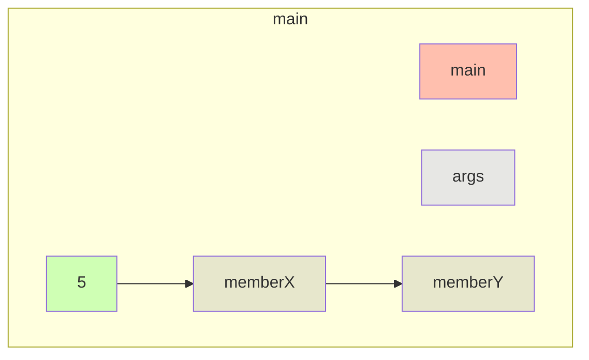

```mermaid
flowchart TD
  subgraph 4308940["main"]
    203055[5]:::LITERAL
    56996632[main]:::RETURN
    1296498184[args]:::FUNC_PARAM
    16131186940[memberX]:::VARIABLE
    16131193604[memberY]:::VARIABLE
    203055[5]:::LITERAL --> 16131186940[memberX]:::VARIABLE
    16131186940[memberX]:::VARIABLE --> 16131193604[memberY]:::VARIABLE
  end
  classDef LITERAL fill:#00FF0030
  classDef VARIABLE fill:#80808030
  classDef BIN_OP fill:#80808080
  classDef FUNC_PARAM fill:#8080FF30
  classDef RETURN fill:#FF808080
```
