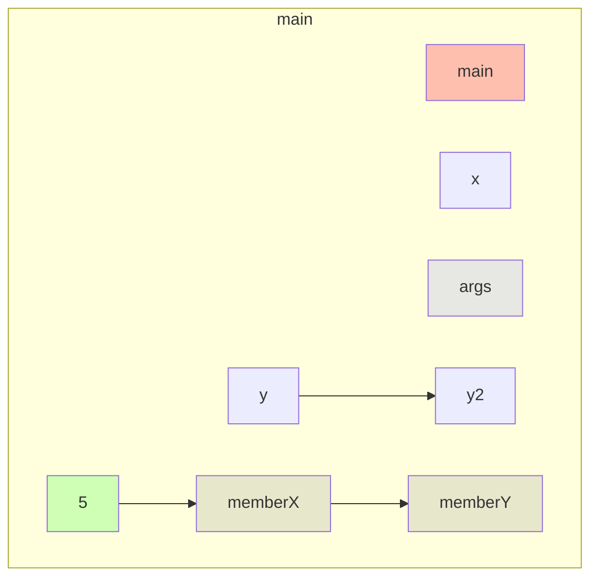

```mermaid
flowchart TD
    subgraph 4309014["main"]
        -1082851059[5]:::LITERAL
        -1082850032[y]:::OBJ_VARIABLE
        -1082786566[y2]:::OBJ_VARIABLE
        56853577[main]:::RETURN
        103683861[x]:::OBJ_VARIABLE
        154667611[args]:::FUNC_PARAM
        16130999090[memberX]:::VARIABLE
        16130999107[memberY]:::VARIABLE
        -1082851059[5]:::LITERAL --> 16130999090[memberX]:::VARIABLE
        -1082850032[y]:::OBJ_VARIABLE --> -1082786566[y2]:::OBJ_VARIABLE
        16130999090[memberX]:::VARIABLE --> 16130999107[memberY]:::VARIABLE
    end
    classDef LITERAL fill:#00FF0030
    classDef VARIABLE fill:#80808030
    classDef BIN_OP fill:#80808080
    classDef FUNC_PARAM fill:#8080FF30
    classDef RETURN fill:#FF808080
```
