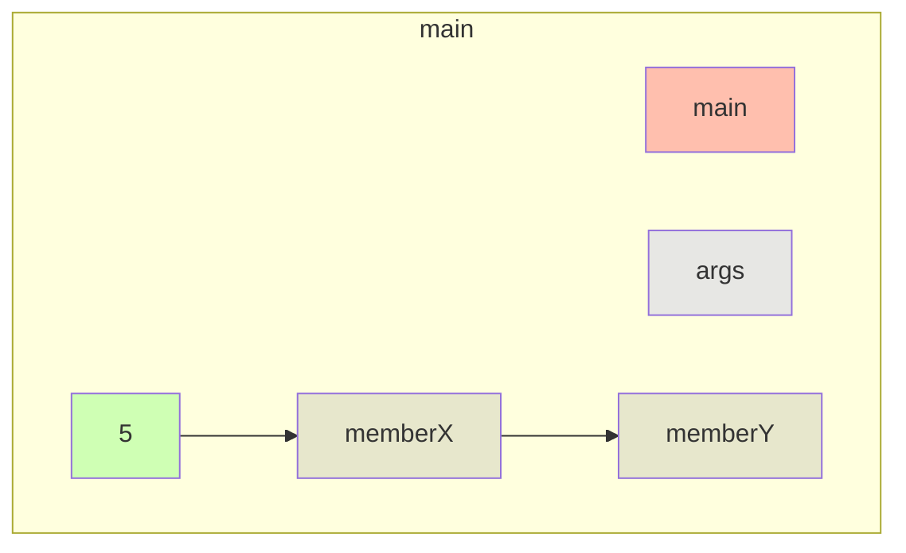

```mermaid
flowchart TD
  subgraph 4309014["main"]
    -1082909215[5]:::LITERAL
    56853577[main]:::RETURN
    154667611[args]:::FUNC_PARAM
    16130999090[memberX]:::VARIABLE
    16130999107[memberY]:::VARIABLE
    -1082909215[5]:::LITERAL --> 16130999090[memberX]:::VARIABLE
    16130999090[memberX]:::VARIABLE --> 16130999107[memberY]:::VARIABLE
  end
  classDef LITERAL fill:#00FF0030
  classDef VARIABLE fill:#80808030
  classDef BIN_OP fill:#80808080
  classDef FUNC_PARAM fill:#8080FF30
  classDef RETURN fill:#FF808080
```
