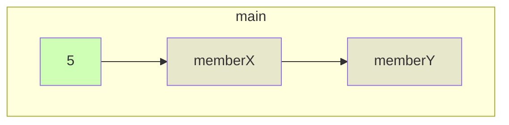

```mermaid
flowchart TD
  subgraph main
    194344737[memberX]:::VARIABLE --> 194344760[memberY]:::VARIABLE
    194344749[5]:::LITERAL --> 194344737[memberX]:::VARIABLE
  end
  classDef LITERAL fill:#00FF0030
  classDef VARIABLE fill:#80808030
  classDef BIN_OP fill:#80808080
  classDef FUNC_PARAM fill:#8080FF30
  classDef RETURN fill:#FF808080
```
