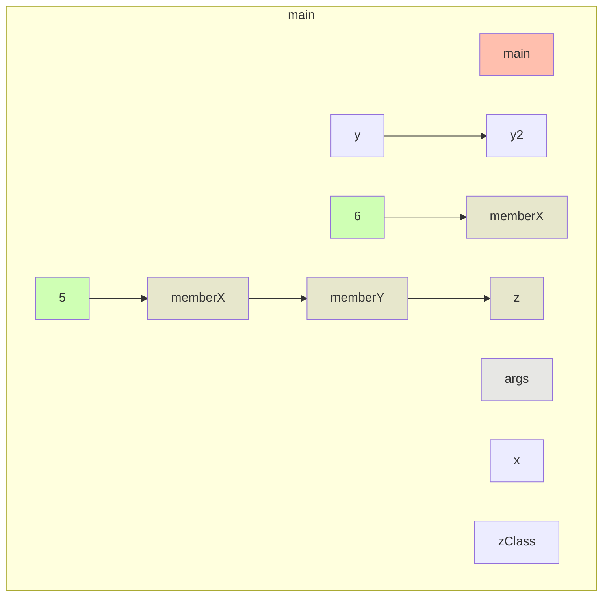

```mermaid
flowchart TD
  subgraph b0["main"]
    n1[main]:::RETURN
    n2[args]:::FUNC_PARAM
    n3[x]:::OBJ_VARIABLE
    n4[y]:::OBJ_VARIABLE
    n5[zClass]:::OBJ_VARIABLE
    n6[memberX]:::VARIABLE
    n7[6]:::LITERAL
    n8[memberX]:::VARIABLE
    n9[5]:::LITERAL
    n10[memberY]:::VARIABLE
    n11[y2]:::OBJ_VARIABLE
    n12[z]:::VARIABLE
    n4[y]:::OBJ_VARIABLE --> n11[y2]:::OBJ_VARIABLE
    n7[6]:::LITERAL --> n6[memberX]:::VARIABLE
    n8[memberX]:::VARIABLE --> n10[memberY]:::VARIABLE
    n9[5]:::LITERAL --> n8[memberX]:::VARIABLE
    n10[memberY]:::VARIABLE --> n12[z]:::VARIABLE
  end
  classDef LITERAL fill:#00FF0030
  classDef VARIABLE fill:#80808030
  classDef BIN_OP fill:#80808080
  classDef FUNC_PARAM fill:#8080FF30
  classDef RETURN fill:#FF808080
  classDef EXTERNAL fill:#FFA50040
```
