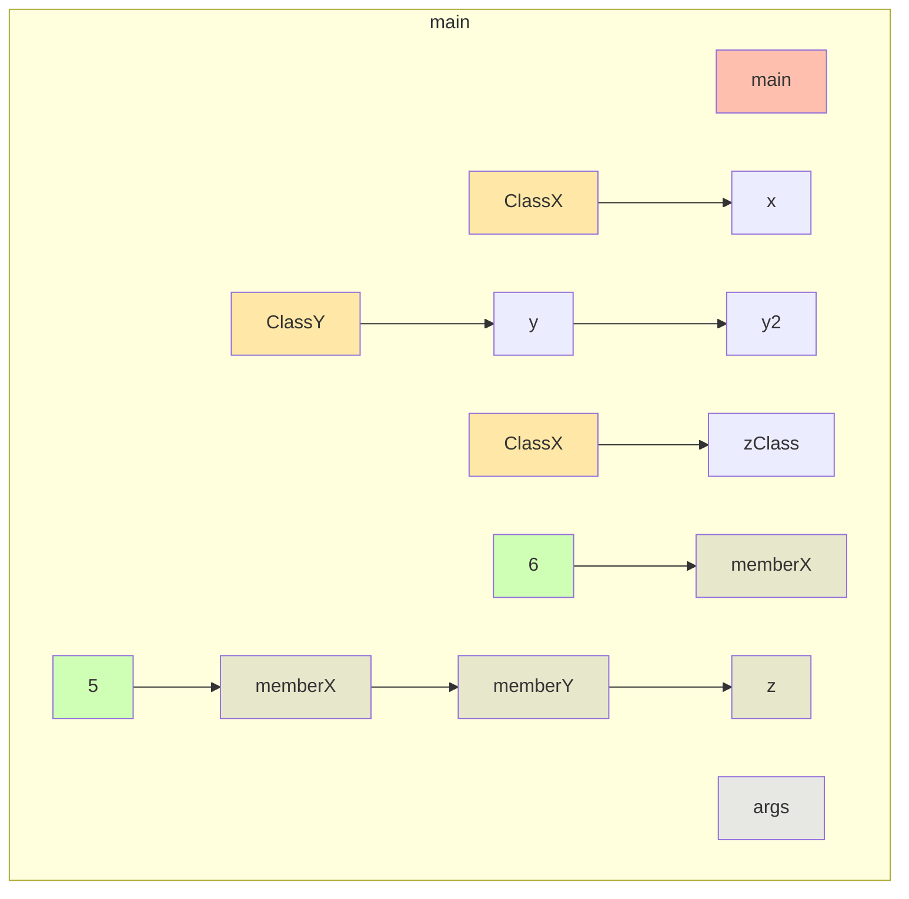

```mermaid
flowchart TD
  subgraph b0["main"]
    n1[main]:::RETURN
    n2[args]:::FUNC_PARAM
    n3[ClassX]:::EXTERNAL
    n4[x]:::OBJ_VARIABLE
    n5[ClassY]:::EXTERNAL
    n6[y]:::OBJ_VARIABLE
    n7[ClassX]:::EXTERNAL
    n8[zClass]:::OBJ_VARIABLE
    n9[6]:::LITERAL
    n10[memberX]:::VARIABLE
    n11[5]:::LITERAL
    n12[memberX]:::VARIABLE
    n13[memberY]:::VARIABLE
    n14[y2]:::OBJ_VARIABLE
    n15[z]:::VARIABLE
    n3[ClassX]:::EXTERNAL --> n4[x]:::OBJ_VARIABLE
    n5[ClassY]:::EXTERNAL --> n6[y]:::OBJ_VARIABLE
    n6[y]:::OBJ_VARIABLE --> n14[y2]:::OBJ_VARIABLE
    n7[ClassX]:::EXTERNAL --> n8[zClass]:::OBJ_VARIABLE
    n9[6]:::LITERAL --> n10[memberX]:::VARIABLE
    n11[5]:::LITERAL --> n12[memberX]:::VARIABLE
    n12[memberX]:::VARIABLE --> n13[memberY]:::VARIABLE
    n13[memberY]:::VARIABLE --> n15[z]:::VARIABLE
  end
  classDef LITERAL fill:#00FF0030
  classDef VARIABLE fill:#80808030
  classDef BIN_OP fill:#80808080
  classDef FUNC_PARAM fill:#8080FF30
  classDef RETURN fill:#FF808080
  classDef EXTERNAL fill:#FFA50040
```
