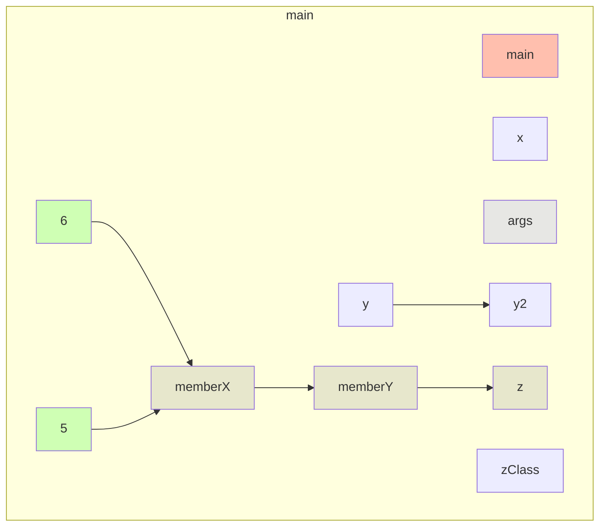

```mermaid
flowchart TD
  subgraph 4309014["main"]
    -13612202907[zClass]:::OBJ_VARIABLE
    -1082850264[6]:::LITERAL
    -1082850195[5]:::LITERAL
    -1082850032[y]:::OBJ_VARIABLE
    -1082848831[z]:::VARIABLE
    -1082786353[y2]:::OBJ_VARIABLE
    56853577[main]:::RETURN
    103683861[x]:::OBJ_VARIABLE
    154667611[args]:::FUNC_PARAM
    16130999090[memberX]:::VARIABLE
    16130999090[memberX]:::VARIABLE
    16130999107[memberY]:::VARIABLE
    -1082850264[6]:::LITERAL --> 16130999090[memberX]:::VARIABLE
    -1082850195[5]:::LITERAL --> 16130999090[memberX]:::VARIABLE
    -1082850032[y]:::OBJ_VARIABLE --> -1082786353[y2]:::OBJ_VARIABLE
    16130999090[memberX]:::VARIABLE --> 16130999107[memberY]:::VARIABLE
    16130999107[memberY]:::VARIABLE --> -1082848831[z]:::VARIABLE
  end
  classDef LITERAL fill:#00FF0030
  classDef VARIABLE fill:#80808030
  classDef BIN_OP fill:#80808080
  classDef FUNC_PARAM fill:#8080FF30
  classDef RETURN fill:#FF808080
```
