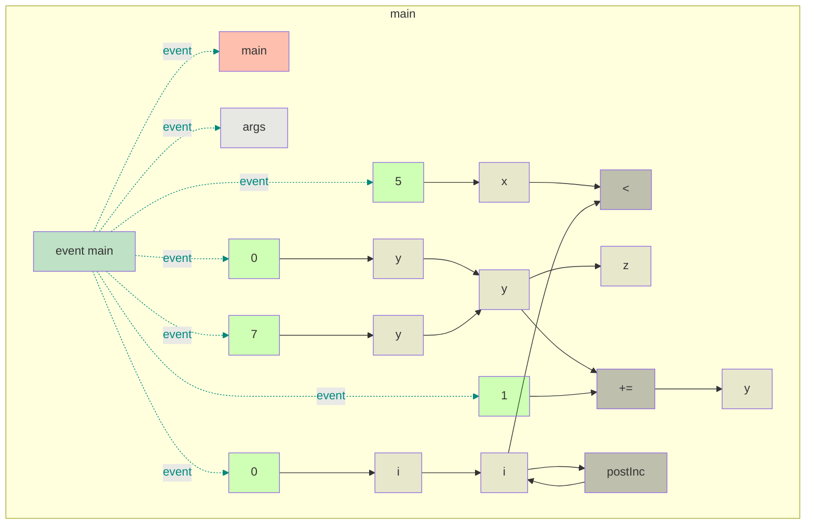

```mermaid
flowchart TD
  subgraph b0["main"]
    n1[event main]:::EVENT
    n2[main]:::RETURN
    n3[args]:::FUNC_PARAM
    n4[5]:::LITERAL
    n5[x]:::VARIABLE
    n6[0]:::LITERAL
    n7[y]:::VARIABLE
    n8[0]:::LITERAL
    n9[i]:::VARIABLE
    n10[y]:::VARIABLE
    n11[i]:::VARIABLE
    n12[<]:::BIN_OP
    n13[7]:::LITERAL
    n14[y]:::VARIABLE
    n15[postInc]:::BIN_OP
    n16[z]:::VARIABLE
    n17[1]:::LITERAL
    n18[+=]:::BIN_OP
    n19[y]:::VARIABLE
    n1[event main]:::EVENT -. event .-> n2[main]:::RETURN
    n1[event main]:::EVENT -. event .-> n3[args]:::FUNC_PARAM
    n1[event main]:::EVENT -. event .-> n4[5]:::LITERAL
    n1[event main]:::EVENT -. event .-> n6[0]:::LITERAL
    n1[event main]:::EVENT -. event .-> n8[0]:::LITERAL
    n1[event main]:::EVENT -. event .-> n13[7]:::LITERAL
    n1[event main]:::EVENT -. event .-> n17[1]:::LITERAL
    n4[5]:::LITERAL --> n5[x]:::VARIABLE
    n5[x]:::VARIABLE --> n12[<]:::BIN_OP
    n6[0]:::LITERAL --> n7[y]:::VARIABLE
    n7[y]:::VARIABLE --> n10[y]:::VARIABLE
    n8[0]:::LITERAL --> n9[i]:::VARIABLE
    n9[i]:::VARIABLE --> n11[i]:::VARIABLE
    n10[y]:::VARIABLE --> n16[z]:::VARIABLE
    n10[y]:::VARIABLE --> n18[+=]:::BIN_OP
    n11[i]:::VARIABLE --> n12[<]:::BIN_OP
    n11[i]:::VARIABLE --> n15[postInc]:::BIN_OP
    n13[7]:::LITERAL --> n14[y]:::VARIABLE
    n14[y]:::VARIABLE --> n10[y]:::VARIABLE
    n15[postInc]:::BIN_OP --> n11[i]:::VARIABLE
    n17[1]:::LITERAL --> n18[+=]:::BIN_OP
    n18[+=]:::BIN_OP --> n19[y]:::VARIABLE
  end
  linkStyle 0 stroke:#00897b,color:#00897b
  linkStyle 1 stroke:#00897b,color:#00897b
  linkStyle 2 stroke:#00897b,color:#00897b
  linkStyle 3 stroke:#00897b,color:#00897b
  linkStyle 4 stroke:#00897b,color:#00897b
  linkStyle 5 stroke:#00897b,color:#00897b
  linkStyle 6 stroke:#00897b,color:#00897b
  classDef LITERAL fill:#00FF0030
  classDef VARIABLE fill:#80808030
  classDef BIN_OP fill:#80808080
  classDef FUNC_PARAM fill:#8080FF30
  classDef RETURN fill:#FF808080
  classDef EXTERNAL fill:#FFA50040
  classDef UNMODELLED fill:#FF000030,stroke-dasharray: 4 2
  classDef EVENT fill:#00897B40
```
