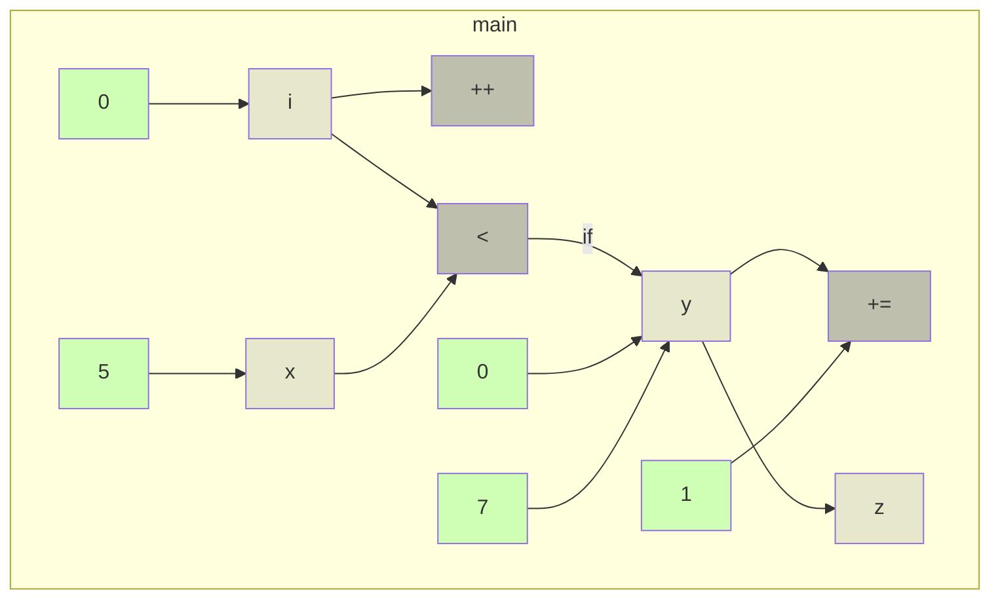

# forLoop: spike value graph (condensed)

```mermaid
flowchart TD
  subgraph m0["main"]
    n0["++"]:::BIN_OP
    n1["+="]:::BIN_OP
    n2["#lt;"]:::BIN_OP
    n3["0"]:::LITERAL
    n4["0"]:::LITERAL
    n5["1"]:::LITERAL
    n6["5"]:::LITERAL
    n7["7"]:::LITERAL
    n8["i"]:::VARIABLE
    n9["x"]:::VARIABLE
    n10["y"]:::VARIABLE
    n11["z"]:::VARIABLE
  end
  n10 --> n1
  n10 --> n11
  n2 -->|if| n10
  n3 --> n10
  n4 --> n8
  n5 --> n1
  n6 --> n9
  n7 --> n10
  n8 --> n0
  n8 --> n2
  n9 --> n2
  classDef LITERAL fill:#00FF0030
  classDef VARIABLE fill:#80808030
  classDef BIN_OP fill:#80808080
  classDef FUNC_PARAM fill:#8080FF30
  classDef RETURN fill:#FF808080
  classDef EXTERNAL fill:#FFA50040
  classDef UNMODELLED fill:#FF000030,stroke-dasharray: 4 2
```
