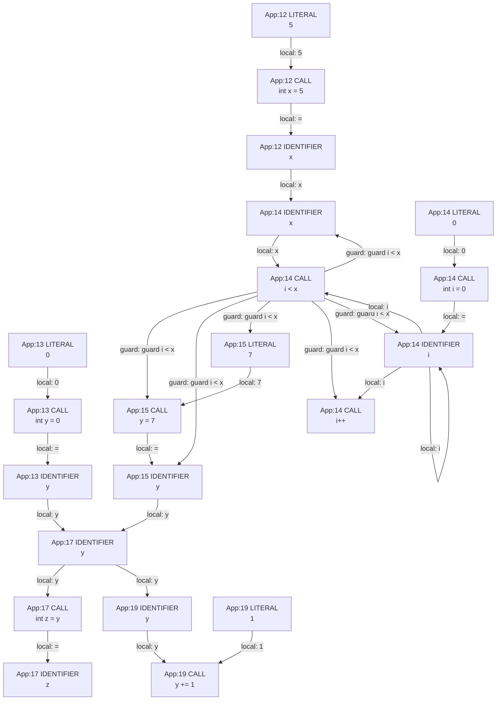

# forLoop: spike value graph

```mermaid
flowchart TD
  n0["App:12 CALL<br/>int x = 5"]
  n1["App:12 IDENTIFIER<br/>x"]
  n2["App:12 LITERAL<br/>5"]
  n3["App:13 CALL<br/>int y = 0"]
  n4["App:13 IDENTIFIER<br/>y"]
  n5["App:13 LITERAL<br/>0"]
  n6["App:14 CALL<br/>i #lt; x"]
  n7["App:14 CALL<br/>i++"]
  n8["App:14 CALL<br/>int i = 0"]
  n9["App:14 IDENTIFIER<br/>i"]
  n10["App:14 IDENTIFIER<br/>x"]
  n11["App:14 LITERAL<br/>0"]
  n12["App:15 CALL<br/>y = 7"]
  n13["App:15 IDENTIFIER<br/>y"]
  n14["App:15 LITERAL<br/>7"]
  n15["App:17 CALL<br/>int z = y"]
  n16["App:17 IDENTIFIER<br/>y"]
  n17["App:17 IDENTIFIER<br/>z"]
  n18["App:19 CALL<br/>y += 1"]
  n19["App:19 IDENTIFIER<br/>y"]
  n20["App:19 LITERAL<br/>1"]
  n0 -->|"local: ="| n1
  n1 -->|"local: x"| n10
  n10 -->|"local: x"| n6
  n11 -->|"local: 0"| n8
  n12 -->|"local: ="| n13
  n13 -->|"local: y"| n16
  n14 -->|"local: 7"| n12
  n15 -->|"local: ="| n17
  n16 -->|"local: y"| n15
  n16 -->|"local: y"| n19
  n19 -->|"local: y"| n18
  n2 -->|"local: 5"| n0
  n20 -->|"local: 1"| n18
  n3 -->|"local: ="| n4
  n4 -->|"local: y"| n16
  n5 -->|"local: 0"| n3
  n6 -->|"guard: guard i #lt; x"| n10
  n6 -->|"guard: guard i #lt; x"| n12
  n6 -->|"guard: guard i #lt; x"| n13
  n6 -->|"guard: guard i #lt; x"| n14
  n6 -->|"guard: guard i #lt; x"| n7
  n6 -->|"guard: guard i #lt; x"| n9
  n8 -->|"local: ="| n9
  n9 -->|"local: i"| n6
  n9 -->|"local: i"| n7
  n9 -->|"local: i"| n9
```
