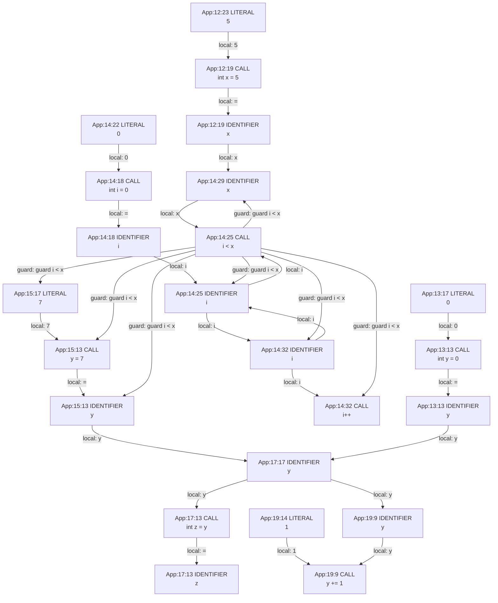

# forLoop: spike value graph

```mermaid
flowchart TD
  n0["App:12:19 CALL<br/>int x = 5"]
  n1["App:12:19 IDENTIFIER<br/>x"]
  n2["App:12:23 LITERAL<br/>5"]
  n3["App:13:13 CALL<br/>int y = 0"]
  n4["App:13:13 IDENTIFIER<br/>y"]
  n5["App:13:17 LITERAL<br/>0"]
  n6["App:14:18 CALL<br/>int i = 0"]
  n7["App:14:18 IDENTIFIER<br/>i"]
  n8["App:14:22 LITERAL<br/>0"]
  n9["App:14:25 CALL<br/>i #lt; x"]
  n10["App:14:25 IDENTIFIER<br/>i"]
  n11["App:14:29 IDENTIFIER<br/>x"]
  n12["App:14:32 CALL<br/>i++"]
  n13["App:14:32 IDENTIFIER<br/>i"]
  n14["App:15:13 CALL<br/>y = 7"]
  n15["App:15:13 IDENTIFIER<br/>y"]
  n16["App:15:17 LITERAL<br/>7"]
  n17["App:17:13 CALL<br/>int z = y"]
  n18["App:17:13 IDENTIFIER<br/>z"]
  n19["App:17:17 IDENTIFIER<br/>y"]
  n20["App:19:14 LITERAL<br/>1"]
  n21["App:19:9 CALL<br/>y += 1"]
  n22["App:19:9 IDENTIFIER<br/>y"]
  n0 -->|"local: ="| n1
  n1 -->|"local: x"| n11
  n10 -->|"local: i"| n13
  n10 -->|"local: i"| n9
  n11 -->|"local: x"| n9
  n13 -->|"local: i"| n10
  n13 -->|"local: i"| n12
  n14 -->|"local: ="| n15
  n15 -->|"local: y"| n19
  n16 -->|"local: 7"| n14
  n17 -->|"local: ="| n18
  n19 -->|"local: y"| n17
  n19 -->|"local: y"| n22
  n2 -->|"local: 5"| n0
  n20 -->|"local: 1"| n21
  n22 -->|"local: y"| n21
  n3 -->|"local: ="| n4
  n4 -->|"local: y"| n19
  n5 -->|"local: 0"| n3
  n6 -->|"local: ="| n7
  n7 -->|"local: i"| n10
  n8 -->|"local: 0"| n6
  n9 -->|"guard: guard i #lt; x"| n10
  n9 -->|"guard: guard i #lt; x"| n11
  n9 -->|"guard: guard i #lt; x"| n12
  n9 -->|"guard: guard i #lt; x"| n13
  n9 -->|"guard: guard i #lt; x"| n14
  n9 -->|"guard: guard i #lt; x"| n15
  n9 -->|"guard: guard i #lt; x"| n16
```
