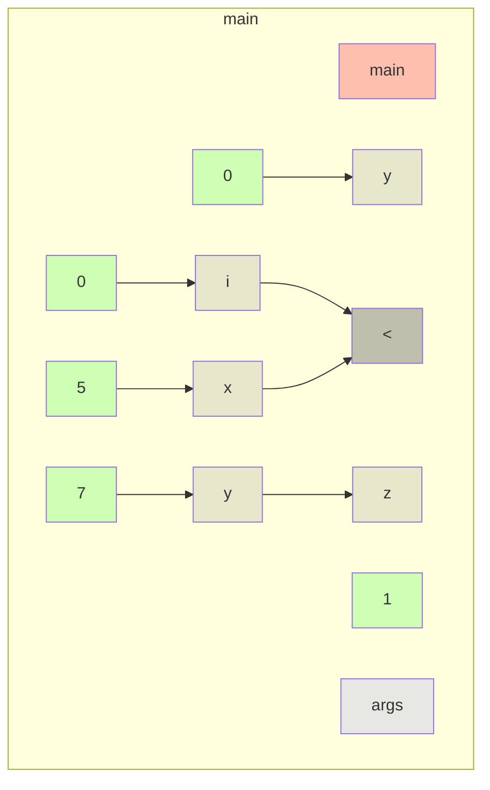

```mermaid
flowchart TD
  subgraph 4309014["main"]
    -870865083[0]:::LITERAL
    -870865059[5]:::LITERAL
    -870865017[0]:::LITERAL
    -870864789[<]:::BIN_OP
    -870864781[7]:::LITERAL
    -870864102[1]:::LITERAL
    -870864056[i]:::VARIABLE
    -870863955[x]:::VARIABLE
    -870863871[y]:::VARIABLE
    -870862928[z]:::VARIABLE
    -819880877[args]:::FUNC_PARAM
    12893[y]:::VARIABLE
    56853577[main]:::RETURN
    -870865083[0]:::LITERAL --> -870863871[y]:::VARIABLE
    -870865059[5]:::LITERAL --> -870863955[x]:::VARIABLE
    -870865017[0]:::LITERAL --> -870864056[i]:::VARIABLE
    -870864781[7]:::LITERAL --> 12893[y]:::VARIABLE
    -870864056[i]:::VARIABLE --> -870864789[<]:::BIN_OP
    -870863955[x]:::VARIABLE --> -870864789[<]:::BIN_OP
    12893[y]:::VARIABLE --> -870862928[z]:::VARIABLE
  end
  classDef LITERAL fill:#00FF0030
  classDef VARIABLE fill:#80808030
  classDef BIN_OP fill:#80808080
  classDef FUNC_PARAM fill:#8080FF30
  classDef RETURN fill:#FF808080
```
