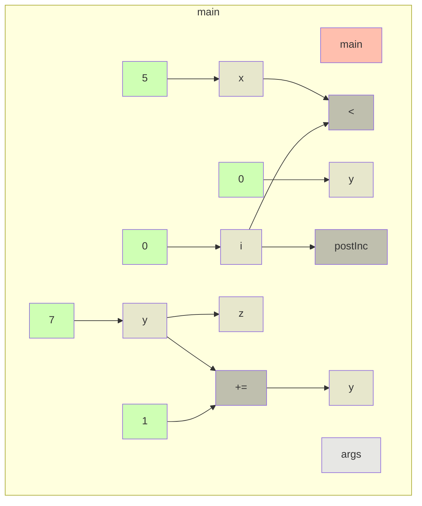

```mermaid
flowchart TD
  subgraph b0["main"]
    n1[main]:::RETURN
    n2[args]:::FUNC_PARAM
    n3[x]:::VARIABLE
    n4[5]:::LITERAL
    n5[y]:::VARIABLE
    n6[0]:::LITERAL
    n7[i]:::VARIABLE
    n8[0]:::LITERAL
    n9[<]:::BIN_OP
    n10[postInc]:::BIN_OP
    n11[y]:::VARIABLE
    n12[7]:::LITERAL
    n13[z]:::VARIABLE
    n14[1]:::LITERAL
    n15[+=]:::BIN_OP
    n16[y]:::VARIABLE
    n3[x]:::VARIABLE --> n9[<]:::BIN_OP
    n4[5]:::LITERAL --> n3[x]:::VARIABLE
    n6[0]:::LITERAL --> n5[y]:::VARIABLE
    n7[i]:::VARIABLE --> n9[<]:::BIN_OP
    n7[i]:::VARIABLE --> n10[postInc]:::BIN_OP
    n8[0]:::LITERAL --> n7[i]:::VARIABLE
    n11[y]:::VARIABLE --> n13[z]:::VARIABLE
    n11[y]:::VARIABLE --> n15[+=]:::BIN_OP
    n12[7]:::LITERAL --> n11[y]:::VARIABLE
    n14[1]:::LITERAL --> n15[+=]:::BIN_OP
    n15[+=]:::BIN_OP --> n16[y]:::VARIABLE
  end
  classDef LITERAL fill:#00FF0030
  classDef VARIABLE fill:#80808030
  classDef BIN_OP fill:#80808080
  classDef FUNC_PARAM fill:#8080FF30
  classDef RETURN fill:#FF808080
  classDef EXTERNAL fill:#FFA50040
```
