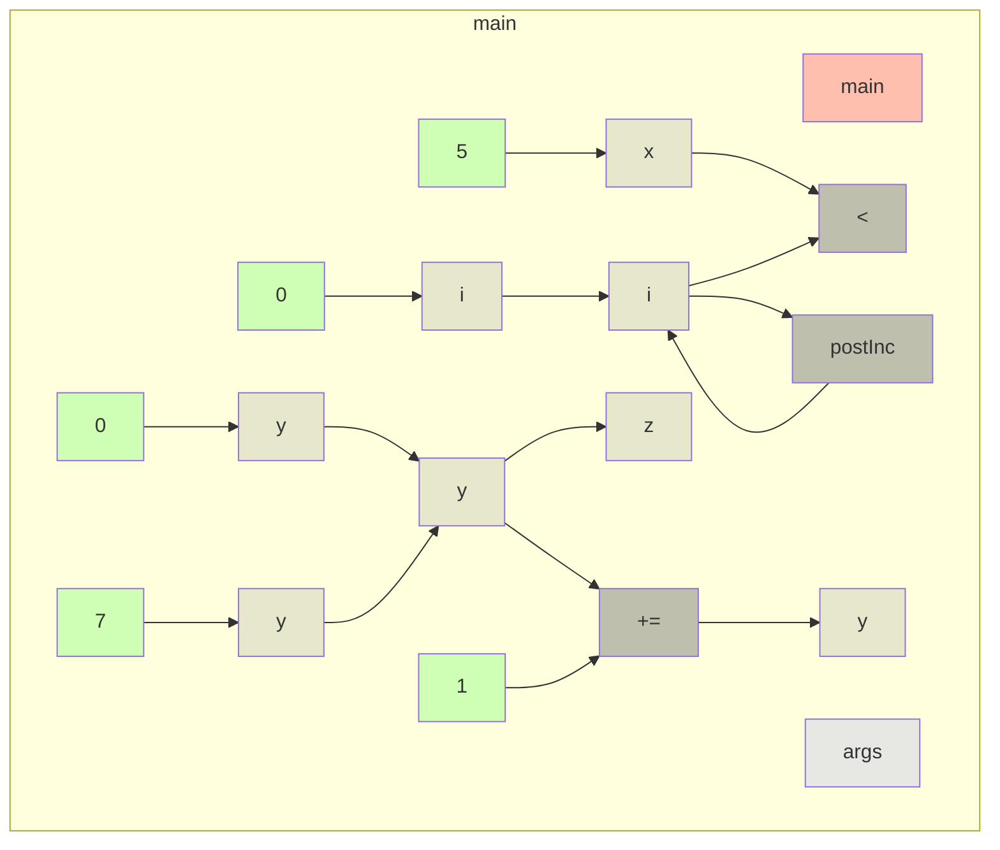

```mermaid
flowchart TD
  subgraph b0["main"]
    n1[main]:::RETURN
    n2[args]:::FUNC_PARAM
    n3[5]:::LITERAL
    n4[x]:::VARIABLE
    n5[0]:::LITERAL
    n6[y]:::VARIABLE
    n7[0]:::LITERAL
    n8[i]:::VARIABLE
    n9[y]:::VARIABLE
    n10[i]:::VARIABLE
    n11[<]:::BIN_OP
    n12[7]:::LITERAL
    n13[y]:::VARIABLE
    n14[postInc]:::BIN_OP
    n15[z]:::VARIABLE
    n16[1]:::LITERAL
    n17[+=]:::BIN_OP
    n18[y]:::VARIABLE
    n3[5]:::LITERAL --> n4[x]:::VARIABLE
    n4[x]:::VARIABLE --> n11[<]:::BIN_OP
    n5[0]:::LITERAL --> n6[y]:::VARIABLE
    n6[y]:::VARIABLE --> n9[y]:::VARIABLE
    n7[0]:::LITERAL --> n8[i]:::VARIABLE
    n8[i]:::VARIABLE --> n10[i]:::VARIABLE
    n9[y]:::VARIABLE --> n15[z]:::VARIABLE
    n9[y]:::VARIABLE --> n17[+=]:::BIN_OP
    n10[i]:::VARIABLE --> n11[<]:::BIN_OP
    n10[i]:::VARIABLE --> n14[postInc]:::BIN_OP
    n12[7]:::LITERAL --> n13[y]:::VARIABLE
    n13[y]:::VARIABLE --> n9[y]:::VARIABLE
    n14[postInc]:::BIN_OP --> n10[i]:::VARIABLE
    n16[1]:::LITERAL --> n17[+=]:::BIN_OP
    n17[+=]:::BIN_OP --> n18[y]:::VARIABLE
  end
  classDef LITERAL fill:#00FF0030
  classDef VARIABLE fill:#80808030
  classDef BIN_OP fill:#80808080
  classDef FUNC_PARAM fill:#8080FF30
  classDef RETURN fill:#FF808080
  classDef EXTERNAL fill:#FFA50040
  classDef UNMODELLED fill:#FF000030,stroke-dasharray: 4 2
```
