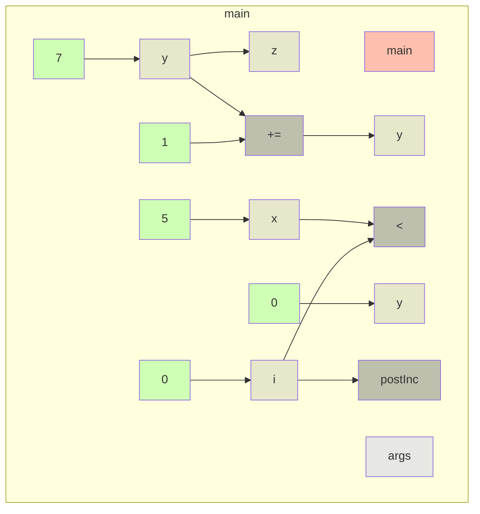

```mermaid
flowchart TD
  subgraph 4309014["main"]
    -7879828465[postInc]:::BIN_OP
    -1228931167[x]:::VARIABLE
    -1228927715[5]:::LITERAL
    -1228903308[y]:::VARIABLE
    -1228901824[0]:::LITERAL
    -1228875807[i]:::VARIABLE
    -1228874722[0]:::LITERAL
    -1228873557[<]:::BIN_OP
    -1228843979[7]:::LITERAL
    -1177975243[args]:::FUNC_PARAM
    12893[y]:::VARIABLE
    56853577[main]:::RETURN
    551019600[z]:::VARIABLE
    551025469[y]:::VARIABLE
    551026017[1]:::LITERAL
    551047110[+=]:::BIN_OP
    -1228931167[x]:::VARIABLE --> -1228873557[<]:::BIN_OP
    -1228927715[5]:::LITERAL --> -1228931167[x]:::VARIABLE
    -1228901824[0]:::LITERAL --> -1228903308[y]:::VARIABLE
    -1228875807[i]:::VARIABLE --> -1228873557[<]:::BIN_OP
    -1228875807[i]:::VARIABLE --> -7879828465[postInc]:::BIN_OP
    -1228874722[0]:::LITERAL --> -1228875807[i]:::VARIABLE
    -1228843979[7]:::LITERAL --> 12893[y]:::VARIABLE
    12893[y]:::VARIABLE --> 551019600[z]:::VARIABLE
    12893[y]:::VARIABLE --> 551047110[+=]:::BIN_OP
    551026017[1]:::LITERAL --> 551047110[+=]:::BIN_OP
    551047110[+=]:::BIN_OP --> 551025469[y]:::VARIABLE
  end
  classDef LITERAL fill:#00FF0030
  classDef VARIABLE fill:#80808030
  classDef BIN_OP fill:#80808080
  classDef FUNC_PARAM fill:#8080FF30
  classDef RETURN fill:#FF808080
  classDef EXTERNAL fill:#FFA50040
```
