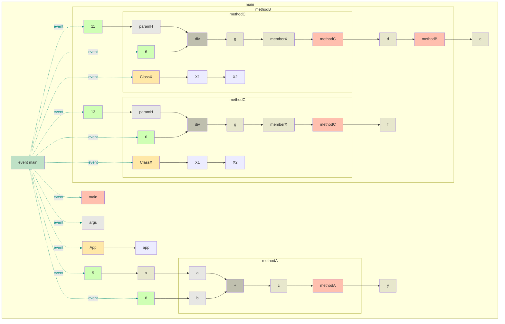

```mermaid
flowchart TD
  subgraph b0["main"]
    n1[event main]:::EVENT
    n2[main]:::RETURN
    n3[args]:::FUNC_PARAM
    n4[5]:::LITERAL
    n5[x]:::VARIABLE
    n6[8]:::LITERAL
    n13[y]:::VARIABLE
    n14[App]:::EXTERNAL
    n15[app]:::OBJ_VARIABLE
    n42[e]:::VARIABLE
    n1[event main]:::EVENT -. event .-> n2[main]:::RETURN
    n1[event main]:::EVENT -. event .-> n3[args]:::FUNC_PARAM
    n1[event main]:::EVENT -. event .-> n4[5]:::LITERAL
    n1[event main]:::EVENT -. event .-> n6[8]:::LITERAL
    n1[event main]:::EVENT -. event .-> n14[App]:::EXTERNAL
    n1[event main]:::EVENT -. event .-> n18[11]:::LITERAL
    n1[event main]:::EVENT -. event .-> n30[13]:::LITERAL
    n1[event main]:::EVENT -. event .-> n22[6]:::LITERAL
    n1[event main]:::EVENT -. event .-> n25[ClassX]:::EXTERNAL
    n1[event main]:::EVENT -. event .-> n34[6]:::LITERAL
    n1[event main]:::EVENT -. event .-> n37[ClassX]:::EXTERNAL
    n4[5]:::LITERAL --> n5[x]:::VARIABLE
    n5[x]:::VARIABLE --> n9[a]:::FUNC_PARAM
    n6[8]:::LITERAL --> n10[b]:::FUNC_PARAM
    n14[App]:::EXTERNAL --> n15[app]:::OBJ_VARIABLE
    n8[methodA]:::RETURN --> n13[y]:::VARIABLE
    n17[methodB]:::RETURN --> n42[e]:::VARIABLE
    subgraph b7["methodA"]
      n8[methodA]:::RETURN
      n9[a]:::FUNC_PARAM
      n10[b]:::FUNC_PARAM
      n11[+]:::BIN_OP
      n12[c]:::VARIABLE
      n9[a]:::FUNC_PARAM --> n11[+]:::BIN_OP
      n10[b]:::FUNC_PARAM --> n11[+]:::BIN_OP
      n11[+]:::BIN_OP --> n12[c]:::VARIABLE
      n12[c]:::VARIABLE --> n8[methodA]:::RETURN
    end
    subgraph b16["methodB"]
      n17[methodB]:::RETURN
      n18[11]:::LITERAL
      n29[d]:::VARIABLE
      n30[13]:::LITERAL
      n41[f]:::VARIABLE
      n18[11]:::LITERAL --> n21[paramH]:::FUNC_PARAM
      n29[d]:::VARIABLE --> n17[methodB]:::RETURN
      n30[13]:::LITERAL --> n33[paramH]:::FUNC_PARAM
      n20[methodC]:::RETURN --> n29[d]:::VARIABLE
      n32[methodC]:::RETURN --> n41[f]:::VARIABLE
      subgraph b19["methodC"]
        n20[methodC]:::RETURN
        n21[paramH]:::FUNC_PARAM
        n22[6]:::LITERAL
        n23[div]:::BIN_OP
        n24[g]:::VARIABLE
        n25[ClassX]:::EXTERNAL
        n26[X1]:::OBJ_VARIABLE
        n27[memberX]:::VARIABLE
        n28[X2]:::OBJ_VARIABLE
        n21[paramH]:::FUNC_PARAM --> n23[div]:::BIN_OP
        n22[6]:::LITERAL --> n23[div]:::BIN_OP
        n23[div]:::BIN_OP --> n24[g]:::VARIABLE
        n24[g]:::VARIABLE --> n27[memberX]:::VARIABLE
        n25[ClassX]:::EXTERNAL --> n26[X1]:::OBJ_VARIABLE
        n26[X1]:::OBJ_VARIABLE --> n28[X2]:::OBJ_VARIABLE
        n27[memberX]:::VARIABLE --> n20[methodC]:::RETURN
      end
      subgraph b31["methodC"]
        n32[methodC]:::RETURN
        n33[paramH]:::FUNC_PARAM
        n34[6]:::LITERAL
        n35[div]:::BIN_OP
        n36[g]:::VARIABLE
        n37[ClassX]:::EXTERNAL
        n38[X1]:::OBJ_VARIABLE
        n39[memberX]:::VARIABLE
        n40[X2]:::OBJ_VARIABLE
        n33[paramH]:::FUNC_PARAM --> n35[div]:::BIN_OP
        n34[6]:::LITERAL --> n35[div]:::BIN_OP
        n35[div]:::BIN_OP --> n36[g]:::VARIABLE
        n36[g]:::VARIABLE --> n39[memberX]:::VARIABLE
        n37[ClassX]:::EXTERNAL --> n38[X1]:::OBJ_VARIABLE
        n38[X1]:::OBJ_VARIABLE --> n40[X2]:::OBJ_VARIABLE
        n39[memberX]:::VARIABLE --> n32[methodC]:::RETURN
      end
    end
  end
  linkStyle 0 stroke:#00897b,color:#00897b
  linkStyle 1 stroke:#00897b,color:#00897b
  linkStyle 2 stroke:#00897b,color:#00897b
  linkStyle 3 stroke:#00897b,color:#00897b
  linkStyle 4 stroke:#00897b,color:#00897b
  linkStyle 5 stroke:#00897b,color:#00897b
  linkStyle 6 stroke:#00897b,color:#00897b
  linkStyle 7 stroke:#00897b,color:#00897b
  linkStyle 8 stroke:#00897b,color:#00897b
  linkStyle 9 stroke:#00897b,color:#00897b
  linkStyle 10 stroke:#00897b,color:#00897b
  classDef LITERAL fill:#00FF0030
  classDef VARIABLE fill:#80808030
  classDef BIN_OP fill:#80808080
  classDef FUNC_PARAM fill:#8080FF30
  classDef RETURN fill:#FF808080
  classDef EXTERNAL fill:#FFA50040
  classDef UNMODELLED fill:#FF000030,stroke-dasharray: 4 2
  classDef EVENT fill:#00897B40
```
