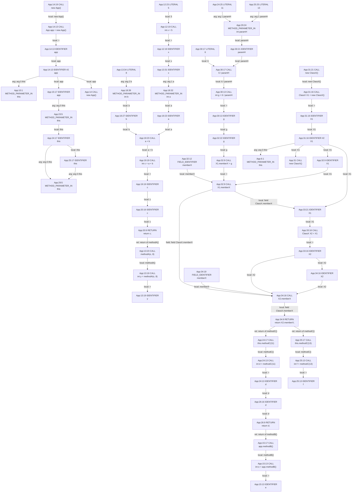

# funcCall: spike value graph

```mermaid
flowchart TD
  n0["App:10:1 METHOD_PARAMETER_IN<br/>this"]
  n1["App:12:19 CALL<br/>int x = 5"]
  n2["App:12:19 IDENTIFIER<br/>x"]
  n3["App:12:23 LITERAL<br/>5"]
  n4["App:13:19 CALL<br/>int y = methodA(x, 8)"]
  n5["App:13:19 IDENTIFIER<br/>y"]
  n6["App:13:23 CALL<br/>methodA(x, 8)"]
  n7["App:13:31 IDENTIFIER<br/>x"]
  n8["App:13:34 LITERAL<br/>8"]
  n9["App:14 CALL<br/>new App()"]
  n10["App:14:13 CALL<br/>App app = new App()"]
  n11["App:14:13 IDENTIFIER #2<br/>app"]
  n12["App:14:13 IDENTIFIER<br/>app"]
  n13["App:14:19 CALL<br/>new App()"]
  n14["App:15:13 CALL<br/>int e = app.methodB()"]
  n15["App:15:13 IDENTIFIER<br/>e"]
  n16["App:15:17 CALL<br/>app.methodB()"]
  n17["App:15:17 IDENTIFIER<br/>app"]
  n18["App:18:32 METHOD_PARAMETER_IN<br/>int a"]
  n19["App:18:39 METHOD_PARAMETER_IN<br/>int b"]
  n20["App:19:19 CALL<br/>int c = a + b"]
  n21["App:19:19 IDENTIFIER<br/>c"]
  n22["App:19:23 CALL<br/>a + b"]
  n23["App:19:23 IDENTIFIER<br/>a"]
  n24["App:19:27 IDENTIFIER<br/>b"]
  n25["App:20:16 IDENTIFIER<br/>c"]
  n26["App:20:9 RETURN<br/>return c;"]
  n27["App:23:5 METHOD_PARAMETER_IN<br/>this"]
  n28["App:24:13 CALL<br/>int d = methodC(11)"]
  n29["App:24:13 IDENTIFIER<br/>d"]
  n30["App:24:17 CALL<br/>this.methodC(11)"]
  n31["App:24:17 IDENTIFIER<br/>this"]
  n32["App:24:25 LITERAL<br/>11"]
  n33["App:25:13 CALL<br/>int f = methodC(13)"]
  n34["App:25:13 IDENTIFIER<br/>f"]
  n35["App:25:17 CALL<br/>this.methodC(13)"]
  n36["App:25:17 IDENTIFIER<br/>this"]
  n37["App:25:25 LITERAL<br/>13"]
  n38["App:26:16 IDENTIFIER<br/>d"]
  n39["App:26:9 RETURN<br/>return d;"]
  n40["App:29:24 METHOD_PARAMETER_IN<br/>int paramH"]
  n41["App:29:5 METHOD_PARAMETER_IN<br/>this"]
  n42["App:30:13 CALL<br/>int g = 6 / paramH"]
  n43["App:30:13 IDENTIFIER<br/>g"]
  n44["App:30:17 CALL<br/>6 / paramH"]
  n45["App:30:17 LITERAL<br/>6"]
  n46["App:30:21 IDENTIFIER<br/>paramH"]
  n47["App:31 CALL<br/>new ClassX()"]
  n48["App:31:16 CALL<br/>ClassX X1 = new ClassX()"]
  n49["App:31:16 IDENTIFIER #2<br/>X1"]
  n50["App:31:16 IDENTIFIER<br/>X1"]
  n51["App:31:21 CALL<br/>new ClassX()"]
  n52["App:32:12 FIELD_IDENTIFIER<br/>memberX"]
  n53["App:32:22 IDENTIFIER<br/>g"]
  n54["App:32:9 CALL<br/>X1.memberX"]
  n55["App:32:9 CALL<br/>X1.memberX = g"]
  n56["App:32:9 IDENTIFIER<br/>X1"]
  n57["App:33:16 CALL<br/>ClassX X2 = X1"]
  n58["App:33:16 IDENTIFIER<br/>X2"]
  n59["App:33:21 IDENTIFIER<br/>X1"]
  n60["App:34:16 CALL<br/>X2.memberX"]
  n61["App:34:16 IDENTIFIER<br/>X2"]
  n62["App:34:19 FIELD_IDENTIFIER<br/>memberX"]
  n63["App:34:9 RETURN<br/>return X2.memberX;"]
  n64["App:6:1 METHOD_PARAMETER_IN<br/>this"]
  n1 -->|"local: ="| n2
  n10 -->|"local: ="| n12
  n11 -->|"arg: arg 0 this"| n0
  n11 -->|"local: app"| n17
  n11 -->|"local: app"| n9
  n12 -->|"local: app"| n11
  n13 -->|"local: new App()"| n10
  n14 -->|"local: ="| n15
  n16 -->|"local: methodB()"| n14
  n17 -->|"arg: arg 0 this"| n27
  n18 -->|"local: a"| n23
  n19 -->|"local: b"| n24
  n2 -->|"local: x"| n7
  n20 -->|"local: ="| n21
  n21 -->|"local: c"| n25
  n22 -->|"local: a + b"| n20
  n23 -->|"local: a"| n22
  n24 -->|"local: b"| n22
  n25 -->|"local: c"| n26
  n26 -->|"ret: return of methodA()"| n6
  n27 -->|"local: this"| n31
  n28 -->|"local: ="| n29
  n29 -->|"local: d"| n38
  n3 -->|"local: 5"| n1
  n30 -->|"local: methodC()"| n28
  n31 -->|"arg: arg 0 this"| n41
  n31 -->|"local: this"| n36
  n32 -->|"arg: arg 1 paramH"| n40
  n33 -->|"local: ="| n34
  n35 -->|"local: methodC()"| n33
  n36 -->|"arg: arg 0 this"| n41
  n37 -->|"arg: arg 1 paramH"| n40
  n38 -->|"local: d"| n39
  n39 -->|"ret: return of methodB()"| n16
  n4 -->|"local: ="| n5
  n40 -->|"local: paramH"| n46
  n42 -->|"local: ="| n43
  n43 -->|"local: g"| n53
  n44 -->|"local: 6 / paramH"| n42
  n45 -->|"local: 6"| n44
  n46 -->|"local: paramH"| n44
  n48 -->|"local: ="| n50
  n49 -->|"arg: arg 0 this"| n64
  n49 -->|"local: X1"| n47
  n49 -->|"local: X1"| n56
  n49 -->|"local: X1"| n59
  n50 -->|"local: X1"| n49
  n51 -->|"local: new ClassX()"| n48
  n52 -->|"local: memberX"| n54
  n53 -->|"local: g"| n55
  n54 -->|"field: field ClassX.memberX"| n60
  n54 -->|"local: field ClassX.memberX"| n59
  n55 -->|"local: ="| n54
  n56 -->|"local: X1"| n54
  n57 -->|"local: ="| n58
  n58 -->|"local: X2"| n60
  n58 -->|"local: X2"| n61
  n59 -->|"local: X1"| n57
  n6 -->|"local: methodA()"| n4
  n60 -->|"local: field ClassX.memberX"| n63
  n61 -->|"local: X2"| n60
  n62 -->|"local: memberX"| n60
  n63 -->|"ret: return of methodC()"| n30
  n63 -->|"ret: return of methodC()"| n35
  n7 -->|"arg: arg 1 a"| n18
  n8 -->|"arg: arg 2 b"| n19
```
