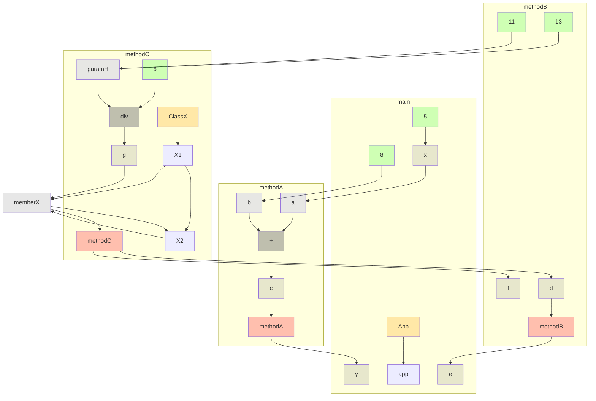

# funcCall: spike value graph (condensed)

```mermaid
flowchart TD
  subgraph m0["main"]
    n0["App"]:::EXTERNAL
    n1["5"]:::LITERAL
    n2["8"]:::LITERAL
    n3["app"]:::OBJ_VARIABLE
    n4["e"]:::VARIABLE
    n5["x"]:::VARIABLE
    n6["y"]:::VARIABLE
  end
  subgraph m1["methodA"]
    n7["+"]:::BIN_OP
    n8["a"]:::FUNC_PARAM
    n9["b"]:::FUNC_PARAM
    n10["methodA"]:::RETURN
    n11["c"]:::VARIABLE
  end
  subgraph m2["methodB"]
    n12["11"]:::LITERAL
    n13["13"]:::LITERAL
    n14["methodB"]:::RETURN
    n15["d"]:::VARIABLE
    n16["f"]:::VARIABLE
  end
  subgraph m3["methodC"]
    n17["div"]:::BIN_OP
    n18["ClassX"]:::EXTERNAL
    n19["paramH"]:::FUNC_PARAM
    n20["6"]:::LITERAL
    n21["X1"]:::OBJ_VARIABLE
    n22["X2"]:::OBJ_VARIABLE
    n23["methodC"]:::RETURN
    n24["g"]:::VARIABLE
  end
  n25["memberX"]:::VARIABLE
  n0 --> n3
  n1 --> n5
  n10 --> n6
  n11 --> n10
  n12 --> n19
  n13 --> n19
  n14 --> n4
  n15 --> n14
  n17 --> n24
  n18 --> n21
  n19 --> n17
  n2 --> n9
  n20 --> n17
  n21 --> n22
  n21 --> n25
  n22 --> n25
  n23 --> n15
  n23 --> n16
  n24 --> n25
  n25 --> n22
  n25 --> n23
  n5 --> n8
  n7 --> n11
  n8 --> n7
  n9 --> n7
  classDef LITERAL fill:#00FF0030
  classDef VARIABLE fill:#80808030
  classDef BIN_OP fill:#80808080
  classDef FUNC_PARAM fill:#8080FF30
  classDef RETURN fill:#FF808080
  classDef EXTERNAL fill:#FFA50040
  classDef UNMODELLED fill:#FF000030,stroke-dasharray: 4 2
```
