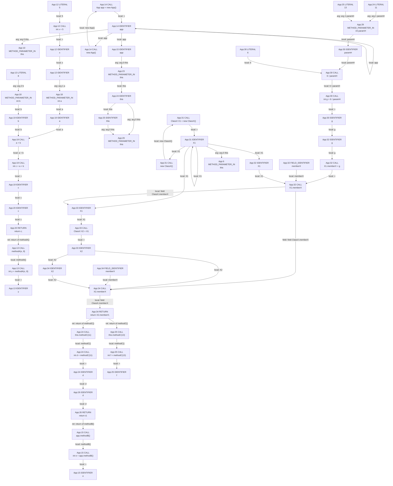

# funcCall: spike value graph

```mermaid
flowchart TD
  n0["App:10 METHOD_PARAMETER_IN<br/>this"]
  n1["App:12 CALL<br/>int x = 5"]
  n2["App:12 IDENTIFIER<br/>x"]
  n3["App:12 LITERAL<br/>5"]
  n4["App:13 CALL<br/>int y = methodA(x, 8)"]
  n5["App:13 CALL<br/>methodA(x, 8)"]
  n6["App:13 IDENTIFIER<br/>x"]
  n7["App:13 IDENTIFIER<br/>y"]
  n8["App:13 LITERAL<br/>8"]
  n9["App:14 CALL<br/>App app = new App()"]
  n10["App:14 CALL<br/>new App()"]
  n11["App:14 IDENTIFIER<br/>app"]
  n12["App:15 CALL<br/>app.methodB()"]
  n13["App:15 CALL<br/>int e = app.methodB()"]
  n14["App:15 IDENTIFIER<br/>app"]
  n15["App:15 IDENTIFIER<br/>e"]
  n16["App:18 METHOD_PARAMETER_IN<br/>int a"]
  n17["App:18 METHOD_PARAMETER_IN<br/>int b"]
  n18["App:19 CALL<br/>a + b"]
  n19["App:19 CALL<br/>int c = a + b"]
  n20["App:19 IDENTIFIER<br/>a"]
  n21["App:19 IDENTIFIER<br/>b"]
  n22["App:19 IDENTIFIER<br/>c"]
  n23["App:20 IDENTIFIER<br/>c"]
  n24["App:20 RETURN<br/>return c;"]
  n25["App:23 METHOD_PARAMETER_IN<br/>this"]
  n26["App:24 CALL<br/>int d = methodC(11)"]
  n27["App:24 CALL<br/>this.methodC(11)"]
  n28["App:24 IDENTIFIER<br/>d"]
  n29["App:24 IDENTIFIER<br/>this"]
  n30["App:24 LITERAL<br/>11"]
  n31["App:25 CALL<br/>int f = methodC(13)"]
  n32["App:25 CALL<br/>this.methodC(13)"]
  n33["App:25 IDENTIFIER<br/>f"]
  n34["App:25 IDENTIFIER<br/>this"]
  n35["App:25 LITERAL<br/>13"]
  n36["App:26 IDENTIFIER<br/>d"]
  n37["App:26 RETURN<br/>return d;"]
  n38["App:29 METHOD_PARAMETER_IN<br/>int paramH"]
  n39["App:29 METHOD_PARAMETER_IN<br/>this"]
  n40["App:30 CALL<br/>6 / paramH"]
  n41["App:30 CALL<br/>int g = 6 / paramH"]
  n42["App:30 IDENTIFIER<br/>g"]
  n43["App:30 IDENTIFIER<br/>paramH"]
  n44["App:30 LITERAL<br/>6"]
  n45["App:31 CALL<br/>ClassX X1 = new ClassX()"]
  n46["App:31 CALL<br/>new ClassX()"]
  n47["App:31 IDENTIFIER<br/>X1"]
  n48["App:32 CALL<br/>X1.memberX"]
  n49["App:32 CALL<br/>X1.memberX = g"]
  n50["App:32 FIELD_IDENTIFIER<br/>memberX"]
  n51["App:32 IDENTIFIER<br/>X1"]
  n52["App:32 IDENTIFIER<br/>g"]
  n53["App:33 CALL<br/>ClassX X2 = X1"]
  n54["App:33 IDENTIFIER<br/>X1"]
  n55["App:33 IDENTIFIER<br/>X2"]
  n56["App:34 CALL<br/>X2.memberX"]
  n57["App:34 FIELD_IDENTIFIER<br/>memberX"]
  n58["App:34 IDENTIFIER<br/>X2"]
  n59["App:34 RETURN<br/>return X2.memberX;"]
  n60["App:6 METHOD_PARAMETER_IN<br/>this"]
  n1 -->|"local: ="| n2
  n10 -->|"local: new App()"| n9
  n11 -->|"arg: arg 0 this"| n0
  n11 -->|"local: app"| n10
  n11 -->|"local: app"| n11
  n11 -->|"local: app"| n14
  n12 -->|"local: methodB()"| n13
  n13 -->|"local: ="| n15
  n14 -->|"arg: arg 0 this"| n25
  n16 -->|"local: a"| n20
  n17 -->|"local: b"| n21
  n18 -->|"local: a + b"| n19
  n19 -->|"local: ="| n22
  n2 -->|"local: x"| n6
  n20 -->|"local: a"| n18
  n21 -->|"local: b"| n18
  n22 -->|"local: c"| n23
  n23 -->|"local: c"| n24
  n24 -->|"ret: return of methodA()"| n5
  n25 -->|"local: this"| n29
  n26 -->|"local: ="| n28
  n27 -->|"local: methodC()"| n26
  n28 -->|"local: d"| n36
  n29 -->|"arg: arg 0 this"| n39
  n29 -->|"local: this"| n34
  n3 -->|"local: 5"| n1
  n30 -->|"arg: arg 1 paramH"| n38
  n31 -->|"local: ="| n33
  n32 -->|"local: methodC()"| n31
  n34 -->|"arg: arg 0 this"| n39
  n35 -->|"arg: arg 1 paramH"| n38
  n36 -->|"local: d"| n37
  n37 -->|"ret: return of methodB()"| n12
  n38 -->|"local: paramH"| n43
  n4 -->|"local: ="| n7
  n40 -->|"local: 6 / paramH"| n41
  n41 -->|"local: ="| n42
  n42 -->|"local: g"| n52
  n43 -->|"local: paramH"| n40
  n44 -->|"local: 6"| n40
  n45 -->|"local: ="| n47
  n46 -->|"local: new ClassX()"| n45
  n47 -->|"arg: arg 0 this"| n60
  n47 -->|"local: X1"| n46
  n47 -->|"local: X1"| n47
  n47 -->|"local: X1"| n51
  n47 -->|"local: X1"| n54
  n48 -->|"field: field ClassX.memberX"| n56
  n48 -->|"local: field ClassX.memberX"| n54
  n49 -->|"local: ="| n48
  n5 -->|"local: methodA()"| n4
  n50 -->|"local: memberX"| n48
  n51 -->|"local: X1"| n48
  n52 -->|"local: g"| n49
  n53 -->|"local: ="| n55
  n54 -->|"local: X1"| n53
  n55 -->|"local: X2"| n56
  n55 -->|"local: X2"| n58
  n56 -->|"local: field ClassX.memberX"| n59
  n57 -->|"local: memberX"| n56
  n58 -->|"local: X2"| n56
  n59 -->|"ret: return of methodC()"| n27
  n59 -->|"ret: return of methodC()"| n32
  n6 -->|"arg: arg 1 a"| n16
  n8 -->|"arg: arg 2 b"| n17
  n9 -->|"local: ="| n11
```
