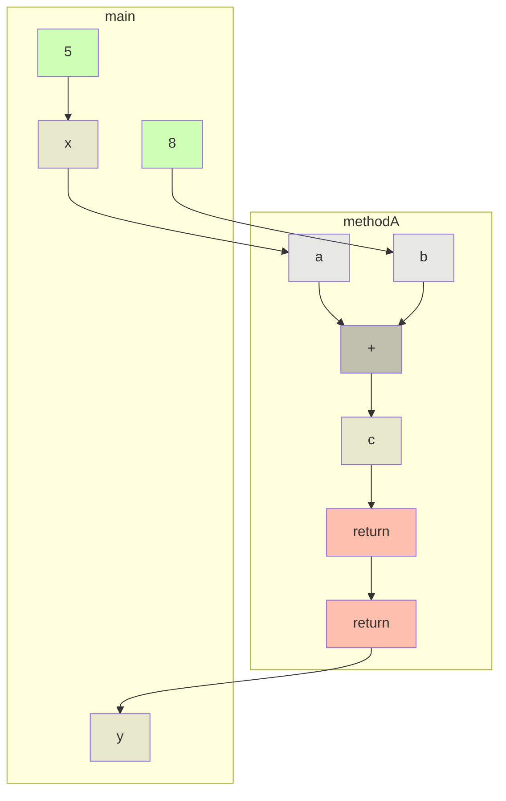

```mermaid
flowchart TD
  subgraph methodA
    7[return]:::RETURN --> 6[return]:::RETURN
    8[a]:::FUNC_PARAM --> 11[+]:::BIN_OP
    9[b]:::FUNC_PARAM --> 11[+]:::BIN_OP
    10[c]:::VARIABLE --> 7[return]:::RETURN
    11[+]:::BIN_OP --> 10[c]:::VARIABLE
  end
  subgraph main
    2[x]:::VARIABLE --> 8[a]:::FUNC_PARAM
    3[5]:::LITERAL --> 2[x]:::VARIABLE
    5[8]:::LITERAL --> 9[b]:::FUNC_PARAM
    6[return]:::RETURN --> 4[y]:::VARIABLE
  end
  classDef LITERAL fill:#00FF0030
  classDef VARIABLE fill:#80808030
  classDef BIN_OP fill:#80808080
  classDef FUNC_PARAM fill:#8080FF30
  classDef RETURN fill:#FF808080
```
