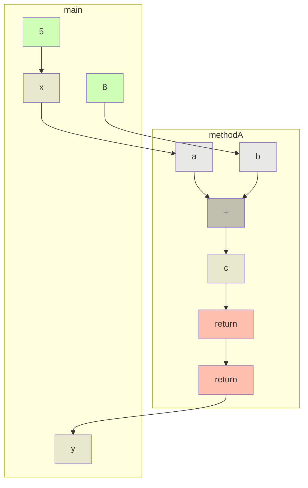

```mermaid
flowchart TD
  subgraph methodA
    23[return]:::RETURN --> 21[return]:::RETURN
    24[a]:::FUNC_PARAM --> 26[+]:::BIN_OP
    25[b]:::FUNC_PARAM --> 26[+]:::BIN_OP
    26[+]:::BIN_OP --> 28[c]:::VARIABLE
    28[c]:::VARIABLE --> 23[return]:::RETURN
  end
  subgraph main
    18[5]:::LITERAL --> 19[x]:::VARIABLE
    19[x]:::VARIABLE --> 24[a]:::FUNC_PARAM
    20[8]:::LITERAL --> 25[b]:::FUNC_PARAM
    21[return]:::RETURN --> 22[y]:::VARIABLE
  end
  classDef LITERAL fill:#00FF0030
  classDef VARIABLE fill:#80808030
  classDef BIN_OP fill:#80808080
  classDef FUNC_PARAM fill:#8080FF30
  classDef RETURN fill:#FF808080
```
