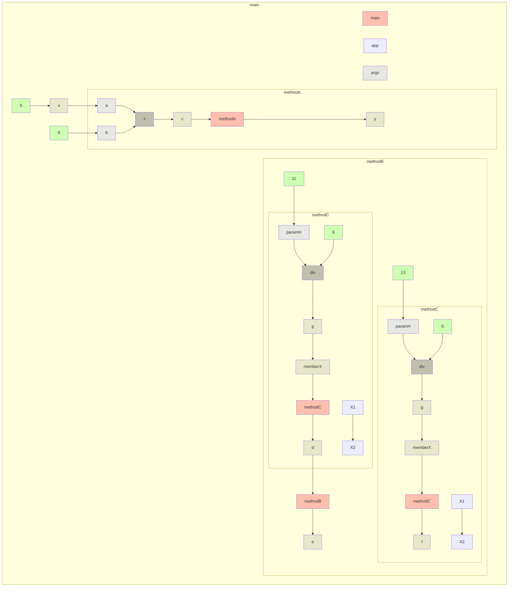

```mermaid
flowchart TD
  subgraph 4309014["main"]
    56853577[main]:::RETURN
    1347555656[5]:::LITERAL
    1347555827[8]:::LITERAL
    1347556717[e]:::VARIABLE
    1347556760[x]:::VARIABLE
    1347556844[y]:::VARIABLE
    1349200525[app]:::OBJ_VARIABLE
    1398539838[args]:::FUNC_PARAM
    1347555656[5]:::LITERAL --> 1347556760[x]:::VARIABLE
    1347555827[8]:::LITERAL --> 171748789[b]:::FUNC_PARAM
    1347556760[x]:::VARIABLE --> 171748744[a]:::FUNC_PARAM
    subgraph -1676100867["methodA"]
      171747948[+]:::BIN_OP
      171748744[a]:::FUNC_PARAM
      171748789[b]:::FUNC_PARAM
      171748844[c]:::VARIABLE
      17591636379[methodA]:::RETURN
      171747948[+]:::BIN_OP --> 171748844[c]:::VARIABLE
      171748744[a]:::FUNC_PARAM --> 171747948[+]:::BIN_OP
      171748789[b]:::FUNC_PARAM --> 171747948[+]:::BIN_OP
      171748844[c]:::VARIABLE --> 17591636379[methodA]:::RETURN
      17591636379[methodA]:::RETURN --> 1347556844[y]:::VARIABLE
    end
    subgraph -1676069898["methodB"]
      171775708[d]:::VARIABLE
      171775834[f]:::VARIABLE
      171800722[11]:::LITERAL
      171801499[13]:::LITERAL
      17591637233[methodB]:::RETURN
      171775708[d]:::VARIABLE --> 17591637233[methodB]:::RETURN
      171800722[11]:::LITERAL --> -18839993683[paramH]:::FUNC_PARAM
      171801499[13]:::LITERAL --> -18839990831[paramH]:::FUNC_PARAM
      17591637233[methodB]:::RETURN --> 1347556717[e]:::VARIABLE
      subgraph 2064649567["methodC"]
        -18839993683[paramH]:::FUNC_PARAM
        -1917716587[6]:::LITERAL
        -1917715783[g]:::VARIABLE
        -1917669583[X1]:::OBJ_VARIABLE
        -1917669382[X2]:::OBJ_VARIABLE
        -1916026464[div]:::BIN_OP
        16302762291[memberX]:::VARIABLE
        16415855607[methodC]:::RETURN
        -18839993683[paramH]:::FUNC_PARAM --> -1916026464[div]:::BIN_OP
        -1917716587[6]:::LITERAL --> -1916026464[div]:::BIN_OP
        -1917715783[g]:::VARIABLE --> 16302762291[memberX]:::VARIABLE
        -1917669583[X1]:::OBJ_VARIABLE --> -1917669382[X2]:::OBJ_VARIABLE
        -1916026464[div]:::BIN_OP --> -1917715783[g]:::VARIABLE
        16302762291[memberX]:::VARIABLE --> 16415855607[methodC]:::RETURN
        16415855607[methodC]:::RETURN --> 171775708[d]:::VARIABLE
      end
      subgraph 2064652971["methodC"]
        -18839990831[paramH]:::FUNC_PARAM
        -1917713735[6]:::LITERAL
        -1917712931[g]:::VARIABLE
        -1917666731[X1]:::OBJ_VARIABLE
        -1917666530[X2]:::OBJ_VARIABLE
        -1916023612[div]:::BIN_OP
        16302762383[memberX]:::VARIABLE
        16415855699[methodC]:::RETURN
        -18839990831[paramH]:::FUNC_PARAM --> -1916023612[div]:::BIN_OP
        -1917713735[6]:::LITERAL --> -1916023612[div]:::BIN_OP
        -1917712931[g]:::VARIABLE --> 16302762383[memberX]:::VARIABLE
        -1917666731[X1]:::OBJ_VARIABLE --> -1917666530[X2]:::OBJ_VARIABLE
        -1916023612[div]:::BIN_OP --> -1917712931[g]:::VARIABLE
        16302762383[memberX]:::VARIABLE --> 16415855699[methodC]:::RETURN
        16415855699[methodC]:::RETURN --> 171775834[f]:::VARIABLE
      end
    end
  end
  classDef LITERAL fill:#00FF0030
  classDef VARIABLE fill:#80808030
  classDef BIN_OP fill:#80808080
  classDef FUNC_PARAM fill:#8080FF30
  classDef RETURN fill:#FF808080
```
