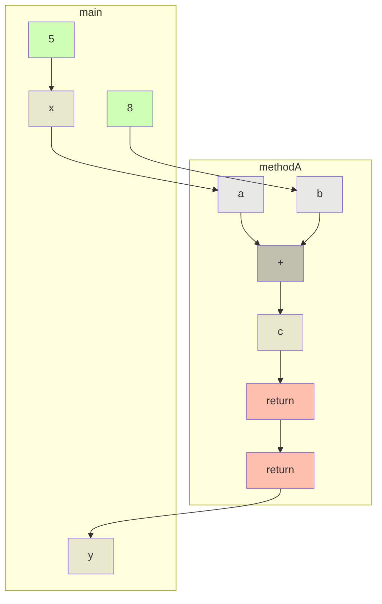

```mermaid
flowchart TD
  subgraph methodA
    439986885[return]:::RETURN --> 439986859[return]:::RETURN
    439986912[a]:::FUNC_PARAM --> 439986962[+]:::BIN_OP
    439986925[b]:::FUNC_PARAM --> 439986962[+]:::BIN_OP
    439986948[c]:::VARIABLE --> 439986885[return]:::RETURN
    439986962[+]:::BIN_OP --> 439986948[c]:::VARIABLE
  end
  subgraph main
    439986820[x]:::VARIABLE --> 439986912[a]:::FUNC_PARAM
    439986834[5]:::LITERAL --> 439986820[x]:::VARIABLE
    439986859[return]:::RETURN --> 439986845[y]:::VARIABLE
    439986870[8]:::LITERAL --> 439986925[b]:::FUNC_PARAM
  end
  classDef LITERAL fill:#00FF0030
  classDef VARIABLE fill:#80808030
  classDef BIN_OP fill:#80808080
  classDef FUNC_PARAM fill:#8080FF30
  classDef RETURN fill:#FF808080
```
