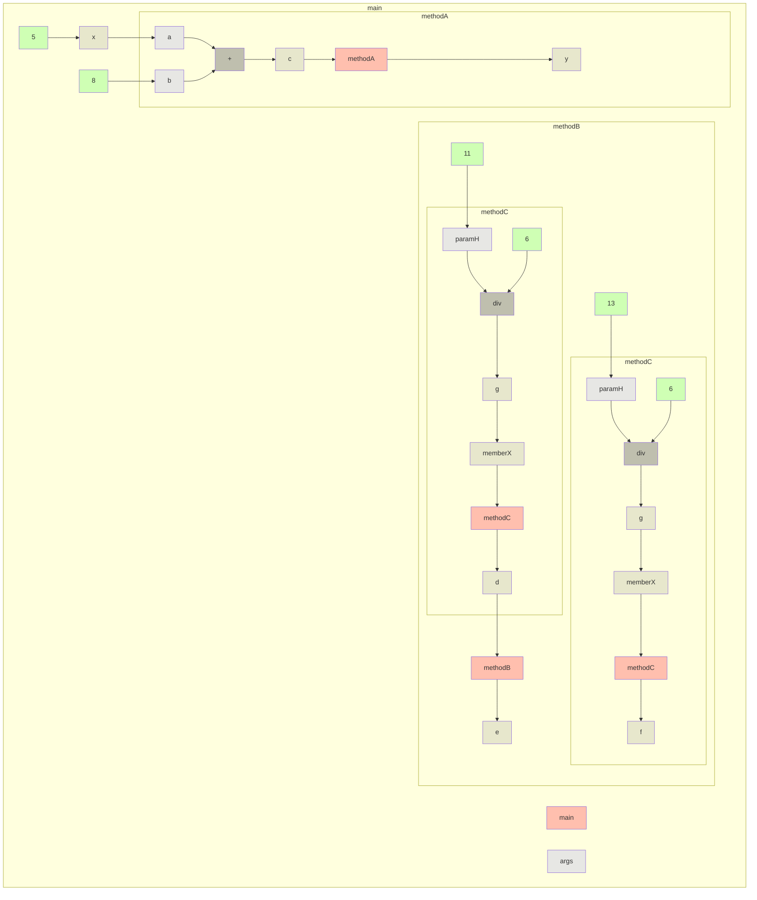

```mermaid
flowchart TD
  subgraph 4308940["main"]
    214598[x]:::VARIABLE
    217505[5]:::LITERAL
    221840[y]:::VARIABLE
    227960[8]:::LITERAL
    240574[e]:::VARIABLE
    56996632[main]:::RETURN
    1296531130[args]:::FUNC_PARAM
    214598[x]:::VARIABLE --> 1248129501[a]:::FUNC_PARAM
    217505[5]:::LITERAL --> 214598[x]:::VARIABLE
    227960[8]:::LITERAL --> 1248131541[b]:::FUNC_PARAM
    subgraph 4317894["methodA"]
      1248129501[a]:::FUNC_PARAM
      1248131541[b]:::FUNC_PARAM
      1347809112[c]:::VARIABLE
      1347812206[+]:::BIN_OP
      16244305365[methodA]:::RETURN
      1248129501[a]:::FUNC_PARAM --> 1347812206[+]:::BIN_OP
      1248131541[b]:::FUNC_PARAM --> 1347812206[+]:::BIN_OP
      1347809112[c]:::VARIABLE --> 16244305365[methodA]:::RETURN
      1347812206[+]:::BIN_OP --> 1347809112[c]:::VARIABLE
      16244305365[methodA]:::RETURN --> 221840[y]:::VARIABLE
    end
    subgraph 4320114["methodB"]
      1347833375[d]:::VARIABLE
      1347841790[f]:::VARIABLE
      1347862955[11]:::LITERAL
      1347871370[13]:::LITERAL
      16244322722[methodB]:::RETURN
      1347833375[d]:::VARIABLE --> 16244322722[methodB]:::RETURN
      1347862955[11]:::LITERAL --> -14324128104[paramH]:::FUNC_PARAM
      1347871370[13]:::LITERAL --> -14323818007[paramH]:::FUNC_PARAM
      16244322722[methodB]:::RETURN --> 240574[e]:::VARIABLE
      subgraph 4326256["methodC"]
        -14324128104[paramH]:::FUNC_PARAM
        172086463[g]:::VARIABLE
        172087942[6]:::LITERAL
        173778065[div]:::BIN_OP
        16303090884[memberX]:::VARIABLE
        17591915557[methodC]:::RETURN
        -14324128104[paramH]:::FUNC_PARAM --> 173778065[div]:::BIN_OP
        172086463[g]:::VARIABLE --> 16303090884[memberX]:::VARIABLE
        172087942[6]:::LITERAL --> 173778065[div]:::BIN_OP
        173778065[div]:::BIN_OP --> 172086463[g]:::VARIABLE
        16303090884[memberX]:::VARIABLE --> 17591915557[methodC]:::RETURN
        17591915557[methodC]:::RETURN --> 1347833375[d]:::VARIABLE
      end
      subgraph 4327329["methodC"]
        -14323818007[paramH]:::FUNC_PARAM
        172086555[g]:::VARIABLE
        172088034[6]:::LITERAL
        173778157[div]:::BIN_OP
        16303090976[memberX]:::VARIABLE
        17591923938[methodC]:::RETURN
        -14323818007[paramH]:::FUNC_PARAM --> 173778157[div]:::BIN_OP
        172086555[g]:::VARIABLE --> 16303090976[memberX]:::VARIABLE
        172088034[6]:::LITERAL --> 173778157[div]:::BIN_OP
        173778157[div]:::BIN_OP --> 172086555[g]:::VARIABLE
        16303090976[memberX]:::VARIABLE --> 17591923938[methodC]:::RETURN
        17591923938[methodC]:::RETURN --> 1347841790[f]:::VARIABLE
      end
    end
  end
  classDef LITERAL fill:#00FF0030
  classDef VARIABLE fill:#80808030
  classDef BIN_OP fill:#80808080
  classDef FUNC_PARAM fill:#8080FF30
  classDef RETURN fill:#FF808080
```
