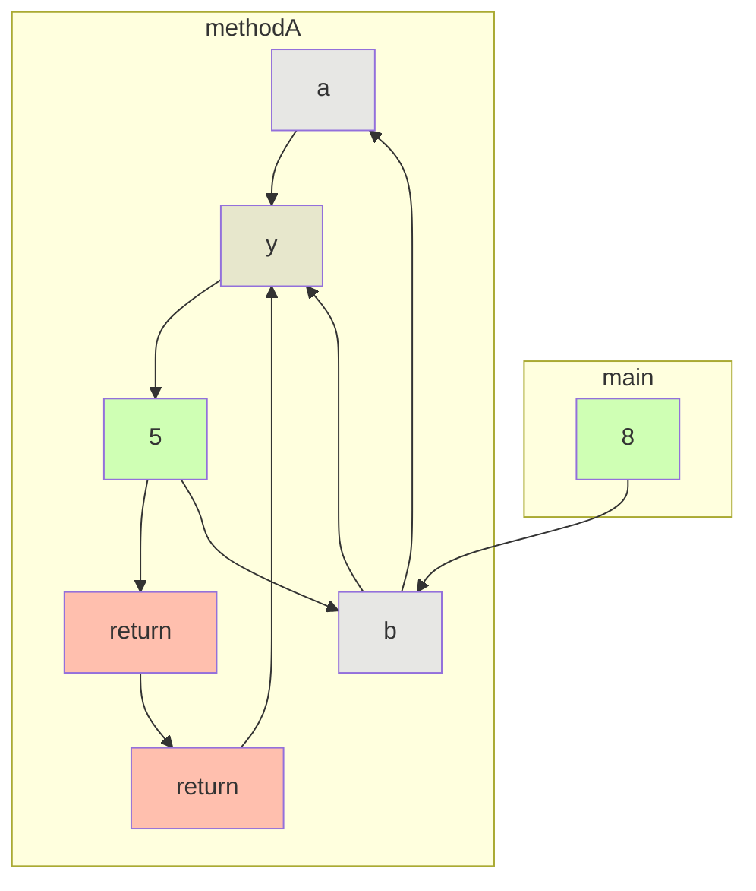

```mermaid
flowchart TD
  subgraph methodA
    0[a]:::FUNC_PARAM --> 3[+]:::BIN_OP
    1[b]:::FUNC_PARAM --> 3[+]:::BIN_OP
    2[c]:::VARIABLE --> 6[return]:::RETURN
    3[+]:::BIN_OP --> 2[c]:::VARIABLE
    6[return]:::RETURN --> 5[return]:::RETURN
  end
  subgraph main
    1[x]:::VARIABLE --> 0[a]:::FUNC_PARAM
    2[5]:::LITERAL --> 1[x]:::VARIABLE
    4[8]:::LITERAL --> 1[b]:::FUNC_PARAM
    5[return]:::RETURN --> 3[y]:::VARIABLE
  end
  classDef LITERAL fill:#00FF0030
  classDef VARIABLE fill:#80808030
  classDef BIN_OP fill:#80808080
  classDef FUNC_PARAM fill:#8080FF30
  classDef RETURN fill:#FF808080
```
