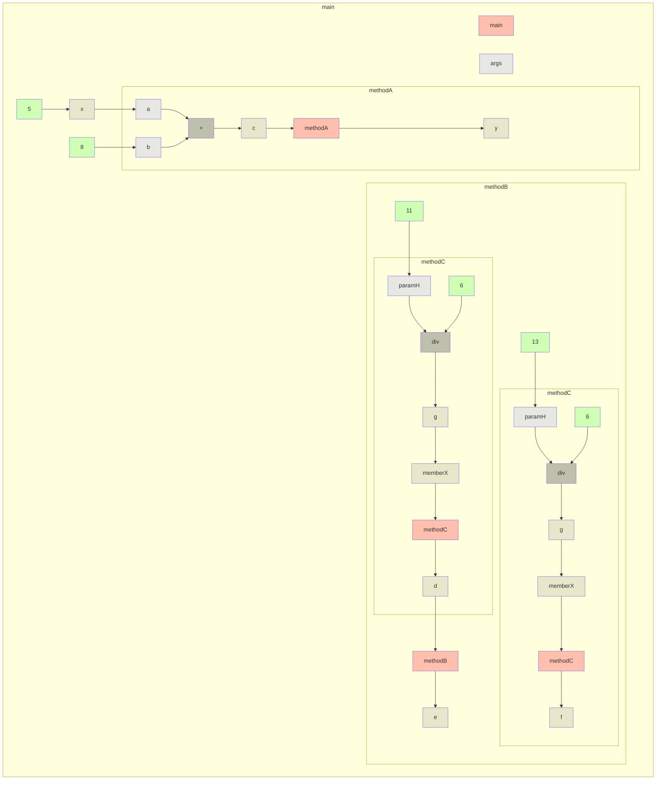

```mermaid
flowchart TD
  subgraph 4309014["main"]
    214598[x]:::VARIABLE
    217505[5]:::LITERAL
    221840[y]:::VARIABLE
    227960[8]:::LITERAL
    240574[e]:::VARIABLE
    56996632[main]:::RETURN
    1296552516[args]:::FUNC_PARAM
    214598[x]:::VARIABLE --> -483667268685[a]:::FUNC_PARAM
    217505[5]:::LITERAL --> 214598[x]:::VARIABLE
    227960[8]:::LITERAL --> -483667266645[b]:::FUNC_PARAM
    subgraph -1678252639["methodA"]
      -483667268685[a]:::FUNC_PARAM
      -483667266645[b]:::FUNC_PARAM
      1347750956[c]:::VARIABLE
      1347754050[+]:::BIN_OP
      17591791216[methodA]:::RETURN
      -483667268685[a]:::FUNC_PARAM --> 1347754050[+]:::BIN_OP
      -483667266645[b]:::FUNC_PARAM --> 1347754050[+]:::BIN_OP
      1347750956[c]:::VARIABLE --> 17591791216[methodA]:::RETURN
      1347754050[+]:::BIN_OP --> 1347750956[c]:::VARIABLE
      17591791216[methodA]:::RETURN --> 221840[y]:::VARIABLE
    end
    subgraph -1678221670["methodB"]
      1347775219[d]:::VARIABLE
      1347783634[f]:::VARIABLE
      1347804799[11]:::LITERAL
      1347813214[13]:::LITERAL
      17591809410[methodB]:::RETURN
      1347775219[d]:::VARIABLE --> 17591809410[methodB]:::RETURN
      1347804799[11]:::LITERAL --> -500568206692[paramH]:::FUNC_PARAM
      1347813214[13]:::LITERAL --> -500567222844[paramH]:::FUNC_PARAM
      17591809410[methodB]:::RETURN --> 240574[e]:::VARIABLE
      subgraph -1678179009["methodC"]
        -500568206692[paramH]:::FUNC_PARAM
        1347811103[g]:::VARIABLE
        1347812582[6]:::LITERAL
        1349502705[div]:::BIN_OP
        17478815524[memberX]:::VARIABLE
        17591858554[methodC]:::RETURN
        -500568206692[paramH]:::FUNC_PARAM --> 1349502705[div]:::BIN_OP
        1347811103[g]:::VARIABLE --> 17478815524[memberX]:::VARIABLE
        1347812582[6]:::LITERAL --> 1349502705[div]:::BIN_OP
        1349502705[div]:::BIN_OP --> 1347811103[g]:::VARIABLE
        17478815524[memberX]:::VARIABLE --> 17591858554[methodC]:::RETURN
        17591858554[methodC]:::RETURN --> 1347775219[d]:::VARIABLE
      end
      subgraph -1678175605["methodC"]
        -500567222844[paramH]:::FUNC_PARAM
        1347811195[g]:::VARIABLE
        1347812674[6]:::LITERAL
        1349502797[div]:::BIN_OP
        17478815616[memberX]:::VARIABLE
        17591867027[methodC]:::RETURN
        -500567222844[paramH]:::FUNC_PARAM --> 1349502797[div]:::BIN_OP
        1347811195[g]:::VARIABLE --> 17478815616[memberX]:::VARIABLE
        1347812674[6]:::LITERAL --> 1349502797[div]:::BIN_OP
        1349502797[div]:::BIN_OP --> 1347811195[g]:::VARIABLE
        17478815616[memberX]:::VARIABLE --> 17591867027[methodC]:::RETURN
        17591867027[methodC]:::RETURN --> 1347783634[f]:::VARIABLE
      end
    end
  end
  classDef LITERAL fill:#00FF0030
  classDef VARIABLE fill:#80808030
  classDef BIN_OP fill:#80808080
  classDef FUNC_PARAM fill:#8080FF30
  classDef RETURN fill:#FF808080
```
